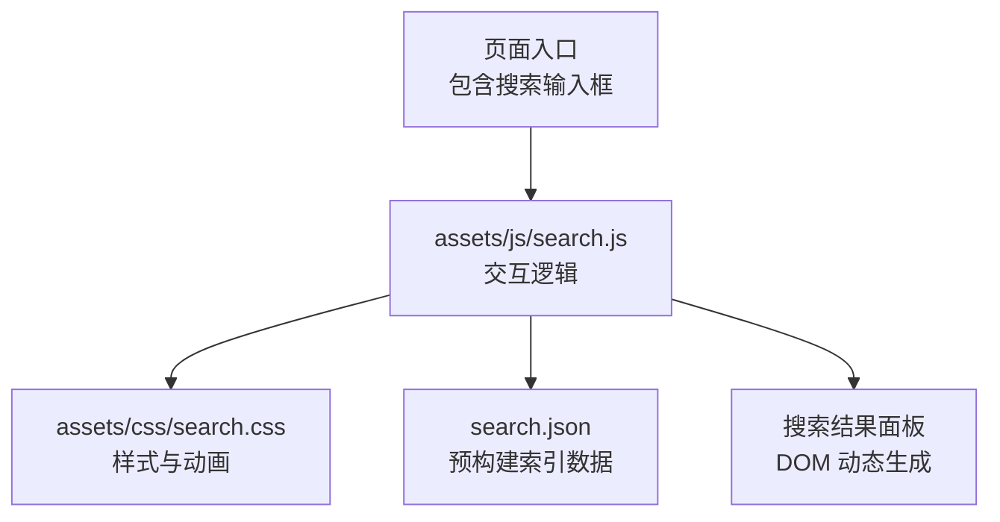
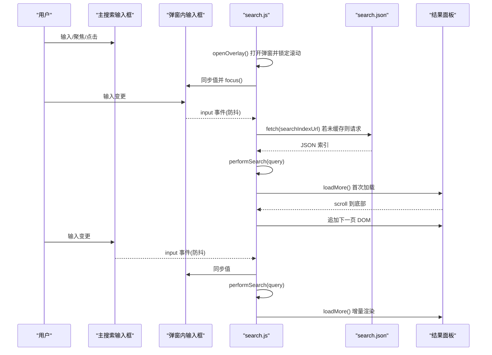
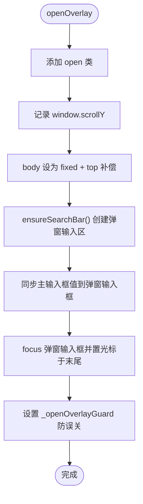
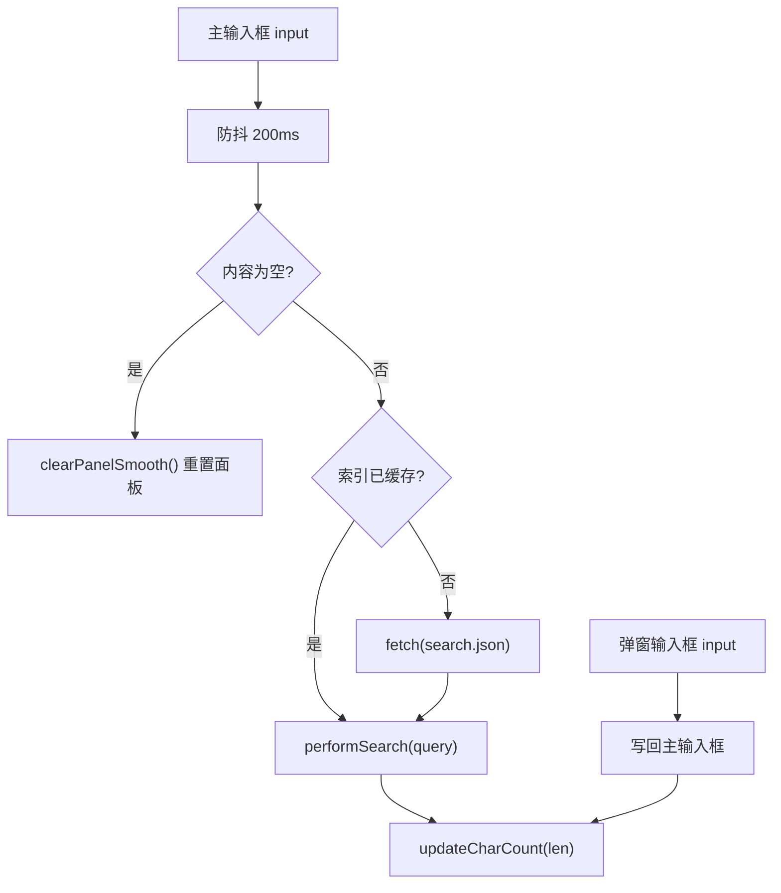
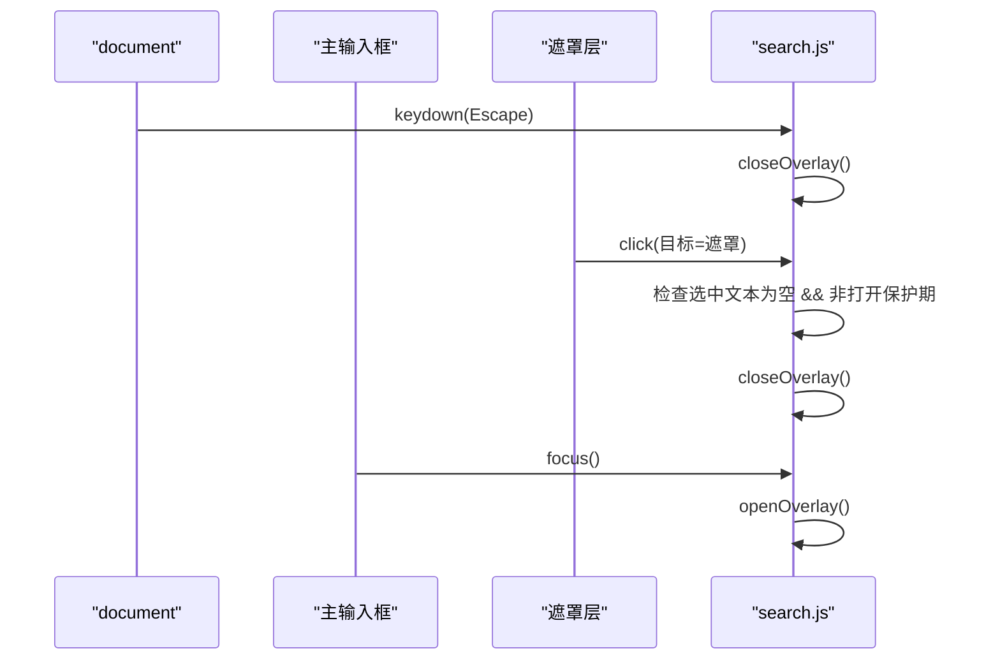
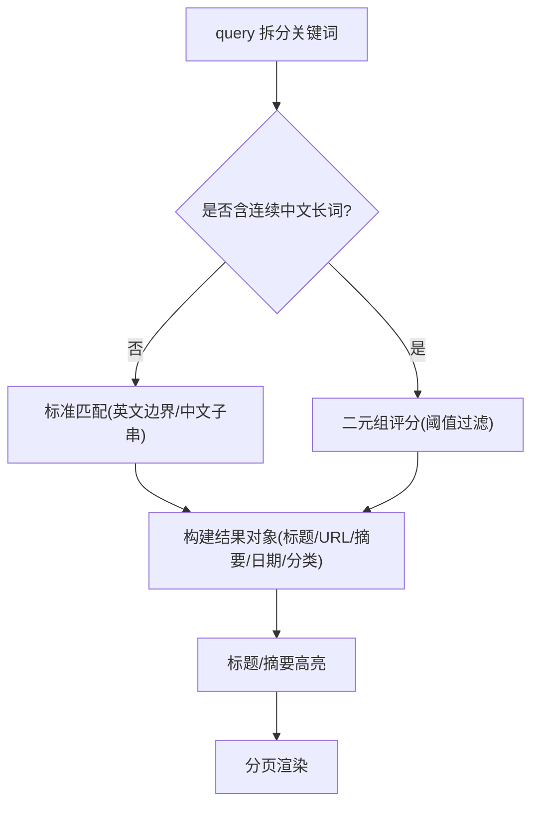
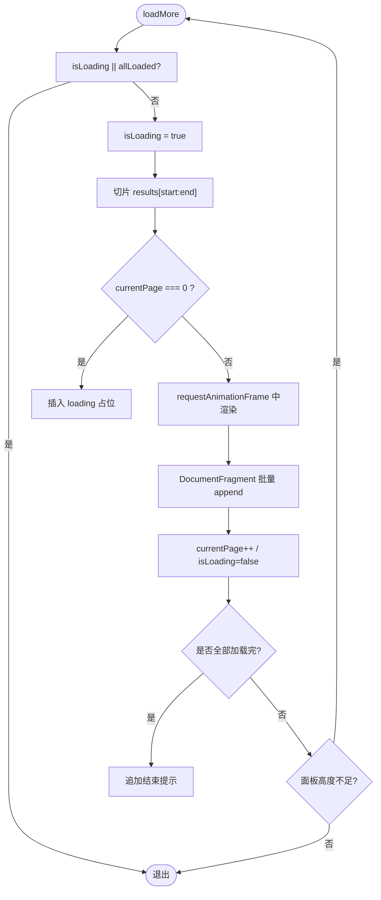
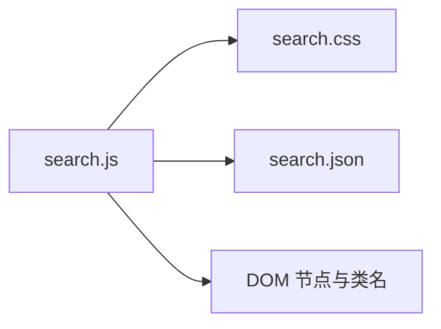

# 搜索界面交互

<cite>
**本文引用的文件**
- [assets/js/search.js](file://assets/js/search.js)
- [assets/css/search.css](file://assets/css/search.css)
- [search.json](file://search.json)
</cite>

## 目录
1. [简介](#简介)
2. [项目结构](#项目结构)
3. [核心组件](#核心组件)
4. [架构总览](#架构总览)
5. [详细组件分析](#详细组件分析)
6. [依赖关系分析](#依赖关系分析)
7. [性能考量](#性能考量)
8. [故障排除指南](#故障排除指南)
9. [结论](#结论)
10. [附录：样式定制与响应式适配](#附录样式定制与响应式适配)

## 简介
本技术文档围绕站点的全屏搜索弹窗实现，系统性说明以下要点：
- 全屏弹窗的打开/关闭动画、背景滚动锁定与恢复、滚动位置保存与还原
- 主搜索框与弹窗内输入框的双向同步机制、字符计数器更新逻辑
- 键盘事件处理（ESC 关闭、Tab/Enter 聚焦触发）
- 结果列表的分页加载与无限滚动触发条件、DOM 操作优化策略
- 搜索界面的样式定制方法与响应式适配方案
- 用户体验优化最佳实践与常见问题排查

## 项目结构
搜索功能由三部分组成：
- 前端交互脚本：负责弹窗生命周期、输入同步、搜索执行、分页渲染等
- 样式表：定义搜索容器、弹窗、结果项、暗色模式与移动端适配
- 静态索引：Jekyll 构建时生成的文章摘要 JSON，供前端本地检索

图表来源
- [assets/js/search.js:1-573](file://assets/js/search.js#L1-L573)
- [assets/css/search.css:477-727](file://assets/css/search.css#L477-L727)
- [search.json:1-13](file://search.json#L1-L13)

章节来源
- [assets/js/search.js:1-573](file://assets/js/search.js#L1-L573)
- [assets/css/search.css:477-727](file://assets/css/search.css#L477-L727)
- [search.json:1-13](file://search.json#L1-L13)

## 核心组件
- 搜索索引加载与去重
  - 页面初始化时预拉取 search.json，并基于 URL 字段进行去重，避免重复条目影响后续匹配与展示。
- 全屏弹窗控制
  - 通过类名切换实现淡入淡出；打开时固定 body 以锁定背景滚动，同时记录 window.scrollY，关闭时恢复滚动位置并移除固定定位。
- 双向输入同步
  - 主搜索框与弹窗内输入框互相赋值，统一通过 updateCharCount 更新两处字符计数显示。
- 搜索算法
  - 英文关键词使用单词边界匹配，中文采用子串匹配；当出现连续中文长词时启用二元组模糊评分，阈值过滤后纳入结果集。
- 结果渲染与分页
  - 首屏加载显示“加载中”，随后按 PAGE_SIZE 分批追加到结果面板；滚动到底部自动加载更多；全部加载完成后显示结束提示。
- 键盘与点击交互
  - ESC 关闭弹窗；点击遮罩且无文本选中时关闭；Tab/Enter 聚焦主搜索框时打开弹窗并聚焦弹窗内输入框。

章节来源
- [assets/js/search.js:28-37](file://assets/js/search.js#L28-L37)
- [assets/js/search.js:147-192](file://assets/js/search.js#L147-L192)
- [assets/js/search.js:113-145](file://assets/js/search.js#L113-L145)
- [assets/js/search.js:225-311](file://assets/js/search.js#L225-L311)
- [assets/js/search.js:325-401](file://assets/js/search.js#L325-L401)
- [assets/js/search.js:414-484](file://assets/js/search.js#L414-L484)
- [assets/js/search.js:518-522](file://assets/js/search.js#L518-L522)

## 架构总览
下图展示了从用户输入到结果展示的完整调用链，包括索引预加载、防抖搜索、结果分页与滚动监听。

图表来源
- [assets/js/search.js:113-145](file://assets/js/search.js#L113-L145)
- [assets/js/search.js:147-192](file://assets/js/search.js#L147-L192)
- [assets/js/search.js:219-223](file://assets/js/search.js#L219-L223)
- [assets/js/search.js:325-401](file://assets/js/search.js#L325-L401)
- [assets/js/search.js:414-484](file://assets/js/search.js#L414-L484)
- [assets/js/search.js:531-559](file://assets/js/search.js#L531-L559)

## 详细组件分析

### 全屏弹窗与滚动锁定
- 打开流程
  - 为结果容器添加 open 类，触发 CSS 透明度与可见性过渡
  - 记录当前滚动位置，将 body 设置为 fixed 并设置 top 为负滚动值，从而锁定背景滚动
  - 计算系统滚动条宽度并写入 body padding-right，避免布局抖动
  - 确保弹窗内搜索栏存在，并将主搜索框的值同步至弹窗输入框，focus 并移动光标到末尾
  - 设置打开保护标记，防止刚打开时焦点事件误触关闭
- 关闭流程
  - 移除 open 类，恢复 body 定位与滚动条宽度
  - 使用 scrollTo 恢复到打开前的滚动位置
  - 主动 blur 当前焦点元素，避免浏览器自动滚动导致页面跳动

图表来源
- [assets/js/search.js:147-175](file://assets/js/search.js#L147-L175)
- [assets/js/search.js:177-192](file://assets/js/search.js#L177-L192)

章节来源
- [assets/js/search.js:147-192](file://assets/js/search.js#L147-L192)

### 输入框双向同步与字符计数
- 主搜索框 input 事件
  - 防抖后根据内容是否为空决定是否清空结果面板
  - 若不为空，在索引可用时执行 performSearch，否则先拉取索引再执行
  - 调用 updateCharCount 更新头部与弹窗内的字符计数
- 弹窗内输入框 input 事件
  - 将值回写到主搜索框，保持两端一致
  - 同样执行防抖搜索与字符计数更新
- 字符计数
  - 统一通过 updateCharCount 更新两处计数显示，最大长度受 MAX_QUERY_LEN 限制

图表来源
- [assets/js/search.js:113-145](file://assets/js/search.js#L113-L145)
- [assets/js/search.js:531-559](file://assets/js/search.js#L531-L559)
- [assets/js/search.js:524-529](file://assets/js/search.js#L524-L529)

章节来源
- [assets/js/search.js:113-145](file://assets/js/search.js#L113-L145)
- [assets/js/search.js:531-559](file://assets/js/search.js#L531-L559)
- [assets/js/search.js:524-529](file://assets/js/search.js#L524-L529)

### 键盘与点击交互
- ESC 键关闭
  - 全局 keydown 监听，当弹窗处于打开状态且按下 Escape 时关闭
- 点击遮罩关闭
  - mousedown 记录是否在遮罩上按下，click 时判断目标为遮罩且非刚打开的保护期，且无选中文本时关闭
- 聚焦触发打开
  - 主输入框 focus 时打开弹窗并聚焦弹窗内输入框；mousedown 时 preventDefault 以避免鼠标选择文字导致的意外行为

图表来源
- [assets/js/search.js:212-217](file://assets/js/search.js#L212-L217)
- [assets/js/search.js:194-205](file://assets/js/search.js#L194-L205)
- [assets/js/search.js:518-522](file://assets/js/search.js#L518-L522)

章节来源
- [assets/js/search.js:212-217](file://assets/js/search.js#L212-L217)
- [assets/js/search.js:194-205](file://assets/js/search.js#L194-L205)
- [assets/js/search.js:518-522](file://assets/js/search.js#L518-L522)

### 搜索算法与高亮/摘要
- 匹配策略
  - 英文关键词：使用单词边界正则匹配
  - 中文关键词：子串匹配
  - 当查询包含连续中文长词时，对关键词做二元组切分，统计命中比例超过阈值的结果纳入
- 高亮与摘要
  - 标题与摘要片段均支持多关键词高亮
  - 摘要优先围绕首个命中位置截取，兼顾前后上下文，超长片段以省略号包裹

图表来源
- [assets/js/search.js:225-311](file://assets/js/search.js#L225-L311)
- [assets/js/search.js:325-401](file://assets/js/search.js#L325-L401)
- [assets/js/search.js:403-412](file://assets/js/search.js#L403-L412)

章节来源
- [assets/js/search.js:225-311](file://assets/js/search.js#L225-L311)
- [assets/js/search.js:325-401](file://assets/js/search.js#L325-L401)
- [assets/js/search.js:403-412](file://assets/js/search.js#L403-L412)

### 结果分页与无限滚动
- 分页参数
  - PAGE_SIZE 控制每批渲染数量，currentPage 跟踪当前批次，allLoaded 标记是否全部加载完毕
- 滚动监听
  - 结果面板内部绑定 scroll 事件，当 scrollTop + clientHeight 接近 scrollHeight 时触发 loadMore
- 渲染优化
  - 使用 DocumentFragment 批量插入节点，减少重排重绘
  - 首屏加载显示“加载中”占位，结束后移除
  - 全部加载完成后追加“已加载全部 N 篇”提示
  - 若内容未填满面板，自动继续加载下一页直至填满或耗尽

图表来源
- [assets/js/search.js:414-484](file://assets/js/search.js#L414-L484)
- [assets/js/search.js:41-59](file://assets/js/search.js#L41-L59)

章节来源
- [assets/js/search.js:41-59](file://assets/js/search.js#L41-L59)
- [assets/js/search.js:414-484](file://assets/js/search.js#L414-L484)

### 样式与主题
- 设计令牌
  - 通过 :root 变量集中管理颜色、圆角、阴影、字体与过渡时长，便于统一换肤
- 暗色模式
  - 使用 prefers-color-scheme 媒体查询覆盖令牌，自动适配系统深色偏好
- 搜索弹窗样式
  - 全屏固定定位容器，默认透明不可见，open 类驱动透明度与可见性过渡
  - 结果面板 sticky 顶部输入区，滚动区域自定义滚动条样式
  - 小屏下弹窗铺满视口，关闭按钮尺寸与位置自适应

章节来源
- [assets/css/search.css:7-58](file://assets/css/search.css#L7-L58)
- [assets/css/search.css:477-727](file://assets/css/search.css#L477-L727)

## 依赖关系分析
- 模块耦合
  - search.js 强依赖 DOM 结构与 CSS 类名（如 .search-results.open、.search-results-panel），以及 search.json 的数据结构（title/url/content/categories/date）
- 外部依赖
  - 仅使用原生 Web API（fetch、addEventListener、requestAnimationFrame、getSelection 等），无第三方库
- 潜在循环依赖
  - 无循环引用；所有函数均为自包含逻辑并通过闭包组织

图表来源
- [assets/js/search.js:1-573](file://assets/js/search.js#L1-L573)
- [assets/css/search.css:477-727](file://assets/css/search.css#L477-L727)
- [search.json:1-13](file://search.json#L1-L13)

章节来源
- [assets/js/search.js:1-573](file://assets/js/search.js#L1-L573)
- [assets/css/search.css:477-727](file://assets/css/search.css#L477-L727)
- [search.json:1-13](file://search.json#L1-L13)

## 性能考量
- 索引预加载
  - 页面初始化即拉取 search.json 并缓存，避免首次输入时的等待延迟
- 防抖搜索
  - 输入事件统一 200ms 防抖，降低频繁搜索带来的 CPU 压力
- 批量 DOM 操作
  - 使用 DocumentFragment 一次性插入多条结果，减少重排重绘
- 滚动节流
  - 仅在滚动接近底部时触发加载，避免不必要的计算
- 动画与过渡
  - 使用 CSS transition 控制弹窗显隐与面板清除动画，GPU 友好
- 内存与清理
  - 关闭弹窗时清空结果面板内容，释放 DOM 引用，避免长时间占用内存

[本节为通用性能建议，不直接分析具体文件]

## 故障排除指南
- 无法加载搜索索引
  - 现象：面板显示“无法加载搜索索引”
  - 排查：确认 search.json 路径可访问、CORS 与 MIME 类型正确；检查网络请求是否成功
  - 相关代码位置：[assets/js/search.js:127-137](file://assets/js/search.js#L127-L137)、[assets/js/search.js:501-510](file://assets/js/search.js#L501-L510)、[assets/js/search.js:544-554](file://assets/js/search.js#L544-L554)
- 弹窗打开后背景仍可滚动
  - 现象：打开弹窗后页面仍可滚动
  - 排查：确认 body 的 position/top/width/paddingRight 是否正确设置与恢复
  - 相关代码位置：[assets/js/search.js:154-161](file://assets/js/search.js#L154-L161)、[assets/js/search.js:182-187](file://assets/js/search.js#L182-L187)
- 点击遮罩未关闭或误关闭
  - 现象：点击遮罩无效或误关闭
  - 排查：检查 mousedown/click 目标判定与选中文本检测逻辑；确认 _openOverlayGuard 保护期
  - 相关代码位置：[assets/js/search.js:194-205](file://assets/js/search.js#L194-L205)
- 滚动位置恢复异常
  - 现象：关闭弹窗后页面滚动位置不正确
  - 排查：确认 _scrollY 记录时机与 scrollTo 行为；避免在关闭前再次修改滚动位置
  - 相关代码位置：[assets/js/search.js:154-155](file://assets/js/search.js#L154-L155)、[assets/js/search.js:187](file://assets/js/search.js#L187)
- 结果未分页或一次性渲染过多
  - 现象：大量结果一次性渲染导致卡顿
  - 排查：确认 PAGE_SIZE 与 loadMore 触发条件；检查面板高度判断逻辑
  - 相关代码位置：[assets/js/search.js:414-484](file://assets/js/search.js#L414-L484)

章节来源
- [assets/js/search.js:127-137](file://assets/js/search.js#L127-L137)
- [assets/js/search.js:154-161](file://assets/js/search.js#L154-L161)
- [assets/js/search.js:182-187](file://assets/js/search.js#L182-L187)
- [assets/js/search.js:194-205](file://assets/js/search.js#L194-L205)
- [assets/js/search.js:414-484](file://assets/js/search.js#L414-L484)

## 结论
该搜索界面通过纯前端实现，具备完善的弹窗体验、输入同步、键盘交互、智能匹配与分页渲染能力。借助设计令牌与媒体查询，实现了良好的主题化与响应式适配。整体架构简洁、依赖最小化，易于维护与扩展。

[本节为总结性内容，不直接分析具体文件]

## 附录：样式定制与响应式适配
- 主题定制
  - 通过修改 :root 中的颜色、圆角、阴影、字体与过渡时长即可全局换肤
  - 暗色模式通过 prefers-color-scheme 自动生效，无需额外开关
- 搜索弹窗样式
  - 调整 .search-results 的 z-index、背景透明度与过渡时长可改变弹窗层级与动效
  - 调整 .search-results-panel 的最大高度与圆角，可改变结果面板形态
  - 调整 .search-overlay-input 的粘性定位与边框，可改变输入区外观
- 小屏适配
  - 在 max-width: 600px 下，弹窗铺满视口，关闭按钮尺寸缩小，输入区与面板圆角归零以获得更好的沉浸体验
- 无障碍与可用性
  - 提供 ESC 关闭、点击遮罩关闭、聚焦自动打开等多通道交互，提升可访问性与易用性

章节来源
- [assets/css/search.css:7-58](file://assets/css/search.css#L7-L58)
- [assets/css/search.css:477-727](file://assets/css/search.css#L477-L727)