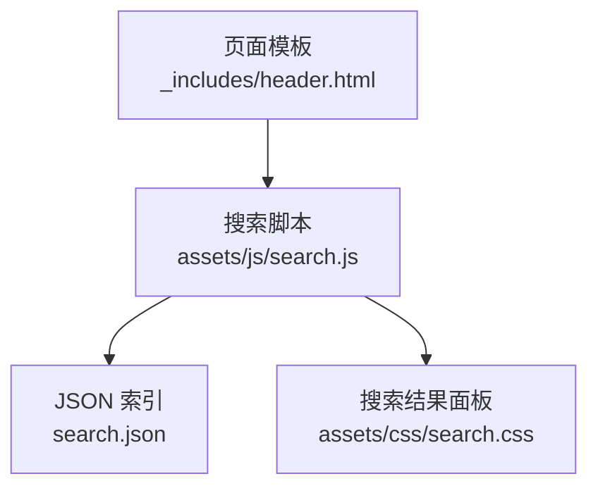
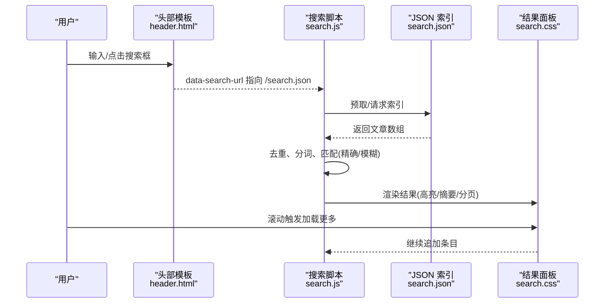
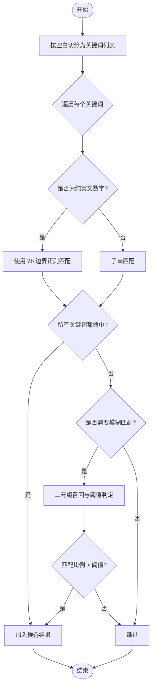
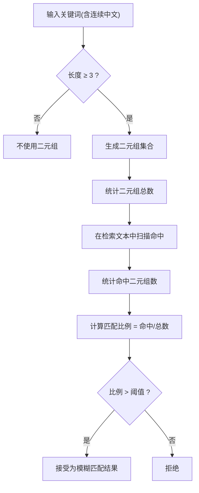
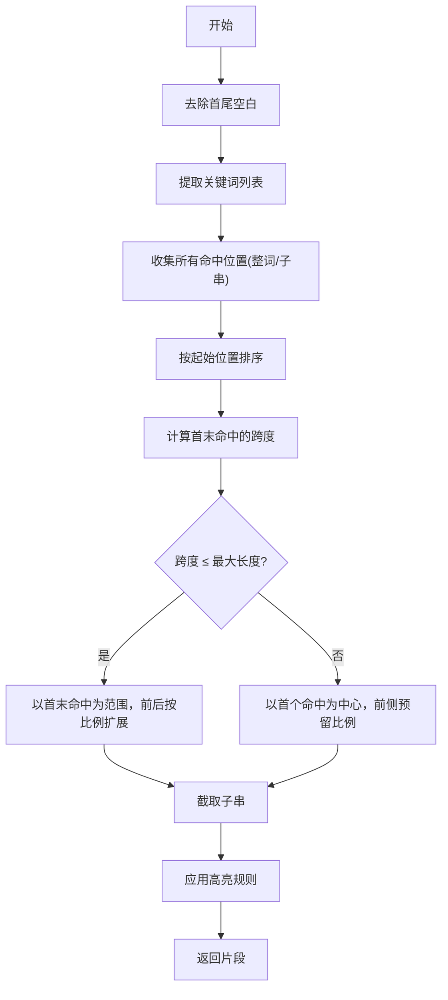
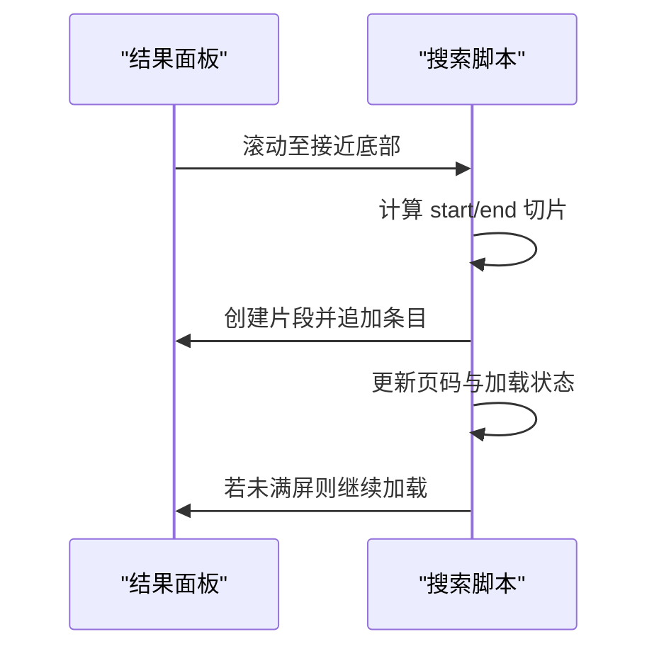
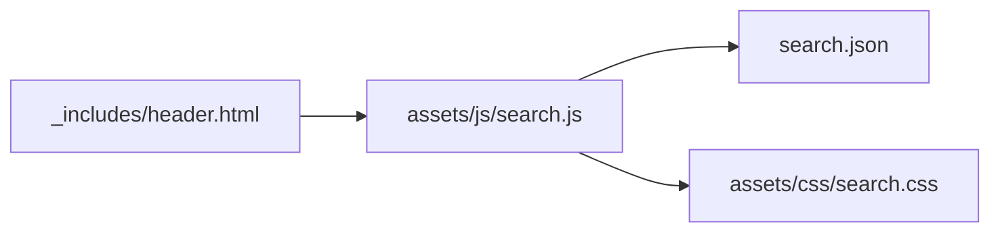

# 搜索算法实现

<cite>
**本文引用的文件**
- [assets/js/search.js](file://assets/js/search.js)
- [search.json](file://search.json)
- [assets/css/search.css](file://assets/css/search.css)
- [_includes/header.html](file://_includes/header.html)
</cite>

## 目录
1. [简介](#简介)
2. [项目结构](#项目结构)
3. [核心组件](#核心组件)
4. [架构总览](#架构总览)
5. [详细组件分析](#详细组件分析)
6. [依赖关系分析](#依赖关系分析)
7. [性能考量](#性能考量)
8. [故障排查指南](#故障排查指南)
9. [结论](#结论)
10. [附录](#附录)

## 简介
本技术文档围绕客户端全文搜索的实现，系统性说明关键词匹配逻辑、中英文混合搜索处理、模糊匹配策略与评分排序机制。重点包括：
- 英文单词边界匹配（\b 正则）与中文子串匹配策略
- 二元组分词算法用于中文模糊搜索
- 结果高亮与摘要片段生成
- 分页加载与滚动触发的性能优化
- 自定义扩展点与调试方法
- 搜索精度调优与性能监控建议

## 项目结构
搜索功能由以下关键文件组成：
- 前端脚本：负责索引预取、查询解析、匹配与渲染
- 站点模板：提供搜索输入框与数据源 URL
- 构建产物：Jekyll 在构建期生成的 JSON 索引
- 样式表：弹窗、列表、高亮等 UI 样式

图表来源
- [_includes/header.html:1-11](file://_includes/header.html#L1-L11)
- [assets/js/search.js:1-20](file://assets/js/search.js#L1-L20)
- [search.json:1-13](file://search.json#L1-L13)
- [assets/css/search.css:477-509](file://assets/css/search.css#L477-L509)

章节来源
- [_includes/header.html:1-11](file://_includes/header.html#L1-L11)
- [assets/js/search.js:1-20](file://assets/js/search.js#L1-L20)
- [search.json:1-13](file://search.json#L1-L13)
- [assets/css/search.css:477-509](file://assets/css/search.css#L477-L509)

## 核心组件
- 索引预取与去重
  - 页面加载时预取 search.json，并在内存中按 URL 去重，避免重复项影响后续匹配与展示。
- 查询解析与分词
  - 将用户输入按空白分割为多个关键词；对纯英文数字组合识别为“整词”，需要单词边界匹配；其余作为子串匹配。
- 精确匹配与模糊匹配
  - 精确匹配：所有关键词均命中才纳入候选；英文使用 \b 边界，中文使用子串。
  - 模糊匹配：当存在连续中文（≥3 个字符）时，采用二元组召回并计算匹配比例阈值。
- 结果高亮与摘要
  - 标题与内容片段进行高亮；根据命中位置选择最佳上下文窗口，兼顾关键词密度与可读性。
- 分页与懒加载
  - 固定每页条数，滚动到底部自动加载更多，减少首屏渲染压力。

章节来源
- [assets/js/search.js:28-37](file://assets/js/search.js#L28-L37)
- [assets/js/search.js:229-240](file://assets/js/search.js#L229-L240)
- [assets/js/search.js:242-252](file://assets/js/search.js#L242-L252)
- [assets/js/search.js:254-311](file://assets/js/search.js#L254-L311)
- [assets/js/search.js:313-323](file://assets/js/search.js#L313-L323)
- [assets/js/search.js:325-401](file://assets/js/search.js#L325-L401)
- [assets/js/search.js:414-484](file://assets/js/search.js#L414-L484)

## 架构总览
整体流程：用户在输入框键入或点击打开弹窗后，脚本从 search.json 拉取索引（若未缓存），执行匹配与排序，渲染到全屏弹窗的结果面板，支持滚动加载更多。

图表来源
- [_includes/header.html:5-7](file://_includes/header.html#L5-L7)
- [assets/js/search.js:219-223](file://assets/js/search.js#L219-L223)
- [assets/js/search.js:325-401](file://assets/js/search.js#L325-L401)
- [assets/js/search.js:414-484](file://assets/js/search.js#L414-L484)
- [assets/css/search.css:477-509](file://assets/css/search.css#L477-L509)

## 详细组件分析

### 关键词匹配与中英文混合处理
- 英文单词边界匹配
  - 通过判断关键词是否仅包含字母与数字，决定使用 \b 边界正则进行大小写不敏感匹配，确保“word”不会误匹配“words”。
- 中文子串匹配
  - 非整词关键词直接进行小写化后的子串查找，适用于中文短语或任意字符序列。
- 多关键词组合
  - 以空格分隔的多个关键词需全部命中才进入候选集，提升相关性。

图表来源
- [assets/js/search.js:229-240](file://assets/js/search.js#L229-L240)
- [assets/js/search.js:325-367](file://assets/js/search.js#L325-L367)
- [assets/js/search.js:313-323](file://assets/js/search.js#L313-L323)

章节来源
- [assets/js/search.js:229-240](file://assets/js/search.js#L229-L240)
- [assets/js/search.js:325-367](file://assets/js/search.js#L325-L367)

### 二元组分词与模糊搜索
- 二元组生成
  - 针对连续中文（≥3 个字符）的关键词，滑动窗口生成长度为 2 的子串集合。
- 模糊评分
  - 统计二元组总数与命中数量，计算匹配比例；超过阈值则纳入结果。
- 适用场景
  - 对中文拼写近似、漏字或多字的情况有一定容错能力。

图表来源
- [assets/js/search.js:313-323](file://assets/js/search.js#L313-L323)
- [assets/js/search.js:350-366](file://assets/js/search.js#L350-L366)

章节来源
- [assets/js/search.js:313-323](file://assets/js/search.js#L313-L323)
- [assets/js/search.js:350-366](file://assets/js/search.js#L350-L366)

### 结果高亮与摘要片段
- 高亮策略
  - 将各关键词转换为正则模式（整词加 \b，非整词直接子串），一次性替换为高亮标签，保证标题与片段一致。
- 摘要窗口选择
  - 收集所有命中位置，按起始索引排序；若跨度小于最大长度，则以第一个命中为中心向两侧扩展，保持关键词靠前；否则以首个命中为主窗口，前侧预留一定比例空间，提升可读性。
- 输出格式
  - 返回带高亮的 HTML 片段，便于直接插入 DOM。

图表来源
- [assets/js/search.js:242-252](file://assets/js/search.js#L242-L252)
- [assets/js/search.js:254-311](file://assets/js/search.js#L254-L311)

章节来源
- [assets/js/search.js:242-252](file://assets/js/search.js#L242-L252)
- [assets/js/search.js:254-311](file://assets/js/search.js#L254-L311)

### 分页加载与滚动触发
- 分页参数
  - 固定每页显示条数，维护当前页码与是否已加载完毕状态。
- 滚动监听
  - 在结果面板内监听滚动事件，当接近底部时触发下一页加载。
- 渲染优化
  - 使用 DocumentFragment 批量插入节点，减少重排重绘；首次加载显示“加载中”，末尾显示“已加载全部”。

图表来源
- [assets/js/search.js:414-484](file://assets/js/search.js#L414-L484)

章节来源
- [assets/js/search.js:414-484](file://assets/js/search.js#L414-L484)

### 搜索结果评分与排序机制
- 当前实现
  - 精确匹配优先：只要所有关键词命中即纳入结果。
  - 模糊匹配辅助：对含长中文的关键词，使用二元组匹配比例阈值筛选。
  - 排序策略：当前未实现显式相关性打分与排序，结果顺序取决于索引遍历顺序。
- 可扩展方向
  - 引入加权评分：标题命中权重高于正文；命中次数、距离开头远近、关键词密度可参与评分。
  - 引入 TF-IDF 或 BM25 思想：基于词频与逆文档频率调整得分。
  - 引入时间衰减：较新文章适当加分。
  - 引入类别/标签权重：特定分类命中加分。

章节来源
- [assets/js/search.js:325-401](file://assets/js/search.js#L325-L401)

### 搜索索引构建与预处理
- 构建阶段
  - Jekyll 在构建期遍历 posts，清理代码块与 HTML 标签，生成扁平化的 JSON 数组，包含标题、URL、内容、分类与日期。
- 内容清洗
  - 移除 <pre> 代码块与 HTML 标签，降低噪声，提高匹配质量。
- 字段拼接
  - 前端将标题与内容拼接为统一检索文本，统一小写化处理后再进行匹配。

章节来源
- [search.json:1-13](file://search.json#L1-L13)
- [assets/js/search.js:335-338](file://assets/js/search.js#L335-L338)

## 依赖关系分析
- 模块耦合
  - header.html 仅提供输入框与索引 URL，无业务逻辑，低耦合。
  - search.js 依赖 search.json 的数据结构与 header.html 的 DOM 元素。
  - search.css 仅负责样式，不影响逻辑。
- 外部依赖
  - 浏览器原生 API：fetch、DOM API、正则表达式。
  - 无第三方库依赖，利于轻量部署与维护。

图表来源
- [_includes/header.html:5-7](file://_includes/header.html#L5-L7)
- [assets/js/search.js:1-20](file://assets/js/search.js#L1-L20)
- [search.json:1-13](file://search.json#L1-L13)
- [assets/css/search.css:477-509](file://assets/css/search.css#L477-L509)

章节来源
- [_includes/header.html:5-7](file://_includes/header.html#L5-L7)
- [assets/js/search.js:1-20](file://assets/js/search.js#L1-L20)
- [search.json:1-13](file://search.json#L1-L13)
- [assets/css/search.css:477-509](file://assets/css/search.css#L477-L509)

## 性能考量
- 索引预取与缓存
  - 页面加载时预取索引，避免首次交互延迟；内存中按 URL 去重，减少无效匹配。
- 防抖与节流
  - 输入事件使用定时器延迟执行，降低频繁搜索带来的 CPU 压力。
- 渲染优化
  - 使用 DocumentFragment 批量插入；仅在必要时清空面板并带动画过渡，避免抖动。
- 分页与懒加载
  - 固定 PAGE_SIZE，滚动到底部再加载，控制首屏渲染成本。
- 正则与字符串操作
  - 整词匹配使用 \b 边界，避免全量扫描；中文子串使用 indexOf 循环查找，复杂度与文本长度线性相关。
- 建议优化
  - 对超长内容可截断或分段检索；对高频关键词可建立倒排索引（进阶）。
  - 对大索引可考虑压缩传输与增量更新。

章节来源
- [assets/js/search.js:219-223](file://assets/js/search.js#L219-L223)
- [assets/js/search.js:28-37](file://assets/js/search.js#L28-L37)
- [assets/js/search.js:414-484](file://assets/js/search.js#L414-L484)
- [assets/js/search.js:229-240](file://assets/js/search.js#L229-L240)

## 故障排查指南
- 无法加载搜索索引
  - 现象：面板显示错误提示。
  - 排查：确认 /search.json 路径可达、CORS 允许、Jekyll 构建产物存在。
- 匹配不准确
  - 现象：英文单词被部分匹配或中文短语未命中。
  - 排查：检查关键词是否为整词、正则转义是否正确、大小写处理是否符合预期。
- 中文模糊匹配效果不佳
  - 现象：长中文短语命中率低。
  - 排查：调整二元组阈值或增加分词粒度；检查连续中文检测条件。
- 性能问题
  - 现象：输入卡顿或结果渲染缓慢。
  - 排查：增大防抖间隔、减小 PAGE_SIZE、缩短摘要长度、减少高亮正则复杂度。

章节来源
- [assets/js/search.js:127-141](file://assets/js/search.js#L127-L141)
- [assets/js/search.js:501-515](file://assets/js/search.js#L501-L515)
- [assets/js/search.js:543-558](file://assets/js/search.js#L543-L558)

## 结论
该搜索实现以轻量、易维护为目标，在前端完成索引预取、关键词解析、精确与模糊匹配、高亮与摘要、分页渲染等核心流程。通过二元组模糊匹配提升中文容错能力，结合正则边界匹配保障英文准确性。当前未实现显式相关性评分与排序，但提供了清晰的扩展点，便于后续引入更复杂的评分模型与索引结构以提升搜索质量与性能。

## 附录

### 自定义扩展方法
- 新增评分维度
  - 在结果对象中加入 score 字段，依据标题命中、命中次数、距离开头远近、分类权重等进行加权计算，并对结果按分数降序排列。
- 增强分词
  - 对中文引入更细粒度的分词器（如词典+N-gram），替代简单的二元组，提高召回率。
- 高级过滤
  - 支持按分类、日期范围、作者等元数据进行过滤，提升精准度。
- 异步与并发
  - 对超大索引可采用分片加载与并行请求，结合 Web Worker 进行后台匹配。

章节来源
- [assets/js/search.js:325-401](file://assets/js/search.js#L325-L401)
- [assets/js/search.js:313-323](file://assets/js/search.js#L313-L323)

### 调试工具使用指南
- 控制台日志
  - 在 performSearch 与 makeResult 处添加日志，观察关键词拆分、匹配过程与结果数量。
- 网络面板
  - 检查 /search.json 的请求与响应，确认内容与结构符合预期。
- 性能面板
  - 使用 Performance 记录输入到渲染的时间线，定位瓶颈（正则构造、DOM 操作、滚动监听）。
- 单元测试思路
  - 对 keywordMatches、chineseBigrams、getSnippet 编写用例，覆盖边界情况（空输入、特殊字符、超长文本）。

章节来源
- [assets/js/search.js:325-401](file://assets/js/search.js#L325-L401)
- [assets/js/search.js:229-240](file://assets/js/search.js#L229-L240)
- [assets/js/search.js:254-311](file://assets/js/search.js#L254-L311)

### 搜索精度调优与性能监控
- 精度调优
  - 调整二元组阈值（例如 0.4）以平衡召回与准确率；对长中文短语启用更严格的分词策略。
  - 引入标题权重与命中位置权重，使更相关的结果靠前。
- 性能监控
  - 统计每次搜索耗时、匹配条目数、渲染帧率；对慢查询进行采样分析。
  - 监控索引体积与传输大小，必要时启用压缩与增量更新。

章节来源
- [assets/js/search.js:350-366](file://assets/js/search.js#L350-L366)
- [assets/js/search.js:414-484](file://assets/js/search.js#L414-L484)