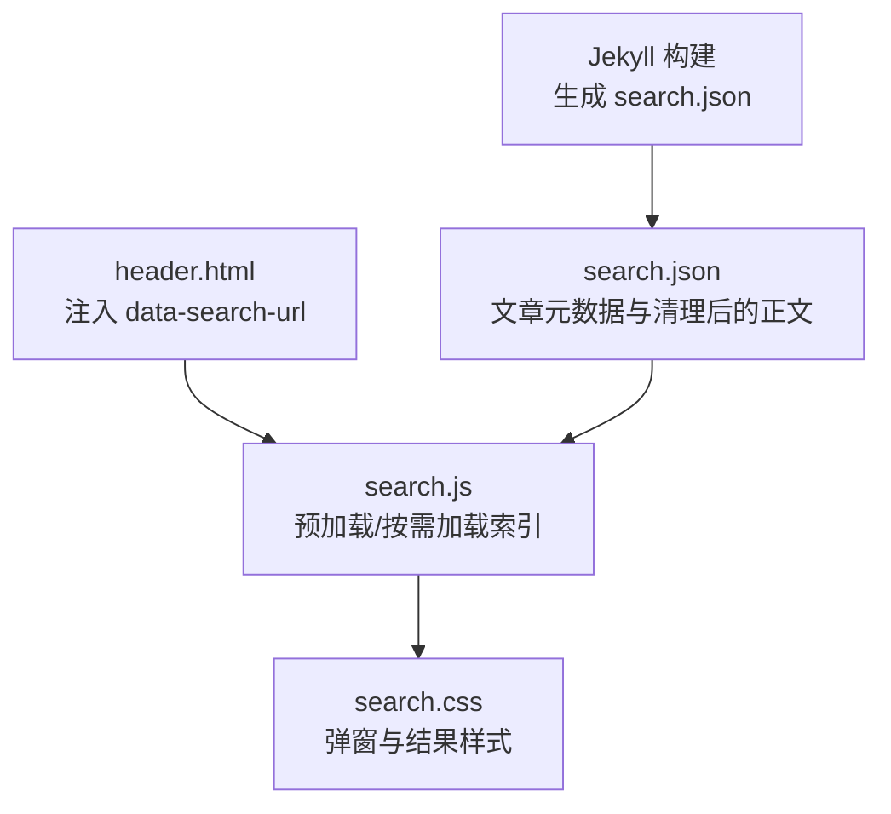
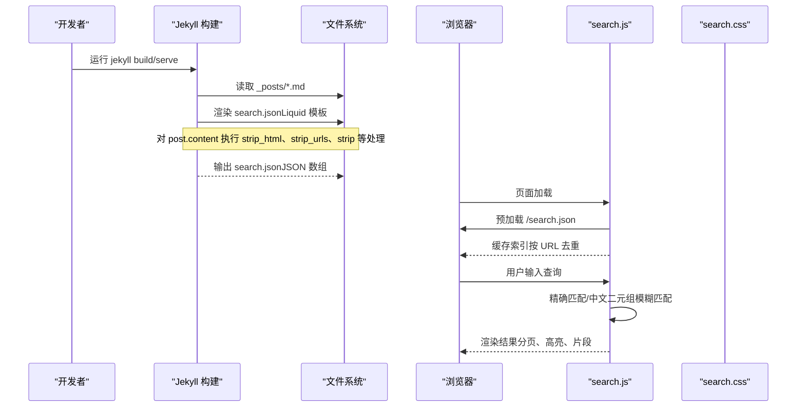
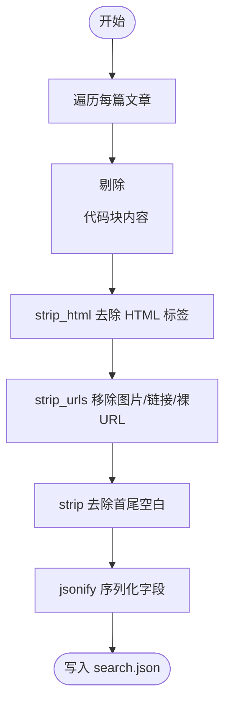
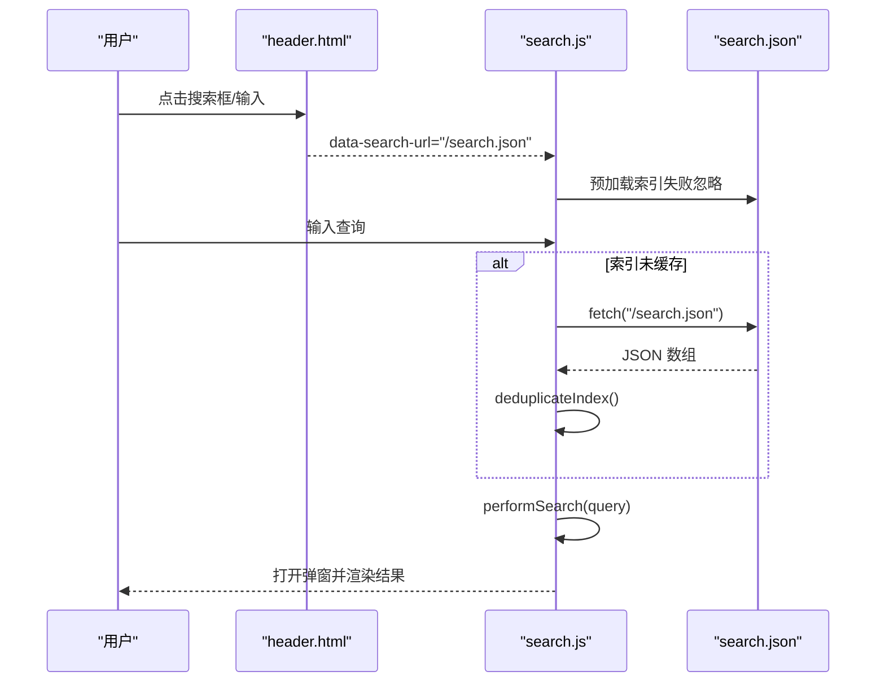
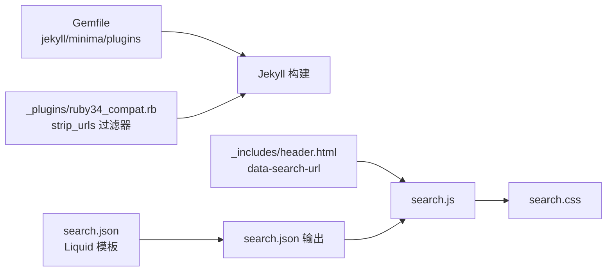

# 搜索索引生成

<cite>
**本文引用的文件**   
- [search.json](file://search.json)
- [_plugins/ruby34_compat.rb](file://_plugins/ruby34_compat.rb)
- [assets/js/search.js](file://assets/js/search.js)
- [assets/css/search.css](file://assets/css/search.css)
- [_includes/header.html](file://_includes/header.html)
- [_config.yml](file://_config.yml)
- [Gemfile](file://Gemfile)
- [README.md](file://README.md)
</cite>

## 目录
1. [简介](#简介)
2. [项目结构](#项目结构)
3. [核心组件](#核心组件)
4. [架构总览](#架构总览)
5. [详细组件分析](#详细组件分析)
6. [依赖关系分析](#依赖关系分析)
7. [性能与优化](#性能与优化)
8. [故障排查指南](#故障排查指南)
9. [结论](#结论)
10. [附录：扩展与自定义](#附录扩展与自定义)

## 简介
本技术文档聚焦于站点“搜索索引”的生成与使用，围绕 search.json 的结构、Jekyll 构建时的内容预处理、前端搜索逻辑、去重机制与性能优化策略展开。同时提供自定义索引字段与扩展开发的指导，并给出文件大小优化与缓存策略建议。

## 项目结构
搜索功能由三部分构成：
- 服务端（Jekyll）：在构建时生成 search.json 静态索引文件
- 客户端（浏览器）：加载 search.json，执行全文检索、分页展示与高亮
- 样式层：提供弹窗式搜索结果 UI

图示来源
- [search.json:1-13](file://search.json#L1-L13)
- [_includes/header.html:1-10](file://_includes/header.html#L1-L10)
- [assets/js/search.js:1-60](file://assets/js/search.js#L1-L60)
- [assets/css/search.css:477-560](file://assets/css/search.css#L477-L560)

章节来源
- [README.md:26-62](file://README.md#L26-L62)
- [_config.yml:35-45](file://_config.yml#L35-L45)

## 核心组件
- Jekyll 模板：search.json 负责遍历所有文章，提取标题、URL、分类、日期，并对正文进行 HTML 标签去除、链接与图片清理、空白规范化处理，最终输出 JSON 数组。
- Liquid 过滤器：strip_urls 用于移除 Markdown 图片、链接以及裸 URL，避免冗余信息进入索引。
- 前端脚本：search.js 负责预加载索引、按关键词匹配（英文单词边界 + 中文子串）、中文二元组模糊匹配、片段截取与高亮、分页加载与去重。
- 样式：search.css 定义搜索框、弹窗、结果列表等视觉表现。

章节来源
- [search.json:1-13](file://search.json#L1-L13)
- [_plugins/ruby34_compat.rb:9-21](file://_plugins/ruby34_compat.rb#L9-L21)
- [assets/js/search.js:28-37](file://assets/js/search.js#L28-L37)
- [assets/js/search.js:225-252](file://assets/js/search.js#L225-L252)
- [assets/js/search.js:313-323](file://assets/js/search.js#L313-L323)
- [assets/js/search.js:325-401](file://assets/js/search.js#L325-L401)
- [assets/css/search.css:402-471](file://assets/css/search.css#L402-L471)

## 架构总览
从构建到运行的端到端流程如下：

图示来源
- [search.json:1-13](file://search.json#L1-L13)
- [_plugins/ruby34_compat.rb:9-21](file://_plugins/ruby34_compat.rb#L9-L21)
- [assets/js/search.js:219-223](file://assets/js/search.js#L219-L223)
- [assets/js/search.js:325-401](file://assets/js/search.js#L325-L401)

## 详细组件分析

### 1) search.json 结构与生成机制
- 数据结构
  - 根节点为 JSON 数组，每个元素代表一篇文章
  - 字段说明
    - title：文章标题
    - url：拼接 baseurl 后的文章地址
    - content：清理后的纯文本正文
    - categories：文章分类数组
    - date：格式化后的日期字符串
- 生成流程
  - 遍历 site.posts
  - 对 post.content 进行预处理：
    - 先通过 split/slice 方式剔除 <pre>...</pre> 代码块内容，减少无关噪音
    - 再调用 strip_html 去除所有 HTML 标签
    - 调用 strip_urls 移除 Markdown 图片、链接与裸 URL
    - 调用 strip 去除首尾空白
  - 使用 jsonify 将各字段序列化为 JSON
- 注意事项
  - 日期格式受主题配置影响，此处固定为 YYYY-MM-DD
  - URL 会拼接站点的 baseurl，确保相对路径正确

章节来源
- [search.json:1-13](file://search.json#L1-L13)
- [_plugins/ruby34_compat.rb:9-21](file://_plugins/ruby34_compat.rb#L9-L21)
- [_config.yml:35-38](file://_config.yml#L35-L38)

### 2) 内容预处理与文本规范化
- 代码块过滤：通过分割 <pre> 标签，仅保留非代码块部分，降低索引体积与噪声
- HTML 清洗：strip_html 移除所有标签，只保留可见文本
- 链接与图片清理：strip_urls 移除 Markdown 图片语法、链接语法及裸 URL，避免无意义字符进入索引
- 空白规范化：strip 去除首尾空白，提升后续分词与匹配稳定性

图示来源
- [search.json:1-13](file://search.json#L1-L13)
- [_plugins/ruby34_compat.rb:9-21](file://_plugins/ruby34_compat.rb#L9-L21)

### 3) 前端搜索逻辑与交互
- 索引加载
  - 页面初始化时预加载 /search.json，失败则静默忽略
  - 首次搜索或弹窗内输入变化时，若未缓存则发起请求
- 匹配策略
  - 标准匹配：英文采用单词边界匹配，中文采用子串匹配
  - 模糊匹配：当包含连续中文字符（长度≥3）时，基于中文二元组评分，阈值 > 0.4 纳入结果
- 片段与高亮
  - 根据关键词命中位置计算最佳片段范围，默认最大长度 200
  - 对标题与片段中的关键词进行高亮（em 标签）
- 分页与去重
  - 结果按 URL 去重，防止重复条目
  - 分页大小 PAGE_SIZE=8，滚动到底部自动加载更多
- 弹窗交互
  - 打开弹窗锁定背景滚动，ESC 关闭，点击遮罩关闭（排除选中文本场景）
  - 弹窗内输入与主搜索框双向同步

图示来源
- [_includes/header.html:1-10](file://_includes/header.html#L1-L10)
- [assets/js/search.js:219-223](file://assets/js/search.js#L219-L223)
- [assets/js/search.js:28-37](file://assets/js/search.js#L28-L37)
- [assets/js/search.js:325-401](file://assets/js/search.js#L325-L401)

章节来源
- [assets/js/search.js:28-37](file://assets/js/search.js#L28-L37)
- [assets/js/search.js:225-252](file://assets/js/search.js#L225-L252)
- [assets/js/search.js:313-323](file://assets/js/search.js#L313-L323)
- [assets/js/search.js:325-401](file://assets/js/search.js#L325-L401)
- [_includes/header.html:1-10](file://_includes/header.html#L1-L10)

### 4) 去重机制
- 构建期：search.json 本身由唯一 URL 的文章生成，天然具备 URL 唯一性
- 运行期：deduplicateIndex 以 URL 为键进行去重，避免重复项；performSearch 后再次按 URL 去重，保证结果集稳定

章节来源
- [assets/js/search.js:28-37](file://assets/js/search.js#L28-L37)
- [assets/js/search.js:373-381](file://assets/js/search.js#L373-L381)

### 5) 性能特性
- 构建期
  - 代码块过滤显著降低索引体积
  - 仅保留必要字段（title/url/content/categories/date），避免冗余
- 运行期
  - 预加载索引，减少首次搜索延迟
  - 分页加载（PAGE_SIZE=8），避免一次性渲染大量 DOM
  - 中文二元组模糊匹配仅在必要时启用，控制 CPU 开销
  - 结果去重，避免重复渲染

章节来源
- [assets/js/search.js:219-223](file://assets/js/search.js#L219-L223)
- [assets/js/search.js:414-484](file://assets/js/search.js#L414-L484)
- [assets/js/search.js:325-367](file://assets/js/search.js#L325-L367)

## 依赖关系分析
- Jekyll 版本与插件
  - Gemfile 指定 jekyll 3.9 与 minima 2.5，兼容 GitHub Pages 环境
  - 启用 jekyll-sitemap、jekyll-seo-tag、jekyll-feed 插件
- 自定义插件
  - ruby34_compat.rb 提供 Ruby 3.4+ 兼容修复，并注册 strip_urls 过滤器
- 前端资源
  - header.html 注入 data-search-url 指向 /search.json
  - search.js 与 search.css 实现搜索交互与样式

图示来源
- [Gemfile:1-25](file://Gemfile#L1-L25)
- [_plugins/ruby34_compat.rb:9-21](file://_plugins/ruby34_compat.rb#L9-L21)
- [_includes/header.html:1-10](file://_includes/header.html#L1-L10)
- [search.json:1-13](file://search.json#L1-L13)

章节来源
- [Gemfile:1-25](file://Gemfile#L1-L25)
- [_plugins/ruby34_compat.rb:9-21](file://_plugins/ruby34_compat.rb#L9-L21)
- [_includes/header.html:1-10](file://_includes/header.html#L1-L10)

## 性能与优化
- 索引体积优化
  - 剔除代码块内容，减少大段源码噪声
  - 仅保留必要字段，避免额外元数据膨胀
  - 使用 strip_urls 移除链接与图片占位，进一步压缩
- 构建期优化
  - 增量构建：修改文章后 Jekyll 仅重建受影响页面与索引
  - 清理缓存：遇到异常可删除 _site 后重新构建
- 运行期优化
  - 预加载索引，避免首查阻塞
  - 分页加载与滚动触发，降低 DOM 压力
  - 中文二元组模糊匹配阈值控制，平衡召回率与性能
- 缓存策略
  - 浏览器原生 HTTP 缓存：search.json 作为静态资源，可由 CDN/浏览器缓存
  - 应用级内存缓存：search.js 全局变量缓存已加载索引，避免重复请求
  - 可选：在服务端设置合适的 Cache-Control 头（如长期缓存 + 版本号）以提升命中率

[本节为通用指导，不直接分析具体文件]

## 故障排查指南
- 无法加载搜索索引
  - 检查 header.html 中 data-search-url 是否正确指向 /search.json
  - 确认 search.json 是否成功生成且可访问
  - 查看控制台网络面板是否有 404/5xx 错误
- 搜索结果无高亮或片段异常
  - 检查 query 是否为空或过长（MAX_QUERY_LEN=100）
  - 确认 content 字段是否被 strip_html/strip_urls 过度清理
- 弹窗行为异常（无法关闭/滚动错乱）
  - 检查 search.css 中 .search-results.open 相关样式是否生效
  - 确认键盘 ESC 事件与遮罩点击事件未被其他脚本拦截
- 构建问题
  - 清理 _site 后重新构建
  - 确认 Ruby 版本与 Gemfile 约束一致

章节来源
- [_includes/header.html:1-10](file://_includes/header.html#L1-L10)
- [assets/js/search.js:148-192](file://assets/js/search.js#L148-L192)
- [assets/css/search.css:477-560](file://assets/css/search.css#L477-L560)
- [README.md:281-292](file://README.md#L281-L292)

## 结论
该搜索方案以轻量、零后端为核心，通过 Jekyll 构建期生成精简的 search.json，并在前端完成高效检索与展示。其设计兼顾了可读性与性能，适合中小型博客站点。通过合理的内容预处理、去重与分页策略，可在保持良好用户体验的同时控制资源占用。

[本节为总结性内容，不直接分析具体文件]

## 附录：扩展与自定义

### 自定义索引字段
- 在 search.json 中添加新字段（例如 tags、summary、author 等）
  - 在遍历 site.posts 时追加对应字段，并使用 jsonify 序列化
  - 注意：新增字段会增加索引体积，需评估必要性
- 在前端适配
  - 在 makeResult 中映射新字段
  - 在结果渲染中展示新字段（如标签、作者等）

章节来源
- [search.json:1-13](file://search.json#L1-L13)
- [assets/js/search.js:403-412](file://assets/js/search.js#L403-L412)

### 扩展开发指导
- 添加新的 Liquid 过滤器
  - 在 _plugins 下新增 Ruby 文件，定义模块与方法
  - 使用 Liquid::Template.register_filter 注册过滤器
  - 在 search.json 中通过 | 调用新过滤器
- 调整匹配算法
  - 修改 keywordMatches 与 chineseBigrams 逻辑
  - 调整模糊匹配阈值与片段长度参数
- 优化分页与渲染
  - 调整 PAGE_SIZE 与滚动触发阈值
  - 增加更多结果元信息展示

章节来源
- [_plugins/ruby34_compat.rb:9-21](file://_plugins/ruby34_compat.rb#L9-L21)
- [assets/js/search.js:225-252](file://assets/js/search.js#L225-L252)
- [assets/js/search.js:313-323](file://assets/js/search.js#L313-L323)
- [assets/js/search.js:414-484](file://assets/js/search.js#L414-L484)