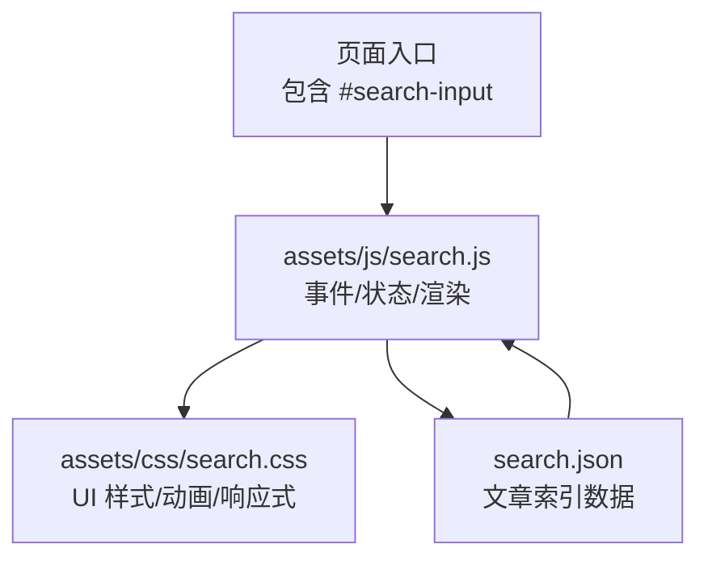
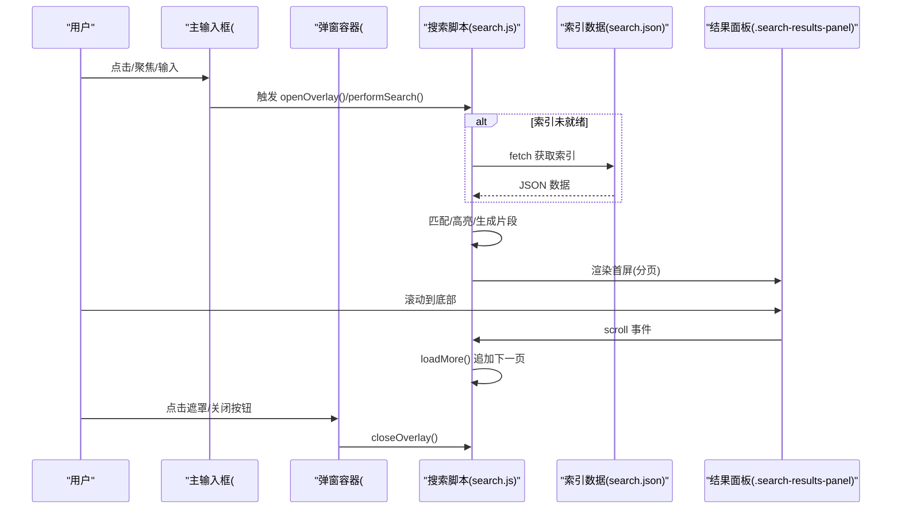
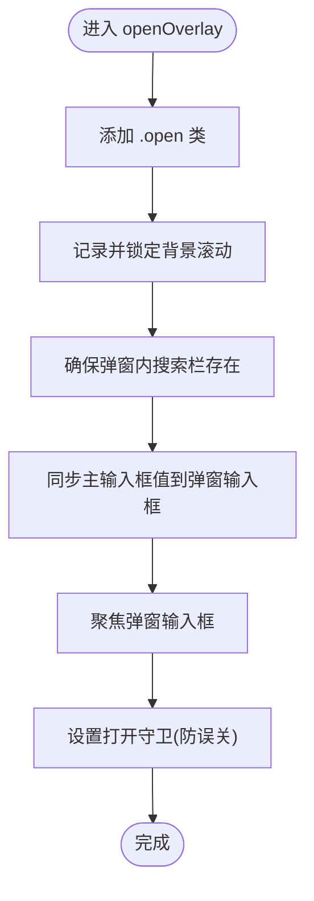
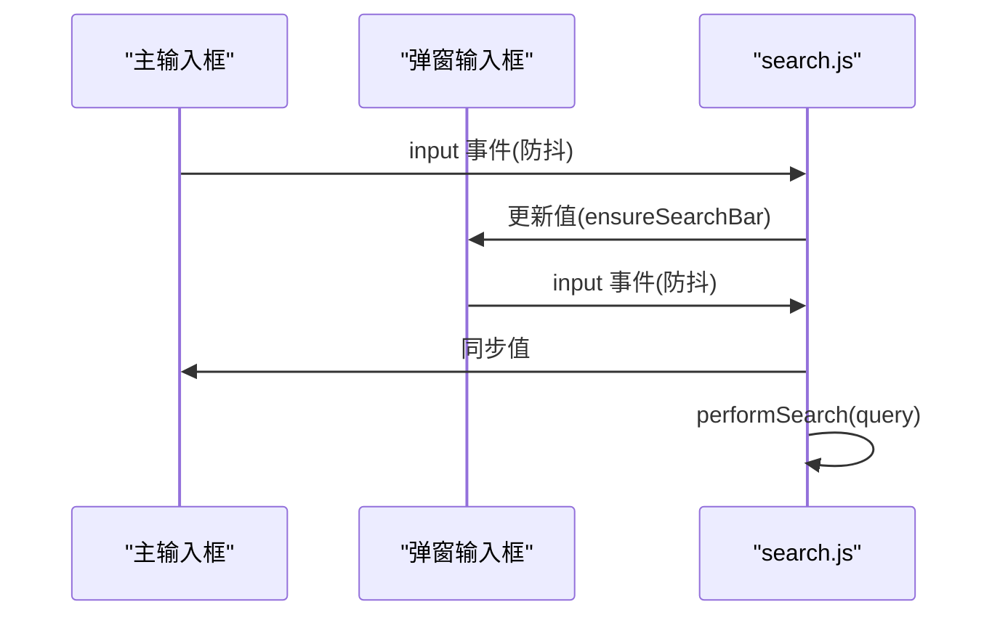
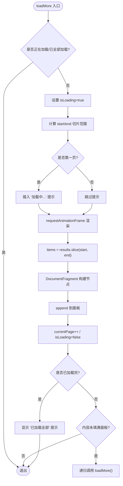
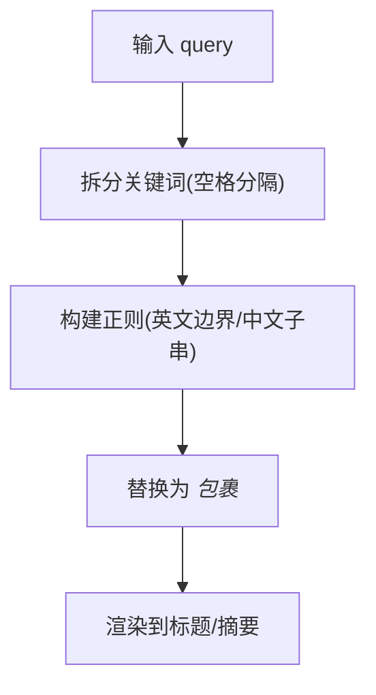
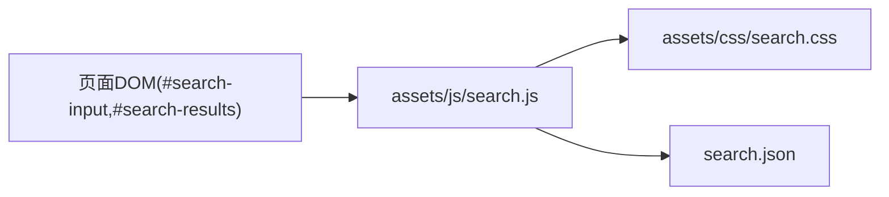

# 搜索界面交互

<cite>
**本文引用的文件**   
- [assets/js/search.js](file://assets/js/search.js)
- [assets/css/search.css](file://assets/css/search.css)
- [search.json](file://search.json)
</cite>

## 目录
1. [简介](#简介)
2. [项目结构](#项目结构)
3. [核心组件](#核心组件)
4. [架构总览](#架构总览)
5. [详细组件分析](#详细组件分析)
6. [依赖关系分析](#依赖关系分析)
7. [性能考量](#性能考量)
8. [故障排查指南](#故障排查指南)
9. [结论](#结论)
10. [附录：样式定制与响应式适配](#附录样式定制与响应式适配)

## 简介
本技术文档围绕站点“搜索用户界面交互”的实现，系统性解析以下能力：
- 全屏弹窗的打开/关闭逻辑、事件监听与状态管理
- 主搜索框与弹窗内搜索框的双向同步机制
- 分页加载（滚动监听、动态追加、性能优化）
- 结果高亮显示（HTML 标签插入与样式应用）
- 键盘导航支持（Tab 聚焦等无障碍体验）
- 动画效果（淡入淡出过渡）
- CSS 样式定制与响应式设计适配方案
- 移动端适配与触摸事件处理细节

## 项目结构
搜索功能由三部分构成：
- 前端脚本：负责 DOM 操作、事件绑定、搜索算法、渲染与分页
- 样式表：定义搜索容器、弹窗、结果项、高亮、暗色模式与响应式布局
- 数据源：Jekyll 生成的静态 JSON 索引，供前端本地检索

图表来源
- [assets/js/search.js:1-23](file://assets/js/search.js#L1-L23)
- [assets/css/search.css:278-310](file://assets/css/search.css#L278-L310)
- [search.json:1-13](file://search.json#L1-L13)

章节来源
- [assets/js/search.js:1-23](file://assets/js/search.js#L1-L23)
- [assets/css/search.css:278-310](file://assets/css/search.css#L278-L310)
- [search.json:1-13](file://search.json#L1-L13)

## 核心组件
- 输入与弹窗容器
  - 主输入框：id 为 search-input，提供点击/聚焦/输入事件触发弹窗与搜索
  - 弹窗容器：id 为 search-results，承载遮罩、弹窗内输入框、结果面板与关闭按钮
- 弹窗内搜索栏
  - 类名 search-overlay-input，内含 input 与计数 span，双向同步主输入框
- 结果面板
  - 类名 search-results-panel，可滚动区域，实现分页加载与滚动监听
- 关闭按钮
  - id 为 search-overlay-close，用于显式关闭弹窗
- 数据层
  - search.json 提供去重后的文章标题、URL、内容片段、分类与日期

章节来源
- [assets/js/search.js:6-22](file://assets/js/search.js#L6-L22)
- [assets/js/search.js:38-55](file://assets/js/search.js#L38-L55)
- [assets/js/search.js:74-129](file://assets/js/search.js#L74-L129)
- [assets/js/search.js:131-163](file://assets/js/search.js#L131-L163)
- [assets/js/search.js:165-181](file://assets/js/search.js#L165-L181)
- [assets/js/search.js:183-187](file://assets/js/search.js#L183-L187)
- [assets/css/search.css:278-310](file://assets/css/search.css#L278-L310)
- [assets/css/search.css:312-347](file://assets/css/search.css#L312-L347)
- [assets/css/search.css:349-380](file://assets/css/search.css#L349-L380)
- [search.json:1-13](file://search.json#L1-L13)

## 架构总览
整体流程：页面初始化时预加载索引；用户通过主输入框或弹窗内输入框触发搜索；脚本在内存中执行匹配与高亮；结果按页渲染并支持滚动加载更多；弹窗打开时锁定背景滚动并提供关闭方式。

图表来源
- [assets/js/search.js:183-187](file://assets/js/search.js#L183-L187)
- [assets/js/search.js:289-365](file://assets/js/search.js#L289-L365)
- [assets/js/search.js:378-448](file://assets/js/search.js#L378-L448)
- [assets/js/search.js:131-163](file://assets/js/search.js#L131-L163)
- [assets/js/search.js:165-181](file://assets/js/search.js#L165-L181)
- [assets/js/search.js:46-53](file://assets/js/search.js#L46-L53)
- [search.json:1-13](file://search.json#L1-L13)

## 详细组件分析

### 全屏弹窗：打开/关闭逻辑与状态管理
- 打开弹窗
  - 添加 .open 类以触发淡入动画
  - 记录当前滚动位置并固定 body，防止背景滚动
  - 确保弹窗内搜索栏存在，并将主输入框的值同步到弹窗输入框，自动聚焦
  - 设置打开守卫时间窗口，避免刚打开时被误判为点击遮罩而关闭
- 关闭弹窗
  - 移除 .open 类，恢复 body 滚动位置
- 遮罩关闭策略
  - 仅在 mousedown 发生在遮罩上且 click 时也落在遮罩上才关闭
  - 若用户有选中文本则不关闭，避免打断阅读
- 关闭按钮
  - 独立按钮点击直接关闭

图表来源
- [assets/js/search.js:131-152](file://assets/js/search.js#L131-L152)
- [assets/js/search.js:154-163](file://assets/js/search.js#L154-L163)
- [assets/js/search.js:165-181](file://assets/js/search.js#L165-L181)

章节来源
- [assets/js/search.js:131-163](file://assets/js/search.js#L131-L163)
- [assets/js/search.js:165-181](file://assets/js/search.js#L165-L181)

### 输入框联动：主搜索框与弹窗内搜索框双向同步
- 弹窗内输入变化
  - 将值写回主输入框，保持两处一致
  - 清空定时器后延迟执行搜索，避免频繁请求
  - 空查询时平滑清空结果面板并重置分页状态
- 主输入框输入变化
  - 同样采用防抖延迟执行搜索
  - 空查询时清空面板并重置分页
- 点击/聚焦行为
  - 点击主输入框打开弹窗，并在已有内容时触发一次搜索
  - Tab 聚焦也打开弹窗，但通过鼠标按下标记避免重复触发

图表来源
- [assets/js/search.js:74-129](file://assets/js/search.js#L74-L129)
- [assets/js/search.js:487-514](file://assets/js/search.js#L487-L514)
- [assets/js/search.js:456-479](file://assets/js/search.js#L456-L479)
- [assets/js/search.js:481-485](file://assets/js/search.js#L481-L485)

章节来源
- [assets/js/search.js:74-129](file://assets/js/search.js#L74-L129)
- [assets/js/search.js:487-514](file://assets/js/search.js#L487-L514)
- [assets/js/search.js:456-479](file://assets/js/search.js#L456-L479)
- [assets/js/search.js:481-485](file://assets/js/search.js#L481-L485)

### 分页加载：滚动监听、动态加载与性能优化
- 分页参数
  - PAGE_SIZE=8，维护 currentResults、currentPage、isLoading、allLoaded 等状态
- 滚动监听
  - 在结果面板首次创建时绑定 scroll 事件
  - 当 scrollTop + clientHeight 接近 scrollHeight 时触发 loadMore
- 动态加载
  - 使用 requestAnimationFrame 批量渲染，减少重排
  - 使用 DocumentFragment 一次性插入节点
  - 首屏显示“加载中…”，末页显示“已加载全部 N 篇”
  - 若内容未填满面板，自动继续加载下一页
- 性能优化
  - 防抖输入，避免频繁搜索
  - 预加载索引，提升首开速度
  - 结果去重，避免重复条目
  - 仅对可见部分进行 DOM 操作

图表来源
- [assets/js/search.js:378-448](file://assets/js/search.js#L378-L448)
- [assets/js/search.js:46-53](file://assets/js/search.js#L46-L53)

章节来源
- [assets/js/search.js:378-448](file://assets/js/search.js#L378-L448)
- [assets/js/search.js:46-53](file://assets/js/search.js#L46-L53)

### 结果高亮：HTML 标签插入与样式应用
- 匹配策略
  - 英文关键词使用单词边界匹配
  - 中文关键词使用子串匹配
  - 连续中文较长时启用二元组模糊评分，提高召回率
- 高亮实现
  - 将匹配的关键词用 <em> 包裹
  - 摘要片段优先包含命中词，前后适度留白
- 样式应用
  - 标题与摘要中的 <em> 使用强调色与浅色背景，突出关键词

图表来源
- [assets/js/search.js:206-216](file://assets/js/search.js#L206-L216)
- [assets/js/search.js:218-275](file://assets/js/search.js#L218-L275)
- [assets/js/search.js:299-331](file://assets/js/search.js#L299-L331)
- [assets/css/search.css:423-427](file://assets/css/search.css#L423-L427)
- [assets/css/search.css:460-467](file://assets/css/search.css#L460-L467)

章节来源
- [assets/js/search.js:206-216](file://assets/js/search.js#L206-L216)
- [assets/js/search.js:218-275](file://assets/js/search.js#L218-L275)
- [assets/js/search.js:299-331](file://assets/js/search.js#L299-L331)
- [assets/css/search.css:423-427](file://assets/css/search.css#L423-L427)
- [assets/css/search.css:460-467](file://assets/css/search.css#L460-L467)

### 键盘导航与无障碍
- Tab 聚焦
  - 主输入框获得焦点时打开弹窗，便于键盘用户快速进入
- 回车选择
  - 当前实现未内置回车键选择结果项的逻辑；如需增强，可在结果项上增加键盘事件监听，结合 active 状态与 Enter 键跳转
- 焦点管理
  - 打开弹窗后自动聚焦弹窗内输入框，保证键盘流顺畅
- 文本选择保护
  - 点击遮罩关闭前检查是否有选中文本，避免中断阅读

章节来源
- [assets/js/search.js:481-485](file://assets/js/search.js#L481-L485)
- [assets/js/search.js:143-148](file://assets/js/search.js#L143-L148)
- [assets/js/search.js:169-176](file://assets/js/search.js#L169-L176)

### 动画效果：淡入淡出过渡
- 弹窗淡入淡出
  - 通过 .open 类切换 opacity 与 visibility，配合 transition 实现平滑过渡
- 面板内容清除动画
  - 先 fade-out，再清空 DOM，最后恢复透明度，避免闪烁

章节来源
- [assets/css/search.css:278-296](file://assets/css/search.css#L278-L296)
- [assets/js/search.js:58-71](file://assets/js/search.js#L58-L71)

### 移动端适配与触摸事件处理
- 小屏布局
  - 弹窗在小屏下占满视口，输入区与结果面板圆角归零，关闭按钮尺寸缩小
- 触摸交互
  - 基于 mousedown/mouseup/click 的组合判断遮罩关闭，兼容触屏点击
  - 打开守卫避免刚打开时的误触关闭
- 滚动锁定
  - 打开弹窗时固定 body，避免背景滚动影响体验

章节来源
- [assets/css/search.css:494-516](file://assets/css/search.css#L494-L516)
- [assets/js/search.js:165-181](file://assets/js/search.js#L165-L181)
- [assets/js/search.js:131-163](file://assets/js/search.js#L131-L163)

## 依赖关系分析
- 模块耦合
  - search.js 强依赖 DOM 元素 id/class 与 search.json 的数据结构
  - search.css 通过类名控制 UI 表现，与 search.js 的渲染产物紧密耦合
- 外部依赖
  - 无第三方库，纯原生 JS/CSS
- 潜在循环依赖
  - 无循环引用，均为单向依赖

图表来源
- [assets/js/search.js:1-23](file://assets/js/search.js#L1-L23)
- [assets/css/search.css:278-310](file://assets/css/search.css#L278-L310)
- [search.json:1-13](file://search.json#L1-L13)

章节来源
- [assets/js/search.js:1-23](file://assets/js/search.js#L1-L23)
- [assets/css/search.css:278-310](file://assets/css/search.css#L278-L310)
- [search.json:1-13](file://search.json#L1-L13)

## 性能考量
- 输入防抖：统一 200ms 延迟，降低高频输入带来的计算与渲染压力
- 索引预取：页面加载即预拉取 search.json，提升首次搜索响应
- 列表渲染优化：
  - requestAnimationFrame 批处理
  - DocumentFragment 批量插入
  - 滚动到底部阈值 30px 提前加载
- 结果去重：按 URL 去重，避免重复渲染
- 面板清空动画：fade-out 后再清空，避免抖动

章节来源
- [assets/js/search.js:110-126](file://assets/js/search.js#L110-L126)
- [assets/js/search.js:183-187](file://assets/js/search.js#L183-L187)
- [assets/js/search.js:395-447](file://assets/js/search.js#L395-L447)
- [assets/js/search.js:25-33](file://assets/js/search.js#L25-L33)
- [assets/js/search.js:58-71](file://assets/js/search.js#L58-L71)

## 故障排查指南
- 无法加载搜索索引
  - 现象：面板显示错误提示
  - 可能原因：search.json 路径不可达或格式异常
  - 定位：检查 fetch 失败分支与错误提示渲染
- 弹窗无法关闭
  - 现象：点击遮罩无效
  - 可能原因：用户存在选中文本导致关闭被阻止
  - 定位：检查选中检测逻辑与遮罩点击分支
- 滚动加载不触发
  - 现象：滚动到底部不再加载
  - 可能原因：isLoading/allLoaded 状态异常或面板高度计算问题
  - 定位：检查滚动监听与 loadMore 条件
- 高亮异常
  - 现象：关键词未被高亮或高亮错乱
  - 可能原因：正则转义或中英文匹配分支问题
  - 定位：检查 escapeRegex 与 keywordMatches/highlightMatch 逻辑

章节来源
- [assets/js/search.js:118-121](file://assets/js/search.js#L118-L121)
- [assets/js/search.js:169-176](file://assets/js/search.js#L169-L176)
- [assets/js/search.js:46-53](file://assets/js/search.js#L46-L53)
- [assets/js/search.js:206-216](file://assets/js/search.js#L206-L216)

## 结论
该搜索界面以轻量原生实现为核心，具备完整的弹窗交互、双向输入同步、分页加载、高亮显示与基础无障碍支持。通过合理的防抖、预取与渲染优化，兼顾了用户体验与性能。后续可按需扩展键盘选择、更丰富的筛选与排序能力。

## 附录：样式定制与响应式适配
- 设计令牌
  - 使用 :root 变量集中管理颜色、圆角、阴影、字体与过渡时长，便于主题化与暗色模式切换
- 搜索容器与输入框
  - 调整 .search-container 最大宽度与间距，适配不同头部布局
  - 修改 .search-input 边框、背景、聚焦态阴影与图标
- 弹窗与结果面板
  - 通过 .search-results 与 .search-results-panel 控制遮罩透明度、面板圆角与阴影
  - 调整 .search-overlay-input 粘性定位与分割线
- 结果项与高亮
  - 自定义 .search-result-item 悬停态、边框与间距
  - 调整 .search-result-title/em 与 .search-result-snippet/em 的高亮色与背景
- 响应式断点
  - 小屏下隐藏桌面端搜索框，弹窗全屏展示
  - 调整关闭按钮尺寸与位置
- 暗色模式
  - 利用 prefers-color-scheme 覆盖令牌，实现系统级暗色适配

章节来源
- [assets/css/search.css:7-58](file://assets/css/search.css#L7-L58)
- [assets/css/search.css:222-272](file://assets/css/search.css#L222-L272)
- [assets/css/search.css:278-310](file://assets/css/search.css#L278-L310)
- [assets/css/search.css:312-347](file://assets/css/search.css#L312-L347)
- [assets/css/search.css:397-467](file://assets/css/search.css#L397-L467)
- [assets/css/search.css:494-516](file://assets/css/search.css#L494-L516)