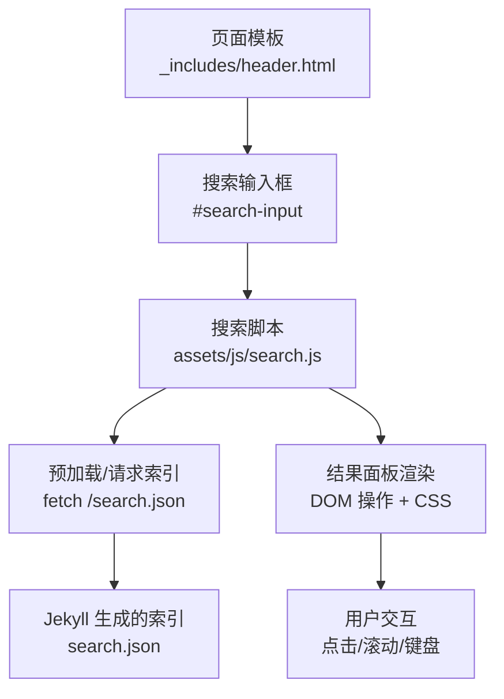
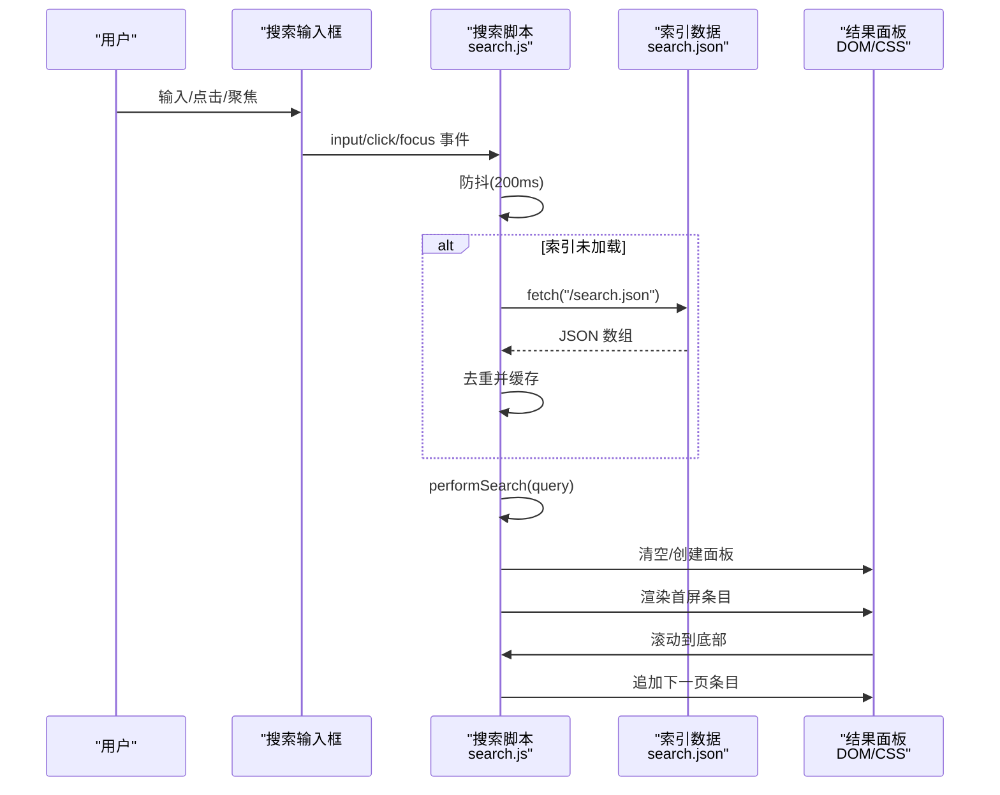
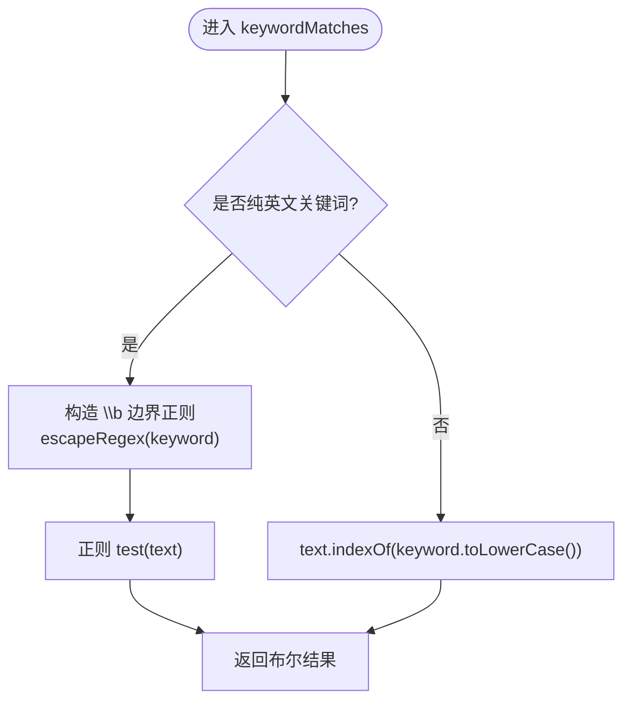
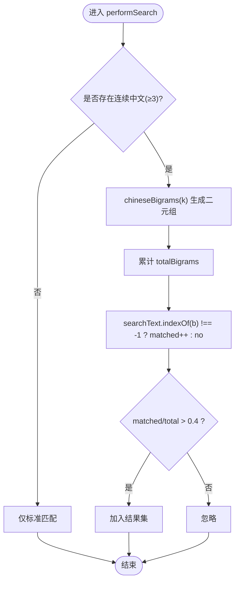
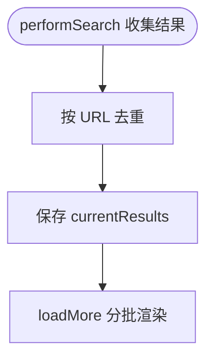
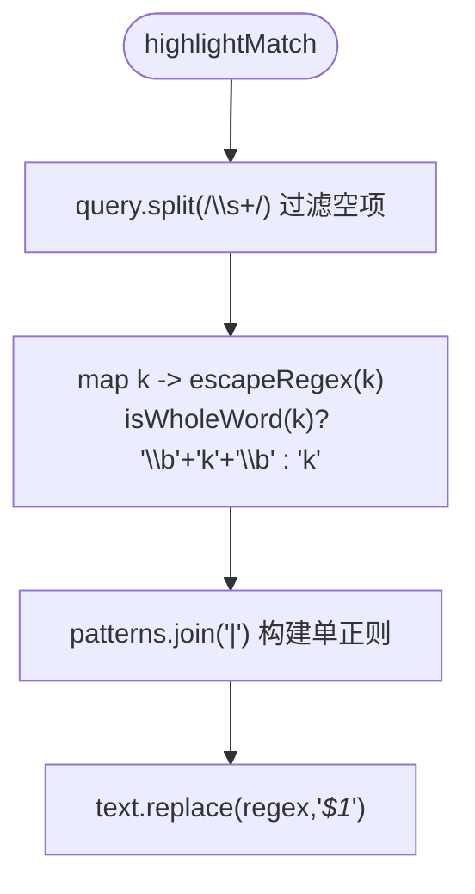
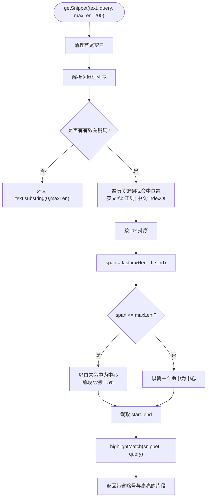
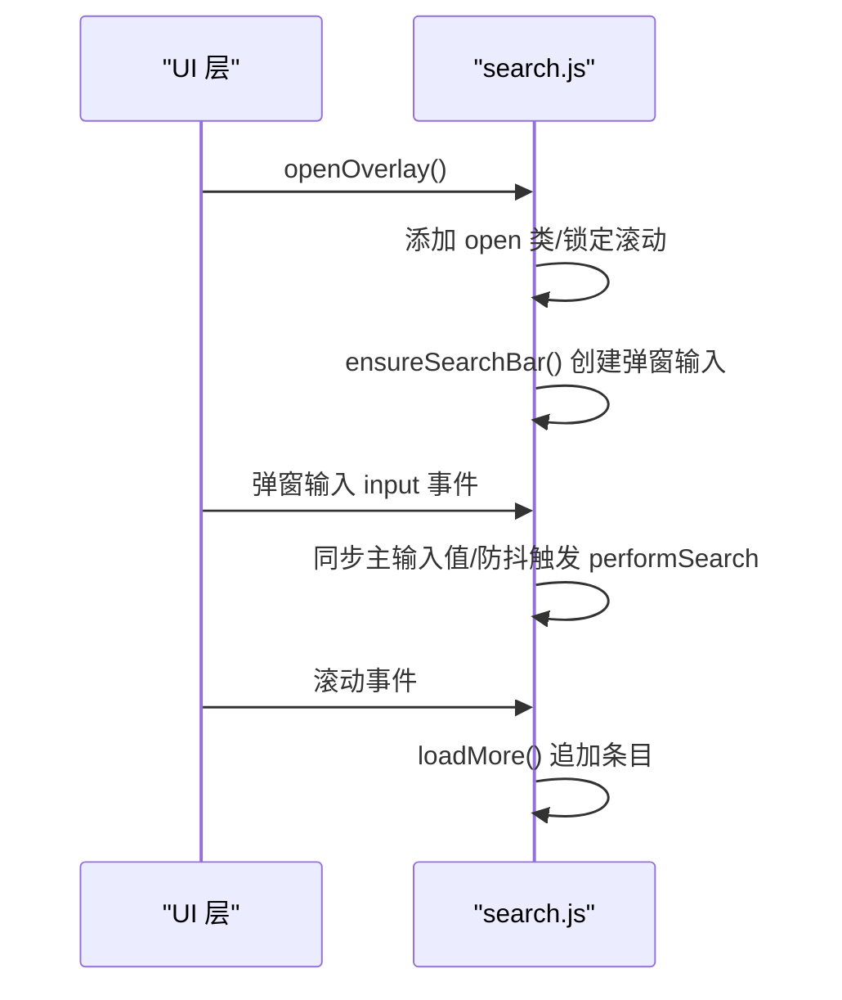
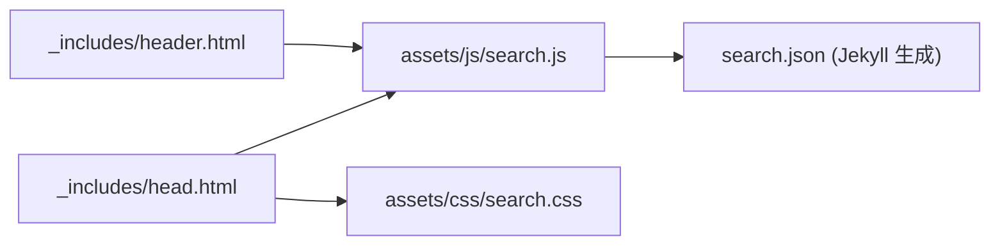

# 搜索算法实现

<cite>
**本文引用的文件**   
- [assets/js/search.js](file://assets/js/search.js)
- [search.json](file://search.json)
- [assets/css/search.css](file://assets/css/search.css)
- [_includes/header.html](file://_includes/header.html)
- [_includes/head.html](file://_includes/head.html)
</cite>

## 目录
1. [简介](#简介)
2. [项目结构](#项目结构)
3. [核心组件](#核心组件)
4. [架构总览](#架构总览)
5. [详细组件分析](#详细组件分析)
6. [依赖关系分析](#依赖关系分析)
7. [性能考量与优化建议](#性能考量与优化建议)
8. [故障排查指南](#故障排查指南)
9. [结论](#结论)
10. [附录：测试用例与基准](#附录测试用例与基准)

## 简介
本技术文档聚焦于前端搜索算法的实现，涵盖关键词匹配策略（英文单词边界匹配、中文子串匹配）、模糊匹配（中文二元组分词与相似度评分）、搜索结果排序与权重、正则表达式优化、摘要生成（getSnippet）以及整体性能优化建议。该搜索功能为纯前端实现，通过 Jekyll 构建的静态索引 search.json 进行检索，无需后端服务。

## 项目结构
搜索相关的前端资源与模板集成如下：
- 样式：assets/css/search.css
- 脚本：assets/js/search.js
- 数据源：search.json（由 Jekyll 在构建时生成）
- 模板集成：_includes/header.html（搜索输入框）、_includes/head.html（引入 CSS/JS）

图表来源
- [_includes/header.html:5-7](file://_includes/header.html#L5-L7)
- [_includes/head.html:9-10,25:9-10](file://_includes/head.html#L9-L10)
- [_includes/head.html:25](file://_includes/head.html#L25)
- [assets/js/search.js:184-187](file://assets/js/search.js#L184-L187)
- [search.json:1-13](file://search.json#L1-L13)

章节来源
- [_includes/header.html:1-10](file://_includes/header.html#L1-L10)
- [_includes/head.html:1-27](file://_includes/head.html#L1-L27)
- [assets/js/search.js:1-20](file://assets/js/search.js#L1-L20)
- [search.json:1-13](file://search.json#L1-L13)

## 核心组件
- 搜索索引加载与去重：从 search.json 获取文章列表，按 URL 去重，缓存到内存。
- 关键词匹配：英文单词边界匹配、中文子串匹配。
- 模糊匹配：对连续中文使用二元组分词与相似度阈值过滤。
- 高亮与摘要：标题与内容片段的高亮显示；基于命中位置计算上下文摘要。
- 结果展示与分页：固定条目的懒加载与滚动加载更多。
- 弹窗交互：全屏遮罩、输入同步、关闭逻辑。

章节来源
- [assets/js/search.js:24-33](file://assets/js/search.js#L24-L33)
- [assets/js/search.js:189-204](file://assets/js/search.js#L189-L204)
- [assets/js/search.js:277-287](file://assets/js/search.js#L277-L287)
- [assets/js/search.js:206-216](file://assets/js/search.js#L206-L216)
- [assets/js/search.js:218-275](file://assets/js/search.js#L218-L275)
- [assets/js/search.js:378-448](file://assets/js/search.js#L378-L448)
- [assets/js/search.js:132-163](file://assets/js/search.js#L132-L163)

## 架构总览
搜索流程从用户输入触发，经过防抖延迟后执行匹配与渲染，同时支持弹窗内输入联动与滚动加载更多。

图表来源
- [assets/js/search.js:487-514](file://assets/js/search.js#L487-L514)
- [assets/js/search.js:184-187](file://assets/js/search.js#L184-L187)
- [assets/js/search.js:289-365](file://assets/js/search.js#L289-L365)
- [assets/js/search.js:378-448](file://assets/js/search.js#L378-L448)

## 详细组件分析

### 关键词匹配逻辑
- 英文单词边界匹配：当关键词仅包含字母数字时，采用 \b 边界匹配，确保“完整单词”命中，避免部分匹配导致的误报。
- 中文子串匹配：非英文关键词直接进行大小写不敏感子串查找，适合中文无空格文本。
- 特殊字符转义：所有用于正则的关键词先进行转义，防止元字符破坏正则语义。

图表来源
- [assets/js/search.js:189-204](file://assets/js/search.js#L189-L204)

章节来源
- [assets/js/search.js:189-204](file://assets/js/search.js#L189-L204)

### 模糊匹配算法（中文二元组分词与相似度评分）
- 二元组分词：对连续中文（长度≥3）生成相邻两字组合，仅保留中文字符对。
- 相似度评分：统计查询中所有二元组的总数与在目标文本中命中的数量，若命中率超过阈值（>0.4），则视为模糊匹配成功。
- 适用场景：解决中文长词或短语在无精确匹配时的召回问题。

图表来源
- [assets/js/search.js:277-287](file://assets/js/search.js#L277-L287)
- [assets/js/search.js:289-331](file://assets/js/search.js#L289-L331)

章节来源
- [assets/js/search.js:277-287](file://assets/js/search.js#L277-L287)
- [assets/js/search.js:289-331](file://assets/js/search.js#L289-L331)

### 搜索结果排序与权重
- 当前实现：结果顺序与索引遍历顺序一致，未进行相关性加权排序。
- 去重策略：按 URL 去重，保证结果唯一性。
- 可扩展方向：可引入标题命中优先、命中次数、命中位置密度等权重因子进行排序。

图表来源
- [assets/js/search.js:337-345](file://assets/js/search.js#L337-L345)
- [assets/js/search.js:378-448](file://assets/js/search.js#L378-L448)

章节来源
- [assets/js/search.js:337-345](file://assets/js/search.js#L337-L345)
- [assets/js/search.js:378-448](file://assets/js/search.js#L378-L448)

### 正则表达式优化技术
- 特殊字符转义：escapeRegex 将正则元字符统一转义，避免非法正则与性能退化。
- 模式复用：在 getSnippet 中对每个关键词分别构造正则以定位命中位置；在 highlightMatch 中合并多关键词为一个正则以减少多次替换开销。
- 大小写不敏感：统一使用 i 标志提升匹配稳定性。

图表来源
- [assets/js/search.js:206-216](file://assets/js/search.js#L206-L216)
- [assets/js/search.js:189-191](file://assets/js/search.js#L189-L191)

章节来源
- [assets/js/search.js:206-216](file://assets/js/search.js#L206-L216)
- [assets/js/search.js:189-191](file://assets/js/search.js#L189-L191)

### getSnippet 摘要生成算法
- 预处理：去除首尾空白，解析关键词列表。
- 命中定位：
  - 英文关键词：使用 \b 边界正则扫描所有命中位置。
  - 中文关键词：使用 indexOf 循环定位所有子串命中。
- 上下文截取：
  - 若所有命中跨度 ≤ maxLen，则以第一个命中为中心，前后按比例分配额外空间（前段约 15%）。
  - 若命中过于分散，则以第一个命中为中心截取固定长度片段。
- 高亮显示：对截取的片段再次应用 highlightMatch 进行高亮。

图表来源
- [assets/js/search.js:218-275](file://assets/js/search.js#L218-L275)
- [assets/js/search.js:206-216](file://assets/js/search.js#L206-L216)

章节来源
- [assets/js/search.js:218-275](file://assets/js/search.js#L218-L275)
- [assets/js/search.js:206-216](file://assets/js/search.js#L206-L216)

### 弹窗与交互控制
- 打开/关闭：通过类名切换 open 状态，锁定背景滚动并恢复滚动位置。
- 输入同步：弹窗内输入变化同步至主搜索框，并触发搜索。
- 点击遮罩关闭：仅在鼠标按下也在遮罩上且无选中文字时关闭，避免误触。
- 懒加载：滚动接近底部时自动加载下一页，直至全部加载完成。

图表来源
- [assets/js/search.js:132-163](file://assets/js/search.js#L132-L163)
- [assets/js/search.js:74-129](file://assets/js/search.js#L74-L129)
- [assets/js/search.js:378-448](file://assets/js/search.js#L378-L448)

章节来源
- [assets/js/search.js:132-163](file://assets/js/search.js#L132-L163)
- [assets/js/search.js:74-129](file://assets/js/search.js#L74-L129)
- [assets/js/search.js:378-448](file://assets/js/search.js#L378-L448)

## 依赖关系分析
- 模板依赖：header.html 提供搜索输入框与 data-search-url；head.html 引入 search.css 与 search.js。
- 运行时依赖：search.js 依赖浏览器 DOM API、Fetch API、正则表达式引擎。
- 数据依赖：search.json 由 Jekyll 构建生成，包含 title、url、content、categories、date 字段。

图表来源
- [_includes/header.html:5-7](file://_includes/header.html#L5-L7)
- [_includes/head.html:9-10,25:9-10](file://_includes/head.html#L9-L10)
- [assets/js/search.js:184-187](file://assets/js/search.js#L184-L187)
- [search.json:1-13](file://search.json#L1-L13)

章节来源
- [_includes/header.html:1-10](file://_includes/header.html#L1-L10)
- [_includes/head.html:1-27](file://_includes/head.html#L1-L27)
- [assets/js/search.js:184-187](file://assets/js/search.js#L184-L187)
- [search.json:1-13](file://search.json#L1-L13)

## 性能考量与优化建议
- 索引预加载：页面初始化即 fetch 索引并缓存，减少首次搜索延迟。
- 防抖机制：input 事件使用 200ms 防抖，降低频繁搜索带来的 CPU 压力。
- 正则优化：
  - 对每个关键词单独构造正则以精确定位命中位置（getSnippet）。
  - 合并多关键词为一个正则进行高亮替换（highlightMatch），减少多次遍历。
  - 统一转义特殊字符，避免无效正则与回溯爆炸。
- 结果分页：PAGE_SIZE=8，按需加载，避免一次性渲染大量 DOM。
- 去重策略：按 URL 去重，避免重复条目影响渲染与用户体验。
- 建议扩展：
  - 预编译正则：对常用关键词集合建立正则缓存，避免重复构造。
  - 倒排索引：对高频词建立位置索引，加速 getSnippet 命中定位。
  - 权重排序：引入标题命中优先、命中密度、时间衰减等策略提升相关性。
  - 二进制分块：对大文本进行分块处理，降低单次字符串操作成本。

[本节为通用性能指导，不直接分析具体文件]

## 故障排查指南
- 无法加载搜索索引：
  - 现象：面板显示“无法加载搜索索引”。
  - 原因：fetch 失败或 CORS/路径错误。
  - 排查：确认 /search.json 存在且可访问；检查 baseurl 配置与相对路径。
- 无结果或结果异常：
  - 现象：输入关键词无结果或结果不符合预期。
  - 原因：索引 content 被 strip_html/strip_urls 处理后丢失关键信息；或关键词匹配策略不符。
  - 排查：查看 search.json 的 content 字段；调整 isWholeWord 判定或阈值。
- 高亮不正确：
  - 现象：高亮覆盖范围错误或遗漏。
  - 原因：正则未正确转义或边界匹配不当。
  - 排查：检查 escapeRegex 与 isWholeWord 逻辑；验证 highlightMatch 的正则组合。

章节来源
- [assets/js/search.js:118-121](file://assets/js/search.js#L118-L121)
- [assets/js/search.js:471-473](file://assets/js/search.js#L471-L473)
- [assets/js/search.js:506-509](file://assets/js/search.js#L506-L509)
- [search.json:4-12](file://search.json#L4-L12)

## 结论
该前端搜索实现以轻量、易部署为目标，通过 Jekyll 构建的静态索引与纯前端脚本完成关键词匹配、模糊匹配、高亮与摘要生成。其优势在于零后端依赖与良好的用户体验（弹窗、懒加载、防抖）。在大规模内容场景下，可通过倒排索引、正则缓存与权重排序进一步提升性能与相关性。

[本节为总结性内容，不直接分析具体文件]

## 附录：测试用例与基准
以下为面向实现的测试建议与基准思路（不包含具体代码，仅提供路径参考）：
- 单元测试建议
  - 关键词匹配：
    - 英文单词边界匹配：验证“JavaScript”不应匹配“javascripts”，但应匹配“javascripts”中的“javascript”作为独立词。
      - 参考路径：[keywordMatches:199-204](file://assets/js/search.js#L199-L204)
    - 中文子串匹配：验证“深度学习”能命中“学习深度”中的子串。
      - 参考路径：[keywordMatches:199-204](file://assets/js/search.js#L199-L204)
  - 模糊匹配：
    - 二元组生成：验证“人工智能”生成“人工”、“工智”、“智能”。
      - 参考路径：[chineseBigrams:277-287](file://assets/js/search.js#L277-L287)
    - 相似度阈值：命中率>0.4 时应纳入结果。
      - 参考路径：[performSearch 模糊分支:314-331](file://assets/js/search.js#L314-L331)
  - 高亮与摘要：
    - 高亮合并正则：验证多关键词高亮正确包裹。
      - 参考路径：[highlightMatch:206-216](file://assets/js/search.js#L206-L216)
    - 摘要截取：验证 span≤maxLen 与 span>maxLen 两种分支。
      - 参考路径：[getSnippet:218-275](file://assets/js/search.js#L218-L275)
- 基准测试建议
  - 索引规模：1000/5000/10000 篇文章。
  - 指标：首次搜索耗时、平均每次输入响应时间、DOM 渲染帧率。
  - 方法：使用 Performance API 记录关键阶段（fetch、performSearch、render）；对比不同 PAGE_SIZE 与阈值的影响。
  - 关注点：正则构造与执行、字符串 indexOf 与 exec 的性能差异、DocumentFragment 批量插入效果。

[本节为方法论与建议，不直接分析具体文件]