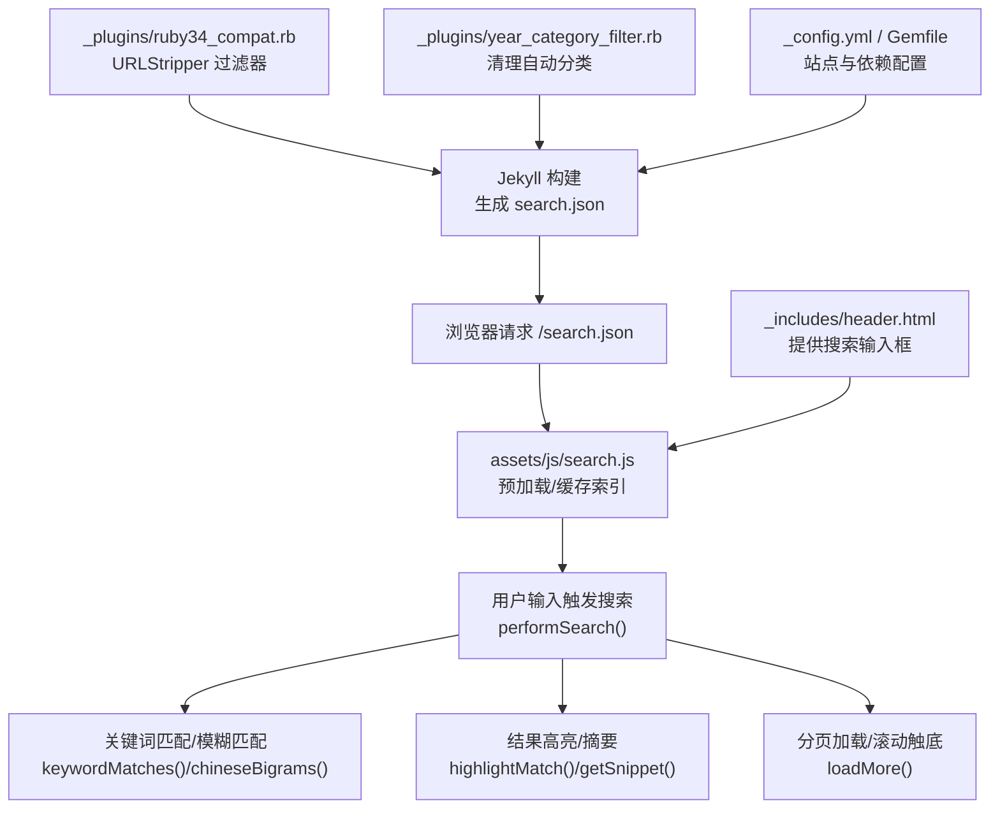
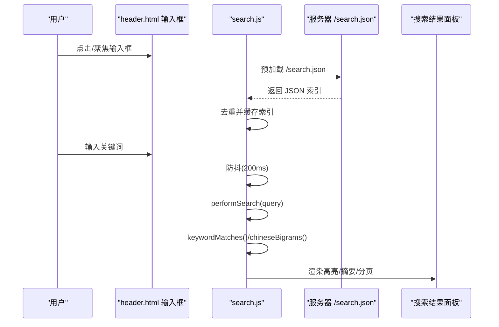
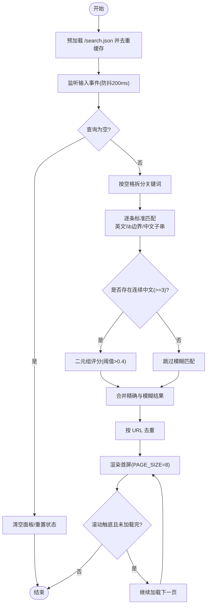
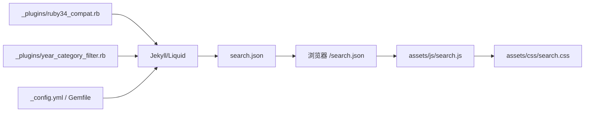

# 搜索系统

<cite>
**本文引用的文件**   
- [search.json](file://search.json)
- [assets/js/search.js](file://assets/js/search.js)
- [assets/css/search.css](file://assets/css/search.css)
- [_includes/header.html](file://_includes/header.html)
- [_plugins/ruby34_compat.rb](file://_plugins/ruby34_compat.rb)
- [_plugins/year_category_filter.rb](file://_plugins/year_category_filter.rb)
- [_config.yml](file://_config.yml)
- [Gemfile](file://Gemfile)
</cite>

## 目录
1. [简介](#简介)
2. [项目结构](#项目结构)
3. [核心组件](#核心组件)
4. [架构总览](#架构总览)
5. [详细组件分析](#详细组件分析)
6. [依赖关系分析](#依赖关系分析)
7. [性能考虑](#性能考虑)
8. [故障排查指南](#故障排查指南)
9. [结论](#结论)
10. [附录：配置与扩展](#附录配置与扩展)

## 简介
本技术文档聚焦于博客的全文搜索功能，覆盖前端索引生成、JavaScript 搜索算法、中文分词策略、中英文混合匹配、结果高亮与分页加载、Ruby 插件兼容性处理、配置项与自定义方法，以及性能优化与调试排障。目标是帮助读者快速理解并扩展该搜索系统。

## 项目结构
搜索相关的关键文件分布如下：
- 构建期生成搜索索引：search.json（由 Jekyll 模板渲染）
- 前端交互与搜索逻辑：assets/js/search.js
- 搜索界面样式：assets/css/search.css
- 搜索入口（头部输入框）：_includes/header.html
- Ruby 兼容性与内容清洗插件：_plugins/ruby34_compat.rb、_plugins/year_category_filter.rb
- 站点与构建配置：_config.yml、Gemfile

图表来源
- [search.json:1-13](file://search.json#L1-L13)
- [assets/js/search.js:1-526](file://assets/js/search.js#L1-L526)
- [_includes/header.html:1-9](file://_includes/header.html#L1-L9)
- [_plugins/ruby34_compat.rb:1-19](file://_plugins/ruby34_compat.rb#L1-L19)
- [_plugins/year_category_filter.rb:1-13](file://_plugins/year_category_filter.rb#L1-L13)
- [_config.yml:1-45](file://_config.yml#L1-L45)
- [Gemfile:1-17](file://Gemfile#L1-L17)

章节来源
- [search.json:1-13](file://search.json#L1-L13)
- [assets/js/search.js:1-526](file://assets/js/search.js#L1-L526)
- [_includes/header.html:1-9](file://_includes/header.html#L1-L9)
- [_plugins/ruby34_compat.rb:1-19](file://_plugins/ruby34_compat.rb#L1-L19)
- [_plugins/year_category_filter.rb:1-13](file://_plugins/year_category_filter.rb#L1-L13)
- [_config.yml:1-45](file://_config.yml#L1-L45)
- [Gemfile:1-17](file://Gemfile#L1-L17)

## 核心组件
- 搜索索引生成器（Jekyll 模板）：遍历所有文章，提取标题、URL、正文（去除 HTML 标签与 URL），输出 JSON 数组。
- 前端搜索脚本：预加载索引、去重、输入防抖、关键词匹配（英文单词边界 + 中文子串）、中文二元组模糊匹配、结果高亮与摘要、分页加载。
- 搜索 UI 与样式：全屏弹窗、输入联动、滚动条、响应式适配。
- Ruby 插件：兼容 Ruby 3.4+ 缺失的 String#untaint；提供 strip_urls 过滤器用于索引内容清洗；移除因目录结构自动注入的分类。

章节来源
- [search.json:1-13](file://search.json#L1-L13)
- [assets/js/search.js:1-526](file://assets/js/search.js#L1-L526)
- [_plugins/ruby34_compat.rb:1-19](file://_plugins/ruby34_compat.rb#L1-L19)
- [_plugins/year_category_filter.rb:1-13](file://_plugins/year_category_filter.rb#L1-L13)

## 架构总览
搜索系统采用“服务端静态索引 + 客户端检索”的架构。Jekyll 在构建时生成 search.json，前端页面加载后预取并缓存该索引，随后在用户输入时进行本地检索与渲染。

图表来源
- [_includes/header.html:1-9](file://_includes/header.html#L1-L9)
- [assets/js/search.js:1-526](file://assets/js/search.js#L1-L526)
- [search.json:1-13](file://search.json#L1-L13)

## 详细组件分析

### 搜索索引生成机制（search.json）
- 遍历 site.posts，为每篇文章构造对象字段：title、url、content、categories、date。
- content 预处理：
  - 通过 Liquid 模板将 HTML 代码块 <pre>...</pre> 剔除，避免代码片段污染索引。
  - 使用 strip_html 去除剩余 HTML 标签。
  - 使用自定义过滤器 strip_urls 去除链接文本，降低噪声。
  - 使用 strip 去除首尾空白。
- 最终输出 JSON 数组，供前端 fetch 获取。

数据结构设计要点
- title：字符串，用于标题匹配与高亮。
- url：拼接 baseurl 后的绝对路径，作为唯一标识与跳转目标。
- content：纯文本，用于正文匹配与摘要生成。
- categories：字符串数组，用于展示标签。
- date：格式化日期字符串，用于元信息展示。

章节来源
- [search.json:1-13](file://search.json#L1-L13)
- [_plugins/ruby34_compat.rb:9-18](file://_plugins/ruby34_compat.rb#L9-L18)

### JavaScript 搜索算法与工作流程
- 预加载与缓存：页面初始化即 fetch /search.json，成功后按 URL 去重并缓存到内存。
- 输入事件与防抖：input/focus/click 均触发打开弹窗；输入变化以 200ms 防抖，避免频繁计算。
- 关键词拆分：按空格分割查询，得到 rawKeywords。
- 匹配策略：
  - 标准匹配：对每个关键词执行 keywordMatches(text, k)。英文关键词使用单词边界匹配（\b... \b），中文关键词使用子串包含匹配。
  - 模糊匹配：若存在连续中文字符串（长度≥3），则基于 chineseBigrams 生成二元组，统计命中比例，超过阈值（>0.4）纳入结果。
- 结果去重：按 URL 再次去重，确保无重复条目。
- 渲染与分页：
  - 每次查询重置 currentPage=0，allLoaded=false。
  - loadMore 每次渲染 PAGE_SIZE（默认 8）条，支持滚动触底加载更多。
  - 当 start >= results.length 时显示“未找到匹配结果”，或追加“已加载全部 N 篇”。

图表来源
- [assets/js/search.js:1-526](file://assets/js/search.js#L1-L526)

章节来源
- [assets/js/search.js:1-526](file://assets/js/search.js#L1-L526)

### 关键词匹配逻辑与中英文混合搜索
- 英文匹配：isWholeWord(k) 判定纯字母数字组合，使用 \b 单词边界正则匹配，忽略大小写。
- 中文匹配：非英文关键词直接进行子串包含匹配（toLowerCase）。
- 混合查询：同时支持英文单词边界与中文子串，多个关键词之间为“与”的关系（every 条件）。
- 中文模糊：chineseBigrams 仅对连续中文字符生成二元组，提升容错率（如输入部分字也能命中）。

章节来源
- [assets/js/search.js:189-216](file://assets/js/search.js#L189-L216)
- [assets/js/search.js:277-287](file://assets/js/search.js#L277-L287)
- [assets/js/search.js:289-331](file://assets/js/search.js#L289-L331)

### 结果高亮与摘要生成
- 高亮：highlightMatch 将匹配到的关键词用 <em> 包裹，支持多关键词并集匹配。
- 摘要：getSnippet 根据关键词命中位置选择最相关的上下文片段，优先包含第一个命中，并在前后添加省略号；最大长度可配置（默认 200）。
- 标题高亮：makeResult 中对 title 也应用 highlightMatch，便于在结果列表中突出关键词。

章节来源
- [assets/js/search.js:206-216](file://assets/js/search.js#L206-L216)
- [assets/js/search.js:218-275](file://assets/js/search.js#L218-L275)
- [assets/js/search.js:367-376](file://assets/js/search.js#L367-L376)

### 分页加载机制
- 常量 PAGE_SIZE = 8，控制每页渲染数量。
- 状态变量：currentPage、isLoading、allLoaded 控制加载流程。
- 滚动监听：当 panel.scrollTop + clientHeight 接近 scrollHeight 时触发 loadMore。
- 空结果与结束提示：无结果时显示“未找到匹配结果”，加载完毕显示“— 已加载全部 N 篇 —”。

章节来源
- [assets/js/search.js:12-17](file://assets/js/search.js#L12-L17)
- [assets/js/search.js:378-448](file://assets/js/search.js#L378-L448)

### Ruby 插件兼容性与内容清洗
- Ruby 3.4+ 兼容：String#untaint 在 Ruby 3.2 被移除，插件提供兼容 shim，避免旧版 Liquid/Jekyll 报错。
- 内容清洗：注册 Liquid 过滤器 strip_urls，用于从文章内容中剔除 http(s) 链接，减少索引噪声。
- 分类过滤：year_category_filter 移除因 _posts 子目录自动注入的分类，仅保留 front matter 显式定义的 categories，保证 search.json 中的 categories 更干净。

章节来源
- [_plugins/ruby34_compat.rb:1-19](file://_plugins/ruby34_compat.rb#L1-L19)
- [_plugins/year_category_filter.rb:1-13](file://_plugins/year_category_filter.rb#L1-L13)

### 搜索 UI 与交互
- 输入框位于 header.html，data-search-url 指向 /search.json。
- 全屏弹窗：openOverlay/closeOverlay 管理遮罩、背景滚动锁定、焦点同步。
- 弹窗内输入栏：ensureSearchBar 动态创建，与主输入框双向同步，实时触发搜索。
- 样式：search.css 定义了主题色、暗色模式、响应式布局、滚动条、结果条目样式等。

章节来源
- [_includes/header.html:1-9](file://_includes/header.html#L1-L9)
- [assets/js/search.js:74-129](file://assets/js/search.js#L74-L129)
- [assets/js/search.js:132-181](file://assets/js/search.js#L132-L181)
- [assets/css/search.css:222-516](file://assets/css/search.css#L222-L516)

## 依赖关系分析
- 构建期依赖：
  - Jekyll 与 Minima 主题负责页面渲染与基础样式。
  - Liquid 模板引擎驱动 search.json 生成。
  - 自定义 Ruby 插件增强内容与分类处理。
- 运行期依赖：
  - 浏览器原生 fetch API 获取 /search.json。
  - DOM API 操作实现弹窗、列表渲染与滚动监听。
  - CSS 变量与媒体查询实现主题与响应式。

图表来源
- [_config.yml:1-45](file://_config.yml#L1-L45)
- [Gemfile:1-17](file://Gemfile#L1-L17)
- [_plugins/ruby34_compat.rb:1-19](file://_plugins/ruby34_compat.rb#L1-L19)
- [_plugins/year_category_filter.rb:1-13](file://_plugins/year_category_filter.rb#L1-L13)
- [search.json:1-13](file://search.json#L1-L13)
- [assets/js/search.js:1-526](file://assets/js/search.js#L1-L526)
- [assets/css/search.css:1-800](file://assets/css/search.css#L1-L800)

章节来源
- [_config.yml:1-45](file://_config.yml#L1-L45)
- [Gemfile:1-17](file://Gemfile#L1-L17)
- [_plugins/ruby34_compat.rb:1-19](file://_plugins/ruby34_compat.rb#L1-L19)
- [_plugins/year_category_filter.rb:1-13](file://_plugins/year_category_filter.rb#L1-L13)
- [search.json:1-13](file://search.json#L1-L13)
- [assets/js/search.js:1-526](file://assets/js/search.js#L1-L526)
- [assets/css/search.css:1-800](file://assets/css/search.css#L1-L800)

## 性能考虑
- 索引体积控制
  - 剔除代码块与链接：search.json 在构建期剔除 <pre> 代码段与链接文本，显著减小索引体积。
  - 建议：对超长文章可考虑截断 content 或仅保留前若干段落，进一步压缩索引。
- 查询缓存
  - 前端在页面加载时预取 /search.json 并缓存至内存，后续查询无需网络开销。
- 计算优化
  - 输入防抖 200ms，避免高频 input 事件导致重复计算。
  - 英文关键词使用 \b 边界匹配，减少误匹配；中文二元组仅在含长中文时启用，降低不必要的计算。
- 渲染优化
  - 分页加载（PAGE_SIZE=8），结合 requestAnimationFrame 批量插入 DOM，减少重排重绘。
  - 滚动触底增量加载，避免一次性渲染大量节点。
- 可扩展优化方向
  - 引入 Web Worker 执行复杂匹配，避免阻塞主线程。
  - 对大索引使用分片加载或压缩传输（如 gzip/brotli）。
  - 增加查询结果排序权重（标题命中 > 正文命中、类别命中加分等）。

[本节为通用性能指导，不直接分析具体文件]

## 故障排查指南
- 无法加载搜索索引
  - 现象：面板显示“无法加载搜索索引”。
  - 排查：确认 /search.json 是否成功生成并可访问；检查网络请求与跨域限制；查看控制台错误。
  - 相关代码路径：assets/js/search.js 中 fetch 失败分支。
- 搜索结果无高亮
  - 现象：标题或摘要未出现 <em> 高亮。
  - 排查：确认 query 非空；检查 highlightMatch/getSnippet 是否被调用；验证正则转义 escapeRegex 是否正确。
- 中文匹配不准确
  - 现象：输入部分中文无法命中。
  - 排查：确认 chineseBigrams 阈值（>0.4）与连续中文检测（长度≥3）是否符合预期；必要时调整阈值或分词策略。
- 分类异常
  - 现象：categories 中包含来自目录结构的自动分类。
  - 排查：确认 year_category_filter 是否生效；检查 front matter 的 categories 定义。
- Ruby 环境报错
  - 现象：构建时报 String#untaint 不存在。
  - 排查：确认 ruby34_compat.rb 已加载；升级 Liquid/Jekyll 版本或保持 Gemfile 中指定版本。

章节来源
- [assets/js/search.js:110-126](file://assets/js/search.js#L110-L126)
- [assets/js/search.js:498-514](file://assets/js/search.js#L498-L514)
- [_plugins/year_category_filter.rb:1-13](file://_plugins/year_category_filter.rb#L1-L13)
- [_plugins/ruby34_compat.rb:1-7](file://_plugins/ruby34_compat.rb#L1-L7)

## 结论
该搜索系统以轻量、易维护为核心目标，通过构建期生成静态索引与前端本地检索相结合，实现了高效的中英文混合搜索体验。其关键优势包括：
- 构建期内容清洗（代码块与链接剔除）提升索引质量。
- 前端双模匹配（精确 + 模糊）兼顾准确性与容错性。
- 分页加载与滚动触底保障大规模结果下的流畅体验。
- Ruby 插件解决兼容性问题并规范分类数据。

建议在后续迭代中引入结果排序权重、Web Worker 异步计算与索引压缩，进一步提升性能与用户体验。

[本节为总结性内容，不直接分析具体文件]

## 附录：配置与扩展
- 搜索入口配置
  - 在 _includes/header.html 中，搜索输入框通过 data-search-url 指定索引地址，默认指向 /search.json。
- 站点与构建配置
  - _config.yml 定义站点元信息与 permalink 规则，影响 search.json 中 url 字段。
  - Gemfile 指定 jekyll/minima/liquid 等依赖版本，确保构建稳定。
- 自定义方法
  - 可在 _plugins/ruby34_compat.rb 中扩展更多 Liquid 过滤器（例如截断 content、提取摘要等）。
  - 可在 assets/js/search.js 中调整 PAGE_SIZE、防抖时间、模糊匹配阈值等参数。
- 样式定制
  - assets/css/search.css 提供主题变量与响应式样式，可按需修改颜色、字体、间距等。

章节来源
- [_includes/header.html:1-9](file://_includes/header.html#L1-L9)
- [_config.yml:1-45](file://_config.yml#L1-L45)
- [Gemfile:1-17](file://Gemfile#L1-L17)
- [_plugins/ruby34_compat.rb:1-19](file://_plugins/ruby34_compat.rb#L1-L19)
- [assets/js/search.js:12-17](file://assets/js/search.js#L12-L17)
- [assets/css/search.css:1-800](file://assets/css/search.css#L1-L800)