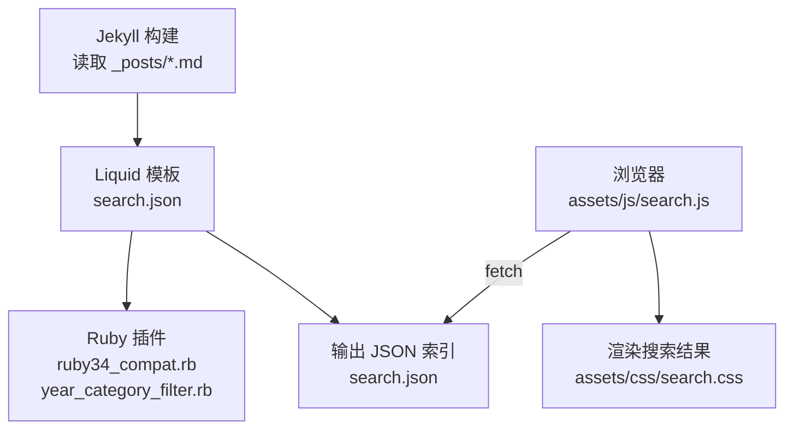
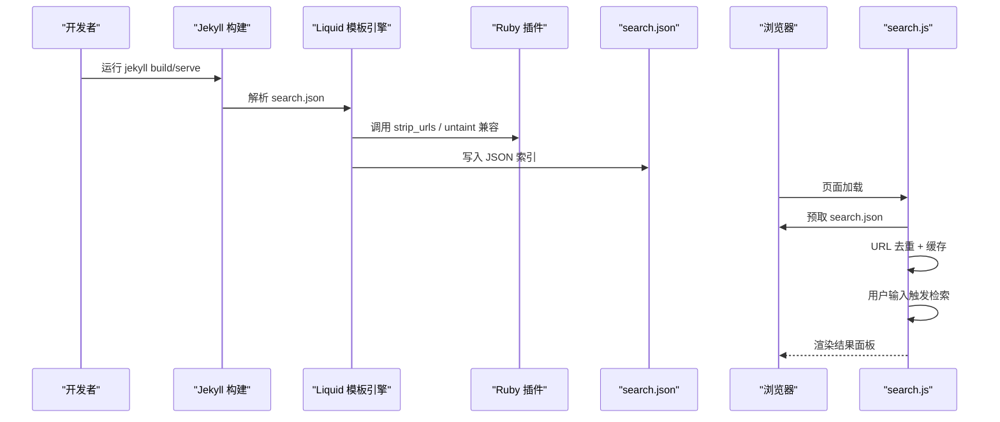
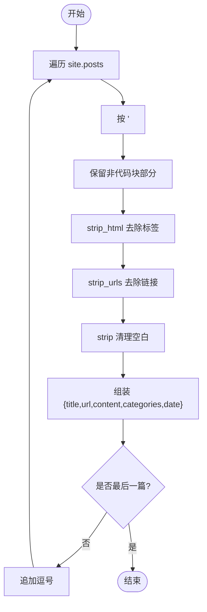
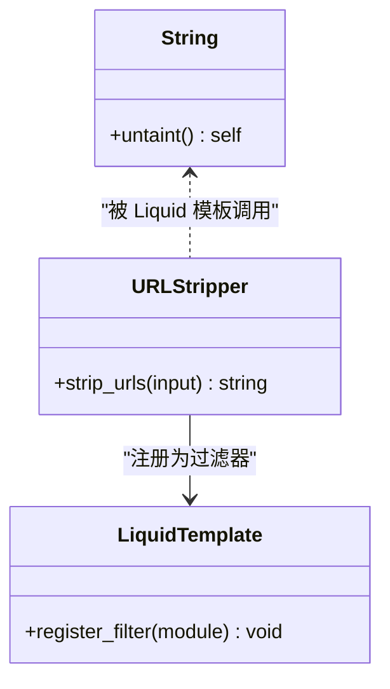
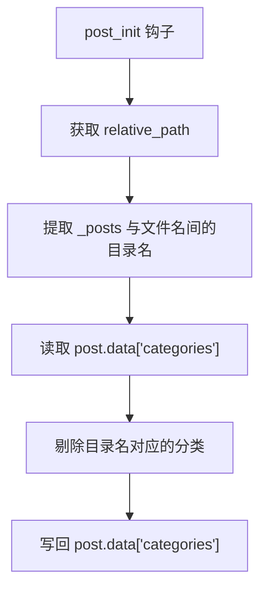
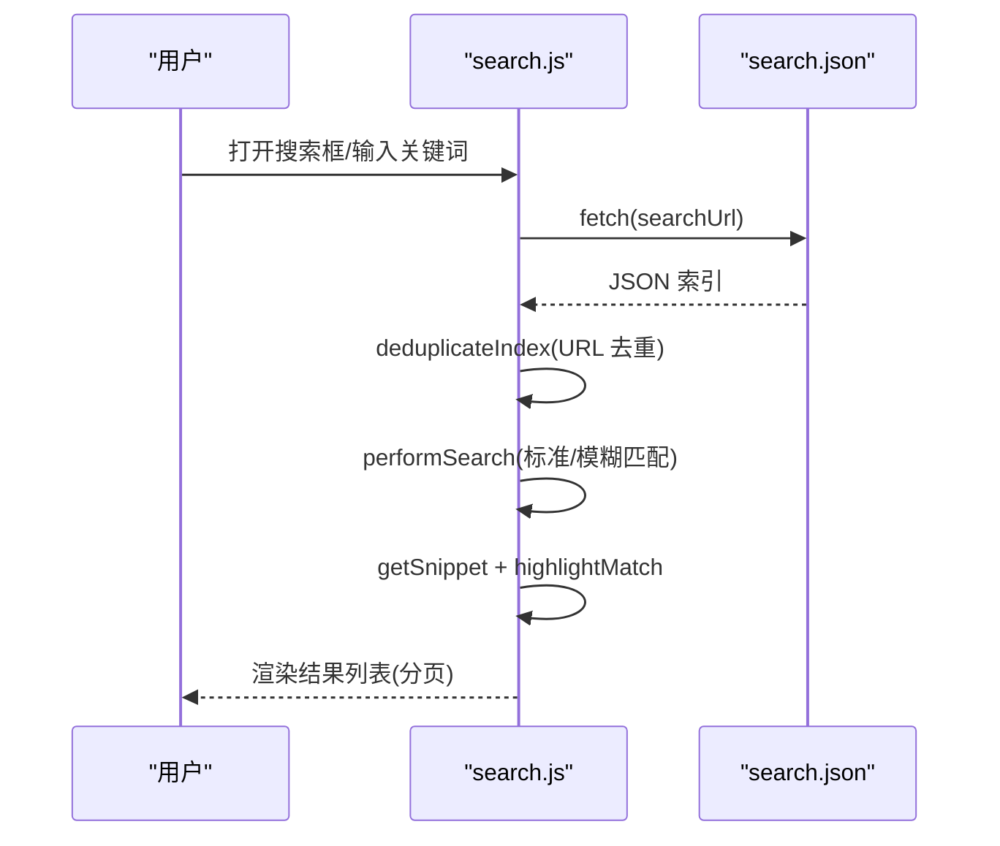
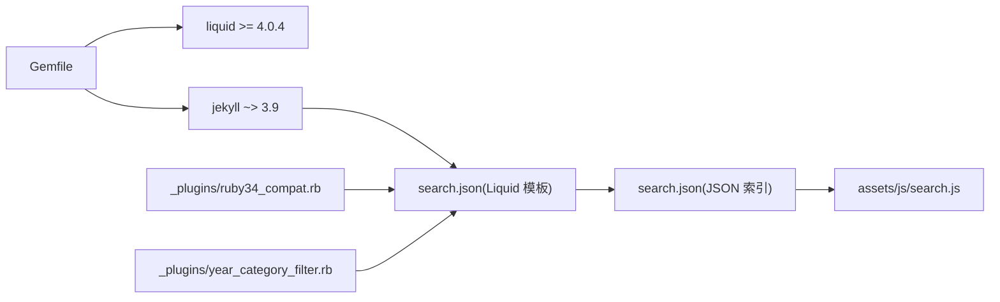

# 搜索索引构建

<cite>
**本文引用的文件**   
- [search.json](file://search.json)
- [_plugins/ruby34_compat.rb](file://_plugins/ruby34_compat.rb)
- [_plugins/year_category_filter.rb](file://_plugins/year_category_filter.rb)
- [Gemfile](file://Gemfile)
- [assets/js/search.js](file://assets/js/search.js)
- [assets/css/search.css](file://assets/css/search.css)
- [_config.yml](file://_config.yml)
</cite>

## 目录
1. [简介](#简介)
2. [项目结构](#项目结构)
3. [核心组件](#核心组件)
4. [架构总览](#架构总览)
5. [详细组件分析](#详细组件分析)
6. [依赖关系分析](#依赖关系分析)
7. [性能与体积优化](#性能与体积优化)
8. [配置与扩展](#配置与扩展)
9. [故障排查与调试](#故障排查与调试)
10. [结论](#结论)

## 简介
本技术文档围绕“搜索索引构建系统”展开，重点解释以下方面：
- search.json 的生成机制、数据结构设计与内容预处理流程
- Ruby 插件在 Jekyll 构建中的作用，特别是 Ruby 3.4+ 兼容性处理
- 索引去重算法的实现原理（URL 去重策略）与数据完整性保证
- 索引文件大小优化策略（内容截断、URL 剥离等）
- 索引构建的配置项与自定义方法
- 索引验证工具与调试方法，帮助开发者快速定位问题

## 项目结构
与本主题直接相关的文件与职责如下：
- search.json：Jekyll 模板，负责遍历文章并输出 JSON 全文索引
- _plugins/ruby34_compat.rb：Ruby 3.4+ 兼容补丁与 Liquid 过滤器注册（URL 剥离）
- _plugins/year_category_filter.rb：清理由目录结构自动注入的分类，仅保留 front matter 显式声明的分类
- assets/js/search.js：前端加载索引、执行检索、结果分页与高亮展示
- assets/css/search.css：搜索弹窗与结果样式
- Gemfile：Jekyll/Liquid 版本约束与 Ruby 3.4+ 相关依赖
- _config.yml：站点基础配置（baseurl、permalink 等），影响 URL 生成与路径拼接

图表来源
- [search.json:1-13](file://search.json#L1-L13)
- [_plugins/ruby34_compat.rb:1-19](file://_plugins/ruby34_compat.rb#L1-L19)
- [_plugins/year_category_filter.rb:1-13](file://_plugins/year_category_filter.rb#L1-L13)
- [assets/js/search.js:1-526](file://assets/js/search.js#L1-L526)
- [assets/css/search.css:1-800](file://assets/css/search.css#L1-L800)

章节来源
- [search.json:1-13](file://search.json#L1-L13)
- [_plugins/ruby34_compat.rb:1-19](file://_plugins/ruby34_compat.rb#L1-L19)
- [_plugins/year_category_filter.rb:1-13](file://_plugins/year_category_filter.rb#L1-L13)
- [Gemfile:1-17](file://Gemfile#L1-L17)
- [_config.yml:1-45](file://_config.yml#L1-L45)

## 核心组件
- 索引生成器（服务端）：search.json 通过 Liquid 遍历 site.posts，提取标题、URL、日期、分类，并对内容进行 HTML 标签与代码块过滤、URL 剥离、空白清理后输出为 JSON。
- 索引消费者（客户端）：search.js 预取 search.json，按 URL 去重后进行关键词匹配、中文二元组模糊匹配、片段截取与高亮，支持分页加载与全屏弹窗交互。
- Ruby 插件：
  - ruby34_compat.rb：提供 String#untaint 兼容实现以适配旧版 Liquid/Jekyll；注册 strip_urls 过滤器用于去除正文中的链接。
  - year_category_filter.rb：在文章初始化钩子中移除由目录结构自动注入的分类，确保分类仅来自 front matter。

章节来源
- [search.json:1-13](file://search.json#L1-L13)
- [_plugins/ruby34_compat.rb:1-19](file://_plugins/ruby34_compat.rb#L1-L19)
- [_plugins/year_category_filter.rb:1-13](file://_plugins/year_category_filter.rb#L1-L13)
- [assets/js/search.js:1-526](file://assets/js/search.js#L1-L526)

## 架构总览
从构建到运行的端到端流程如下：

图表来源
- [search.json:1-13](file://search.json#L1-L13)
- [_plugins/ruby34_compat.rb:1-19](file://_plugins/ruby34_compat.rb#L1-L19)
- [assets/js/search.js:1-526](file://assets/js/search.js#L1-L526)

## 详细组件分析

### 索引生成器（search.json）
- 遍历所有文章，逐条构造对象字段：
  - title：文章标题
  - url：使用 baseurl 前缀拼接后的完整路径
  - content：对 post.content 进行预处理后输出
  - categories：文章分类数组
  - date：格式化后的日期字符串
- 内容预处理步骤：
  - 基于 <pre> 标签分割，跳过代码块内容，避免将代码片段纳入索引
  - 使用 strip_html 去除 HTML 标签
  - 使用 strip_urls 过滤器去除正文中的链接文本
  - 使用 strip 清理首尾空白
- 输出格式：JSON 数组，元素之间用逗号分隔，末尾无多余逗号

图表来源
- [search.json:1-13](file://search.json#L1-L13)
- [_plugins/ruby34_compat.rb:1-19](file://_plugins/ruby34_compat.rb#L1-L19)

章节来源
- [search.json:1-13](file://search.json#L1-L13)
- [_plugins/ruby34_compat.rb:1-19](file://_plugins/ruby34_compat.rb#L1-L19)

### Ruby 插件：Ruby 3.4+ 兼容与 URL 剥离
- 兼容层：
  - 当运行时缺少 String#untaint 时，定义一个返回自身的 stub，使旧版 Liquid/Jekyll 不再崩溃
- 过滤器：
  - 注册 Jekyll::URLStripper.strip_urls(input)，使用正则剔除 http/https 链接，减少索引噪声与体积
- 作用点：
  - 在 Liquid 模板中通过 | strip_urls 调用，作用于文章内容字段

图表来源
- [_plugins/ruby34_compat.rb:1-19](file://_plugins/ruby34_compat.rb#L1-L19)

章节来源
- [_plugins/ruby34_compat.rb:1-19](file://_plugins/ruby34_compat.rb#L1-L19)

### Ruby 插件：分类过滤（year_category_filter.rb）
- 钩子：在 posts 的 post_init 阶段执行
- 逻辑：
  - 根据相对路径提取 _posts 与文件名之间的目录名作为潜在分类
  - 从 post.data.categories 中剔除这些目录名带来的分类
  - 最终只保留 front matter 中显式定义的分类
- 目的：避免目录结构污染分类语义，保持索引分类一致性

图表来源
- [_plugins/year_category_filter.rb:1-13](file://_plugins/year_category_filter.rb#L1-L13)

章节来源
- [_plugins/year_category_filter.rb:1-13](file://_plugins/year_category_filter.rb#L1-L13)

### 前端索引消费者（search.js）
- 索引加载与缓存：
  - 页面加载时预取 search.json，解析为 JSON 并按 URL 去重后缓存
- 检索策略：
  - 标准匹配：英文单词边界匹配，中文子串匹配
  - 模糊匹配：若包含连续中文，则采用中文二元组评分，阈值 > 0.4 命中
- 结果处理：
  - 再次按 URL 去重，防止重复条目
  - 片段截取：围绕关键词位置计算上下文窗口，默认最大长度约 200 字符
  - 高亮：对标题与片段中的关键词进行 em 包裹高亮
- 交互与分页：
  - 每页固定数量（PAGE_SIZE=8），滚动到底部自动加载更多
  - 全屏弹窗，支持关闭遮罩、键盘焦点联动、输入防抖

图表来源
- [assets/js/search.js:1-526](file://assets/js/search.js#L1-L526)

章节来源
- [assets/js/search.js:1-526](file://assets/js/search.js#L1-L526)

## 依赖关系分析
- 构建期依赖（Gemfile）：
  - jekyll ~> 3.9，minima ~> 2.5
  - liquid >= 4.0.4（修复 Ruby 3.4+ untaint 兼容问题）
  - webrick、csv、base64、bigdecimal（Ruby 3.0+/3.4+ 所需）
  - kramdown-parser-gfm（Markdown 解析）
- 运行时依赖：
  - 浏览器侧：fetch API、DOM API、CSS 变量
- 插件与模板耦合：
  - search.json 依赖 strip_urls 过滤器与 Liquid 内置过滤器（strip_html、jsonify、date）
  - year_category_filter.rb 在文章初始化阶段修改分类集合，影响 search.json 输出的 categories 字段

图表来源
- [Gemfile:1-17](file://Gemfile#L1-L17)
- [search.json:1-13](file://search.json#L1-L13)
- [_plugins/ruby34_compat.rb:1-19](file://_plugins/ruby34_compat.rb#L1-L19)
- [_plugins/year_category_filter.rb:1-13](file://_plugins/year_category_filter.rb#L1-L13)
- [assets/js/search.js:1-526](file://assets/js/search.js#L1-L526)

章节来源
- [Gemfile:1-17](file://Gemfile#L1-L17)

## 性能与体积优化
- 内容截断与精简：
  - 跳过 <pre> 代码块，避免大段代码进入索引
  - strip_html 去除 HTML 标签，降低冗余
  - strip_urls 去除链接文本，减少噪声与体积
  - strip 清理空白，进一步压缩
- 前端检索优化：
  - 预取与内存缓存索引，避免重复请求
  - 关键词分词与二元组模糊匹配，提升召回率同时控制开销
  - 片段截取限制长度，减少 DOM 渲染压力
  - 分页加载，按需渲染，避免一次性插入大量节点
- 网络与存储：
  - 建议启用服务器端 gzip/br 压缩（由部署环境决定）
  - 合理设置 CDN 缓存策略，提高二次访问速度

[本节为通用指导，不直接分析具体文件]

## 配置与扩展
- 站点级配置（_config.yml）：
  - baseurl：影响 search.json 中 url 字段的前缀拼接
  - permalink：影响文章 URL 生成规则，间接影响索引中的 url 字段
- 插件扩展点：
  - 可在 _plugins/ruby34_compat.rb 中新增或调整 strip_urls 的正则，以适配更多链接形式
  - 可在 _plugins/year_category_filter.rb 中调整分类过滤策略，例如允许特定目录名作为分类
- 前端可配置项（search.js）：
  - PAGE_SIZE：分页大小
  - 模糊匹配阈值：二元组匹配比例阈值（当前 > 0.4）
  - 片段长度：getSnippet 的 maxLen 参数（默认约 200）
  - 搜索延迟：input 事件防抖时间（当前 200ms）

章节来源
- [_config.yml:1-45](file://_config.yml#L1-L45)
- [_plugins/ruby34_compat.rb:1-19](file://_plugins/ruby34_compat.rb#L1-L19)
- [_plugins/year_category_filter.rb:1-13](file://_plugins/year_category_filter.rb#L1-L13)
- [assets/js/search.js:1-526](file://assets/js/search.js#L1-L526)

## 故障排查与调试
- 常见问题与定位：
  - 无法加载搜索索引：检查 search.json 是否存在且为合法 JSON；确认 fetch 地址是否正确（注意 baseurl 与域名）
  - 搜索结果重复：确认 URL 去重逻辑生效；检查是否有相同 URL 的不同条目
  - 中文匹配不佳：检查是否包含连续中文触发二元组模糊匹配；适当调整阈值
  - 索引过大导致加载慢：检查是否遗漏了 <pre> 过滤或 strip_urls；考虑进一步截断内容
- 调试方法：
  - 直接在浏览器控制台查看 search.json 的结构与大小
  - 在 search.js 中添加日志，观察 deduplicateIndex、performSearch、getSnippet 的执行过程
  - 临时禁用模糊匹配，仅使用标准匹配，验证是否为中文分词问题
  - 使用浏览器网络面板检查请求耗时与响应体大小
- 构建期问题：
  - Ruby 3.4+ 报错：确认已安装 liquid >= 4.0.4 并确保 _plugins/ruby34_compat.rb 生效
  - 分类异常：检查 year_category_filter.rb 是否误删了期望的分类

章节来源
- [assets/js/search.js:1-526](file://assets/js/search.js#L1-L526)
- [_plugins/ruby34_compat.rb:1-19](file://_plugins/ruby34_compat.rb#L1-L19)
- [_plugins/year_category_filter.rb:1-13](file://_plugins/year_category_filter.rb#L1-L13)

## 结论
该搜索索引构建系统以轻量、易维护为核心目标：
- 服务端通过 Liquid 模板与 Ruby 插件完成内容清洗、URL 剥离与分类规范化，输出紧凑的 JSON 索引
- 客户端实现高效检索、智能片段与高亮、分页加载与良好的交互体验
- 通过 URL 去重与内容裁剪等手段保障数据完整性与体积可控
- 借助明确的配置与扩展点，便于在不同环境与需求下灵活定制