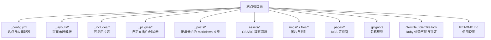
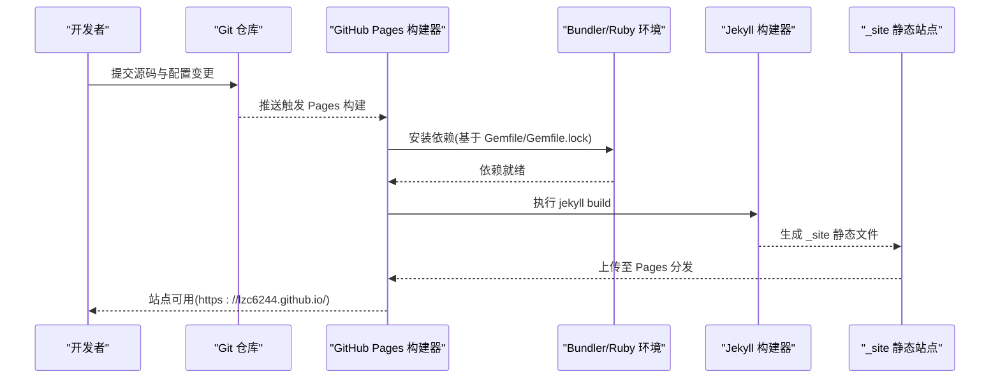
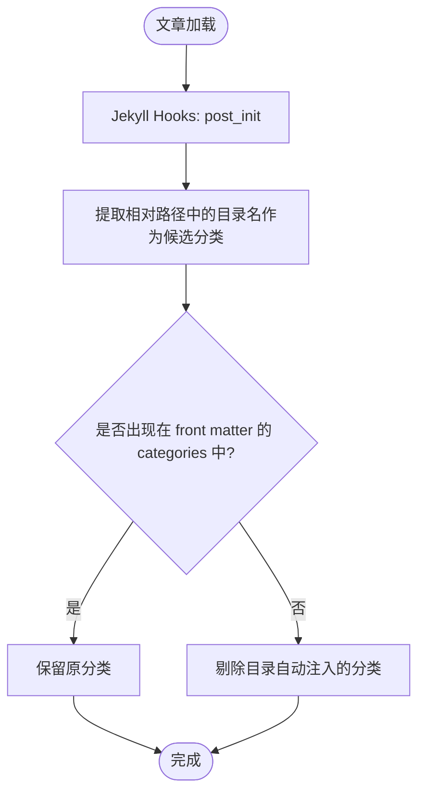
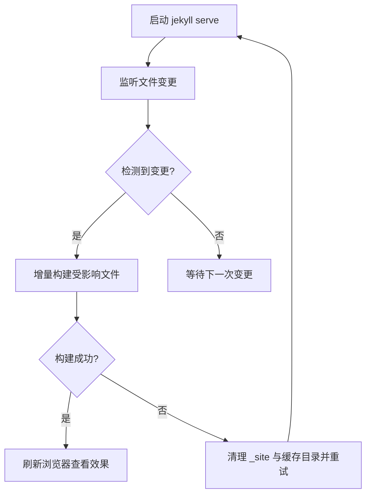

# 部署与维护

<cite>
**本文引用的文件**   
- [_config.yml](file://_config.yml)
- [Gemfile](file://Gemfile)
- [Gemfile.lock](file://Gemfile.lock)
- [.gitignore](file://.gitignore)
- [README.md](file://README.md)
- [_plugins/ruby34_compat.rb](file://_plugins/ruby34_compat.rb)
- [_plugins/year_category_filter.rb](file://_plugins/year_category_filter.rb)
- [_layouts/home.html](file://_layouts/home.html)
- [_layouts/post.html](file://_layouts/post.html)
- [pages/feed.xml](file://pages/feed.xml)
</cite>

## 目录
1. [简介](#简介)
2. [项目结构](#项目结构)
3. [核心组件](#核心组件)
4. [架构总览](#架构总览)
5. [详细组件分析](#详细组件分析)
6. [依赖与版本锁定](#依赖与版本锁定)
7. [构建缓存与增量构建](#构建缓存与增量构建)
8. [GitHub Pages 自动化构建与部署](#github-pages-自动化构建与部署)
9. [故障排除指南](#故障排除指南)
10. [备份与恢复策略](#备份与恢复策略)
11. [性能监控与优化建议](#性能监控与优化建议)
12. [结论](#结论)

## 简介
本指南面向维护者，系统化说明该 Jekyll 博客在 GitHub Pages 上的构建、部署、日常维护与排障流程。内容覆盖仓库配置、分支策略、构建触发器、依赖锁定机制、忽略规则、构建缓存管理、常见问题排查、备份恢复以及性能监控与优化建议。

## 项目结构
仓库采用 Jekyll 标准目录组织：
- 站点配置与主题：_config.yml、_layouts、_includes
- 文章与资源：_posts、assets、imgs、files
- 插件与过滤器：_plugins
- 生成产物（本地）：_site（被 .gitignore 忽略）
- 站点元数据与功能页：index.md、search.json、pages/feed.xml、404.html 等

图表来源
- [_config.yml:1-45](file://_config.yml#L1-L45)
- [Gemfile:1-17](file://Gemfile#L1-L17)
- [Gemfile.lock:1-132](file://Gemfile.lock#L1-L132)
- [.gitignore:1-136](file://.gitignore#L1-L136)
- [README.md:1-157](file://README.md#L1-L157)

章节来源
- [_config.yml:1-45](file://_config.yml#L1-L45)
- [README.md:1-157](file://README.md#L1-L157)

## 核心组件
- 站点配置与主题
  - 站点标题、描述、作者、URL、baseurl、主题与皮肤、社交链接、头像与 favicon、评论与分析集成、永久链接格式、Markdown 解析器与代码高亮、插件列表等均在 _config.yml 中集中管理。
- 主题与布局
  - 使用 Minima 主题，并通过 _layouts/home.html 和 _layouts/post.html 实现分类/日期双视图切换、文章目录侧边栏、时间显示等交互逻辑。
- 插件与过滤器
  - 兼容 Ruby 3.4+ 的 Liquid/Jekyll 兼容性补丁；移除由目录结构自动注入的分类，仅保留 front matter 显式定义的分类；提供 URL 过滤工具用于搜索索引。
- 依赖与平台
  - 通过 Gemfile 声明 Jekyll、Minima、Liquid、Webrick、CSV、Base64、BigDecimal、Kramdown 解析器等依赖；Gemfile.lock 锁定具体版本与校验和，确保跨环境一致。
- 忽略规则
  - .gitignore 明确忽略 _site、.jekyll-cache、.sass-cache、vendor、IDE 设置、虚拟环境等本地临时与构建产物，避免污染仓库。

章节来源
- [_config.yml:1-45](file://_config.yml#L1-L45)
- [_layouts/home.html:1-135](file://_layouts/home.html#L1-L135)
- [_layouts/post.html:1-105](file://_layouts/post.html#L1-L105)
- [_plugins/ruby34_compat.rb:1-19](file://_plugins/ruby34_compat.rb#L1-L19)
- [_plugins/year_category_filter.rb:1-13](file://_plugins/year_category_filter.rb#L1-L13)
- [Gemfile:1-17](file://Gemfile#L1-L17)
- [Gemfile.lock:1-132](file://Gemfile.lock#L1-L132)
- [.gitignore:1-136](file://.gitignore#L1-L136)

## 架构总览
下图展示从源码到 GitHub Pages 发布产物的端到端流程，包括本地开发与远程构建的关键节点。

图表来源
- [_config.yml:1-45](file://_config.yml#L1-L45)
- [Gemfile:1-17](file://Gemfile#L1-L17)
- [Gemfile.lock:1-132](file://Gemfile.lock#L1-L132)
- [README.md:128-141](file://README.md#L128-L141)

## 详细组件分析

### 站点配置与主题（_config.yml）
- 站点基础信息：标题、描述、作者、邮箱、URL、baseurl。
- 主题与皮肤：启用 Minima 主题并设置 skin 为 auto，支持明暗模式自动切换。
- 社交与头像：GitHub、知乎用户名，头像与 favicon 路径。
- 第三方服务：Disqus shortname、Google Analytics ID。
- 构建选项：permalink 格式、markdown 引擎 kramdown、highlighter rouge。
- 插件：sitemap、seo-tag、feed。

章节来源
- [_config.yml:1-45](file://_config.yml#L1-L45)

### 首页与文章布局（_layouts）
- 首页（home.html）
  - 提供“分类/日期”两种视图切换，支持折叠归档、统计计数、RSS 订阅入口。
  - 前端脚本控制视图切换与 DOM 显示隐藏。
- 文章页（post.html）
  - 渲染创建/更新时间、发布时间、作者等元信息。
  - 自动生成文章目录侧边栏，支持滚动高亮与移动端收起。

章节来源
- [_layouts/home.html:1-135](file://_layouts/home.html#L1-L135)
- [_layouts/post.html:1-105](file://_layouts/post.html#L1-L105)

### 自定义插件与过滤器（_plugins）
- Ruby 3.4+ 兼容层
  - 为旧版 Liquid/Jekyll 提供 String#untaint 兼容方法，避免在新 Ruby 上运行失败。
  - 注册 URL 剥离过滤器，用于搜索索引清理。
- 分类过滤钩子
  - 在文章初始化后，移除由 _posts 子目录自动注入的分类，仅保留 front matter 中的 categories，保证分类可控。

图表来源
- [_plugins/year_category_filter.rb:1-13](file://_plugins/year_category_filter.rb#L1-L13)

章节来源
- [_plugins/ruby34_compat.rb:1-19](file://_plugins/ruby34_compat.rb#L1-L19)
- [_plugins/year_category_filter.rb:1-13](file://_plugins/year_category_filter.rb#L1-L13)

### RSS 输出（pages/feed.xml）
- 基于 Jekyll 变量生成 RSS 频道，包含最近 10 篇文章的标题、摘要、发布日期、链接与分类标签。

章节来源
- [pages/feed.xml:1-30](file://pages/feed.xml#L1-L30)

## 依赖与版本锁定
- Gemfile
  - 声明 Jekyll 主版本范围、Minima 主题、Liquid 最低版本、Webrick、CSV、Base64、BigDecimal、kramdown-parser-gfm 等依赖。
  - 将 sitemap、seo-tag、feed 插件放入 jekyll_plugins 分组，便于 Jekyll 自动加载。
- Gemfile.lock
  - 锁定所有依赖的具体版本号、平台信息与 SHA256 校验和，确保在不同机器或 CI 环境中获得一致的构建结果。
  - 记录 Bundler 版本，有助于复现依赖解析过程。

最佳实践
- 始终使用 bundle exec 执行 Jekyll 命令，确保使用 Gemfile 指定的依赖版本。
- 升级依赖时先更新 Gemfile，再运行 bundle update 生成新的 Gemfile.lock，并提交锁文件。

章节来源
- [Gemfile:1-17](file://Gemfile#L1-L17)
- [Gemfile.lock:1-132](file://Gemfile.lock#L1-L132)
- [README.md:49-51](file://README.md#L49-L51)

## 构建缓存与增量构建
- 本地开发
  - 使用 jekyll serve 进行增量构建与热重载，修改文章即时生效。
  - 若出现样式错乱、页面未更新或 header 重复等问题，需清理历史构建并重启服务。
- 清理策略
  - 删除 _site 目录以强制全量重建，避免增量缓存冲突。
  - 同时注意 .jekyll-cache、.sass-cache、.jekyll-metadata 等缓存目录（已被 .gitignore 忽略），必要时一并清理。

图表来源
- [README.md:128-141](file://README.md#L128-L141)
- [.gitignore:128-136](file://.gitignore#L128-L136)

章节来源
- [README.md:128-141](file://README.md#L128-L141)
- [.gitignore:128-136](file://.gitignore#L128-L136)

## GitHub Pages 自动化构建与部署
- 默认行为
  - 当推送到仓库默认分支（通常为 main 或 master）时，GitHub Pages 会自动拉取源码并使用内置 Jekyll 构建器生成 _site 静态站点并分发。
- 构建触发器
  - 推送（push）到受保护分支即触发构建；也可在 GitHub Actions 中自定义 workflow 以增强构建能力（当前仓库未包含 .github/workflows）。
- 分支策略建议
  - main/master：生产分支，直接触发 Pages 构建。
  - develop：集成测试分支，可在本地或 CI 验证后再合并到 main。
  - feature/*：功能分支，按需合并回 develop/main。
- 构建环境一致性
  - 使用 Gemfile 与 Gemfile.lock 锁定依赖版本，确保 Pages 构建环境与本地一致。
  - 如需指定 Jekyll 版本或额外构建参数，可通过 _config.yml 或 Actions 环境变量控制。

注意事项
- 当前仓库未包含 .github/workflows，Pages 使用默认构建流程。
- 若未来引入 Actions，建议在 workflow 中显式安装依赖（bundle install）并执行 jekyll build，以便统一日志与缓存策略。

章节来源
- [README.md:151-157](file://README.md#L151-L157)
- [Gemfile:1-17](file://Gemfile#L1-L17)
- [Gemfile.lock:1-132](file://Gemfile.lock#L1-L132)

## 故障排除指南
- 构建失败
  - 检查 Ruby 与 Bundler 版本是否与 Gemfile.lock 匹配；确认 Gemfile 中依赖版本约束合理。
  - 若提示缺少系统库或编译依赖，参考 README 的环境搭建步骤安装必要工具链。
- 样式错乱或页面不更新
  - 清理 _site 与缓存目录（_sass-cache、_jekyll-cache、_jekyll-metadata），然后重新构建。
  - 修改 _config.yml 后需要重启 jekyll serve。
- 分类异常
  - 若发现分类来自目录结构而非 front matter，确认 year_category_filter 插件是否生效。
- 搜索索引异常
  - 检查 ruby34_compat 插件是否正确注册 URL 剥离过滤器，确保搜索内容不包含多余链接。
- 评论与分析未生效
  - 核对 _config.yml 中的 Disqus shortname 与 Google Analytics ID 是否正确配置。

章节来源
- [README.md:128-141](file://README.md#L128-L141)
- [_plugins/ruby34_compat.rb:1-19](file://_plugins/ruby34_compat.rb#L1-L19)
- [_plugins/year_category_filter.rb:1-13](file://_plugins/year_category_filter.rb#L1-L13)
- [_config.yml:28-34](file://_config.yml#L28-L34)

## 备份与恢复策略
- 源码与配置
  - 将仓库本身作为唯一事实源，定期推送至远端；必要时对仓库进行镜像或导出快照。
- 静态站点
  - 由于 GitHub Pages 生成的 _site 未被纳入版本控制，无需单独备份；站点可从源码重建。
- 附件与图片
  - imgs 与 files 目录中的资源应纳入版本控制，确保可恢复性。
- 定时任务与外部数据
  - 若站点涉及外部数据或服务器端脚本，建议结合操作系统级备份方案（如 crontab 备份脚本）进行周期性归档。

章节来源
- [README.md:111-126](file://README.md#L111-L126)
- [Gemfile.lock:1-132](file://Gemfile.lock#L1-L132)

## 性能监控与优化建议
- 访问分析
  - 已在 _config.yml 中启用 Google Analytics，可用于监控访问量与用户行为。
- 站点地图与 SEO
  - 启用 jekyll-sitemap 与 jekyll-seo-tag，提升搜索引擎收录与展示质量。
- 资源优化
  - 图片压缩与懒加载：对 imgs 中的大图进行压缩，考虑使用现代格式与响应式尺寸。
  - CSS/JS 精简：减少不必要的样式与脚本，利用浏览器缓存与 CDN 加速。
- 构建与缓存
  - 合理使用增量构建，避免频繁全量清理；仅在必要时清理 _site 与缓存目录。
- 字体与外部资源
  - Inter 字体通过 Google Fonts 加载，可考虑自托管字体以提升稳定性与速度。

章节来源
- [_config.yml:32-44](file://_config.yml#L32-L44)
- [README.md:151-157](file://README.md#L151-L157)

## 结论
本指南围绕该 Jekyll 博客的构建、部署、维护与优化提供了系统化说明。通过严格的依赖锁定、合理的忽略规则、清晰的构建缓存管理与完善的故障排除流程，可保障站点稳定高效地运行于 GitHub Pages。建议在生产实践中持续完善 Actions 工作流、监控指标与资源优化策略，进一步提升用户体验与可维护性。