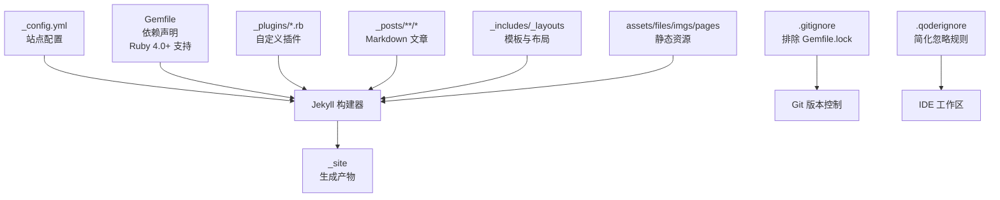
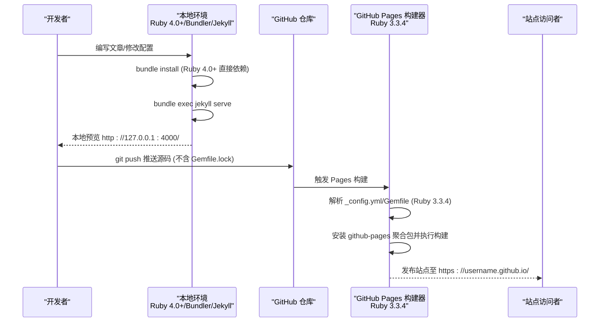
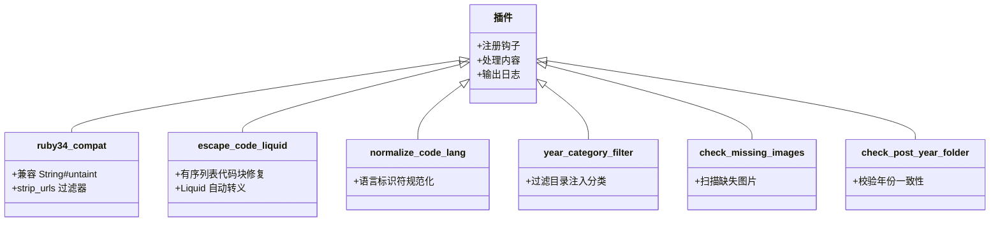
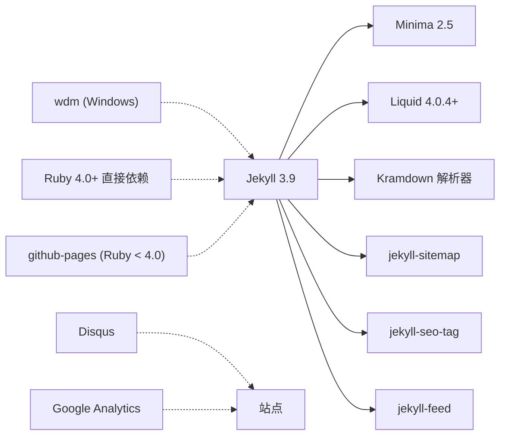

# GitHub Pages 部署

<cite>
**本文引用的文件**
- [_config.yml](file://_config.yml)
- [Gemfile](file://Gemfile)
- [.gitignore](file://.gitignore)
- [.qoderignore](file://.qoderignore)
- [README.md](file://README.md)
- [_plugins/ruby34_compat.rb](file://_plugins/ruby34_compat.rb)
- [_plugins/escape_code_liquid.rb](file://_plugins/escape_code_liquid.rb)
- [_plugins/normalize_code_lang.rb](file://_plugins/normalize_code_lang.rb)
- [_plugins/year_category_filter.rb](file://_plugins/year_category_filter.rb)
- [_plugins/check_missing_images.rb](file://_plugins/check_missing_images.rb)
- [_plugins/check_post_year_folder.rb](file://_plugins/check_post_year_folder.rb)
</cite>

## 更新摘要
**变更内容**
- 更新了 Gemfile 配置以支持 Ruby 4.0+ 环境，改进了依赖管理策略
- 移除了 Gemfile.lock 的版本控制，避免本地与线上版本不一致问题
- 简化了 .qoderignore 配置文件，仅保留必要的忽略规则
- 增强了 Ruby 版本兼容性处理和本地开发体验

## 目录
1. [简介](#简介)
2. [项目结构](#项目结构)
3. [核心组件](#核心组件)
4. [架构总览](#架构总览)
5. [详细组件分析](#详细组件分析)
6. [依赖分析](#依赖分析)
7. [性能与构建特性](#性能与构建特性)
8. [故障排查指南](#故障排查指南)
9. [结论](#结论)
10. [附录：本地开发与部署清单](#附录本地开发与部署清单)

## 简介
本指南面向使用 Jekyll + GitHub Pages 搭建博客的开发者，提供从仓库命名、分支配置到自动构建流程的完整说明；并给出 Windows 与 Ubuntu 环境下的本地开发步骤（Ruby、Jekyll、Bundler 安装与镜像源配置）、依赖管理（Gemfile 与 bundle install）、本地预览（jekyll serve）以及提交后触发自动构建与常见构建失败原因及处理方法。

**更新** 本项目已优化对 Ruby 4.0+ 环境的支持，改进了依赖管理策略，移除了 Gemfile.lock 的版本控制以避免本地与线上版本不一致问题。

## 项目结构
本项目为典型的 Jekyll 站点结构，包含站点配置、主题、插件、文章与静态资源等。关键目录与文件如下：
- _config.yml：站点全局配置（标题、URL、主题、插件等）
- Gemfile：Ruby 依赖声明与版本约束（支持 Ruby 4.0+ 环境）
- .gitignore：版本控制忽略规则（已移除 Gemfile.lock）
- .qoderignore：IDE 忽略规则（简化配置）
- _includes/_layouts/_plugins：模板片段、页面布局与自定义插件
- _posts：按年份子目录组织的 Markdown 文章
- assets/files/imgs/favicons/pages：前端资源、附件、图片、额外页面等

**图表来源**
- [_config.yml:1-45](file://_config.yml#L1-L45)
- [Gemfile:1-25](file://Gemfile#L1-L25)
- [.gitignore:137-139](file://.gitignore#L137-L139)
- [.qoderignore:1-3](file://.qoderignore#L1-L3)

章节来源
- [README.md:26-62](file://README.md#L26-L62)

## 核心组件
- 站点配置（_config.yml）
  - 站点元信息（title、description、author、url、baseurl）
  - 主题与皮肤（theme: minima，minima.skin/date_format）
  - 社交链接与头像/Favicon 路径
  - Disqus 评论 shortname、Google Analytics ID
  - 构建设置（permalink、markdown、highlighter）
  - 插件列表（sitemap、seo-tag、feed）
- 依赖管理（Gemfile）
  - **更新** 根据 Ruby 版本智能选择依赖策略：Ruby 4.0+ 使用直接依赖，其他版本使用 github-pages 聚合包
  - 显式声明 jekyll、minima、liquid、kramdown-parser-gfm、webrick、csv、base64、bigdecimal
  - 在 jekyll_plugins 分组中声明 sitemap、seo-tag、feed
  - Windows 下启用 wdm 优化文件监控
- 版本控制配置
  - **更新** .gitignore 排除了 Gemfile.lock，避免本地 Ruby 4.0 与线上 Ruby 3.3.4 版本冲突
  - .qoderignore 简化为仅忽略 .qoder/repowiki/ 目录
- 自定义插件（_plugins）
  - ruby34_compat.rb：兼容 Ruby 3.4+（String#untaint 移除），并提供 strip_urls 过滤器
  - escape_code_liquid.rb：代码块与行内代码中的 Liquid 语法自动转义
  - normalize_code_lang.rb：规范化代码语言标识符
  - year_category_filter.rb：过滤由目录结构注入的分类
  - check_missing_images.rb：构建时检查缺失图片并输出警告
  - check_post_year_folder.rb：校验文章所在文件夹年份与文件名年份一致性

**章节来源**
- [_config.yml:1-45](file://_config.yml#L1-L45)
- [Gemfile:1-25](file://Gemfile#L1-L25)
- [.gitignore:137-139](file://.gitignore#L137-L139)
- [.qoderignore:1-3](file://.qoderignore#L1-L3)
- [_plugins/ruby34_compat.rb:1-22](file://_plugins/ruby34_compat.rb#L1-L22)
- [_plugins/escape_code_liquid.rb:1-62](file://_plugins/escape_code_liquid.rb#L1-L62)
- [_plugins/normalize_code_lang.rb:1-42](file://_plugins/normalize_code_lang.rb#L1-L42)
- [_plugins/year_category_filter.rb:1-13](file://_plugins/year_category_filter.rb#L1-L13)
- [_plugins/check_missing_images.rb:1-38](file://_plugins/check_missing_images.rb#L1-L38)
- [_plugins/check_post_year_folder.rb:1-33](file://_plugins/check_post_year_folder.rb#L1-L33)

## 架构总览
下图展示了本地开发与 GitHub Pages 自动构建的整体流程：本地通过 Bundler 锁定依赖，Jekyll 读取配置与插件渲染站点；将源码推送到 GitHub 后，GitHub Pages 基于仓库根目录进行构建并发布。

**更新** 新的架构支持 Ruby 4.0+ 本地环境，同时保持与 GitHub Pages Ruby 3.3.4 的兼容性。

**图表来源**
- [_config.yml:1-45](file://_config.yml#L1-L45)
- [Gemfile:1-25](file://Gemfile#L1-L25)
- [.gitignore:137-139](file://.gitignore#L137-L139)
- [README.md:64-132](file://README.md#L64-L132)

## 详细组件分析

### 站点配置（_config.yml）
- 站点基础信息与 URL
  - url 指向最终域名，用于生成绝对链接与 RSS/SEO 标签
  - baseurl 为空字符串，适用于 username.github.io 根域部署
- 主题与皮肤
  - theme: minima，skin: auto，date_format: "%Y-%m-%d"
- 社交与头像
  - github_username/zhihu_username/avatar/favicon 路径
- 评论与分析
  - disqus.shortname 控制评论区开关
  - google_analytics 注入统计脚本
- 构建选项
  - permalink 定义文章永久链接格式
  - markdown: kramdown，highlighter: rouge
- 插件
  - jekyll-sitemap、jekyll-seo-tag、jekyll-feed

**章节来源**
- [_config.yml:1-45](file://_config.yml#L1-L45)

### 依赖管理（Gemfile）
- **更新** 版本策略
  - 当 RUBY_VERSION >= 4.0.0 时，显式声明 jekyll (~> 3.9)、minima (~> 2.5)、liquid (>= 4.0.4)、kramdown-parser-gfm、webrick、csv、base64、bigdecimal，并在 jekyll_plugins 分组中声明 sitemap、seo-tag、feed
  - 否则使用 github-pages 聚合包以匹配线上环境
  - **新增** liquid gem 明确指定 >= 4.0.4 版本以修复 Ruby 3.4+ untaint 兼容问题
- Windows 优化
  - 在 Windows 平台启用 wdm 提升文件监控性能
- 镜像源
  - 默认 source 为 rubygems.org；可在系统级 gem 配置中替换为国内镜像（见"附录"）

**章节来源**
- [Gemfile:1-25](file://Gemfile#L1-L25)

### 版本控制配置
- **更新** .gitignore 配置
  - 明确排除了 Gemfile.lock 文件，避免本地 Ruby 4.0 与线上 Ruby 3.3.4 版本冲突
  - 保留了 Jekyll 相关的缓存目录和临时文件忽略规则
- **.qoderignore 简化配置**
  - 仅保留 .qoder/repowiki/ 目录的忽略规则
  - 移除了复杂的忽略模式，保持配置简洁

**章节来源**
- [.gitignore:137-139](file://.gitignore#L137-L139)
- [.qoderignore:1-3](file://.qoderignore#L1-L3)

### 自定义插件（_plugins）
- ruby34_compat.rb
  - 兼容 Ruby 3.4+（String#untaint 已移除）
  - 注册 strip_urls 过滤器，用于搜索索引清理
- escape_code_liquid.rb
  - 有序列表内的围栏代码块自动转换标记
  - 代码块与行内代码中的 {{ }} 自动用  保护
- normalize_code_lang.rb
  - 规范化代码语言标识符（大小写、空格、别名映射）
- year_category_filter.rb
  - 移除由目录结构注入的分类，仅保留 front matter 中显式定义的分类
- check_missing_images.rb
  - 扫描文章中本地图片引用，缺失则输出警告
- check_post_year_folder.rb
  - 校验文章所在文件夹年份与文件名年份一致，不一致则输出警告

**图表来源**
- [_plugins/ruby34_compat.rb:1-22](file://_plugins/ruby34_compat.rb#L1-L22)
- [_plugins/escape_code_liquid.rb:1-62](file://_plugins/escape_code_liquid.rb#L1-L62)
- [_plugins/normalize_code_lang.rb:1-42](file://_plugins/normalize_code_lang.rb#L1-L42)
- [_plugins/year_category_filter.rb:1-13](file://_plugins/year_category_filter.rb#L1-L13)
- [_plugins/check_missing_images.rb:1-38](file://_plugins/check_missing_images.rb#L1-L38)
- [_plugins/check_post_year_folder.rb:1-33](file://_plugins/check_post_year_folder.rb#L1-L33)

**章节来源**
- [_plugins/ruby34_compat.rb:1-22](file://_plugins/ruby34_compat.rb#L1-L22)
- [_plugins/escape_code_liquid.rb:1-62](file://_plugins/escape_code_liquid.rb#L1-L62)
- [_plugins/normalize_code_lang.rb:1-42](file://_plugins/normalize_code_lang.rb#L1-L42)
- [_plugins/year_category_filter.rb:1-13](file://_plugins/year_category_filter.rb#L1-L13)
- [_plugins/check_missing_images.rb:1-38](file://_plugins/check_missing_images.rb#L1-L38)
- [_plugins/check_post_year_folder.rb:1-33](file://_plugins/check_post_year_folder.rb#L1-L33)

## 依赖分析
- **更新** 直接依赖
  - jekyll (~> 3.9)、minima (~> 2.5)、liquid (>= 4.0.4)、kramdown-parser-gfm、webrick、csv、base64、bigdecimal（Ruby 4.0+ 分支）
  - jekyll-sitemap、jekyll-seo-tag、jekyll-feed（jekyll_plugins 分组）
  - wdm（Windows 平台）
  - github-pages（Ruby < 4.0 分支）
- 间接依赖
  - 无变化
- 外部集成点
  - Google Fonts（Inter 字体）
  - Disqus 评论服务
  - Google Analytics 统计

**图表来源**
- [Gemfile:1-25](file://Gemfile#L1-L25)
- [_config.yml:1-45](file://_config.yml#L1-L45)

**章节来源**
- [Gemfile:1-25](file://Gemfile#L1-L25)
- [_config.yml:1-45](file://_config.yml#L1-L45)

## 性能与构建特性
- 本地文件监控
  - Windows 下启用 wdm 提升增量构建性能
- 构建缓存与清理
  - 遇到样式错乱或重复 header 等问题，建议删除 _site 后重新构建
- 插件辅助
  - 自动转义与语言标识符规范化可减少渲染异常
  - 缺失图片与年份不匹配检查有助于提前发现问题
- **更新** 版本兼容性
  - Ruby 4.0+ 本地环境使用直接依赖，避免 github-pages 聚合包的版本限制
  - GitHub Pages 线上环境继续使用 Ruby 3.3.4 和 github-pages 聚合包

**章节来源**
- [Gemfile:24-25](file://Gemfile#L24-L25)
- [README.md:281-294](file://README.md#L281-L294)
- [_plugins/escape_code_liquid.rb:1-62](file://_plugins/escape_code_liquid.rb#L1-L62)
- [_plugins/normalize_code_lang.rb:1-42](file://_plugins/normalize_code_lang.rb#L1-L42)
- [_plugins/check_missing_images.rb:1-38](file://_plugins/check_missing_images.rb#L1-L38)
- [_plugins/check_post_year_folder.rb:1-33](file://_plugins/check_post_year_folder.rb#L1-L33)

## 故障排查指南
- 本地无法启动或端口占用
  - 确认 4000 端口未被占用；必要时更换端口或关闭占用进程
- 依赖安装失败
  - **更新** 检查 Ruby 版本是否符合 Gemfile 分支条件（Ruby 4.0+ 使用直接依赖）
  - 若网络受限，配置国内镜像源（见"附录"）
- 构建时报错缺少依赖
  - 确保使用 bundle exec jekyll 运行，避免与全局版本冲突
- 图片未显示
  - 检查图片路径是否为本地绝对路径且文件存在；可参考缺失图片检查插件的输出
- 文章未出现在预期分类
  - 确认未在 front matter 外依赖目录名作为分类；year_category_filter 会过滤目录注入的分类
- 代码块语言高亮异常
  - 使用规范的语言标识符；normalize_code_lang 会自动修正常见别名与大小写问题
- **更新** 本地与线上行为不一致
  - 由于移除了 Gemfile.lock 的版本控制，本地 Ruby 4.0+ 与线上 Ruby 3.3.4 可能产生差异
  - 建议使用 Docker 或虚拟机模拟线上环境进行验证
  - 关注 liquid gem 版本要求（>= 4.0.4）以确保 Ruby 3.4+ 兼容性

**章节来源**
- [README.md:64-132](file://README.md#L64-L132)
- [Gemfile:1-25](file://Gemfile#L1-L25)
- [.gitignore:137-139](file://.gitignore#L137-L139)
- [_plugins/check_missing_images.rb:1-38](file://_plugins/check_missing_images.rb#L1-L38)
- [_plugins/year_category_filter.rb:1-13](file://_plugins/year_category_filter.rb#L1-L13)
- [_plugins/normalize_code_lang.rb:1-42](file://_plugins/normalize_code_lang.rb#L1-L42)

## 结论
通过合理的仓库命名与分支配置，结合优化的 Gemfile 依赖管理与自定义插件的质量保障，可以在本地高效开发并在 GitHub Pages 上稳定自动构建与发布。**更新** 新的架构支持 Ruby 4.0+ 本地环境，同时保持与线上环境的兼容性，显著提升了开发体验和构建稳定性。遵循本文的安装与排障指引，可显著降低环境问题与构建失败的概率。

## 附录：本地开发与部署清单

### 仓库命名与分支
- 仓库命名规范
  - 用户主页：username.github.io（例如 lzc6244.github.io）
  - 组织页：orgname.github.io
- 分支配置
  - 推荐 main 分支作为默认分支
  - 旧仓库可能使用 master，迁移后建议统一为 main
- 自动构建
  - GitHub Pages 默认从仓库根目录构建，无需额外工作流文件
  - 推送代码到默认分支即触发构建与发布

### 本地开发环境搭建（Windows）
- 安装 Ruby+Devkit
  - 下载并安装 Ruby+Devkit，勾选添加到 PATH
- 安装开发工具链
  - 执行 ridk install，按提示完成编译工具链安装
- 配置 gem 镜像源（可选，国内推荐）
  - 将默认源替换为国内镜像以提升下载速度
- 安装 Jekyll 与 Bundler
  - 安装 jekyll 与 bundler
- 安装项目依赖并启动
  - 在项目根目录执行 bundle install
  - 使用 bundle exec jekyll serve 启动本地预览

**章节来源**
- [README.md:66-96](file://README.md#L66-L96)

### 本地开发环境搭建（Ubuntu）
- 安装系统依赖
  - 安装 ruby-full、build-essential、zlib1g-dev
- 配置 gem 安装路径（避免 root 权限）
  - 设置 GEM_HOME 与 PATH，使 gem 命令可用
- 配置 gem 镜像源（可选，国内推荐）
  - 将默认源替换为国内镜像
- 安装 Jekyll 与 Bundler
  - 安装 jekyll 与 bundler
- 安装项目依赖并启动
  - 在项目根目录执行 bundle install
  - 使用 bundle exec jekyll serve 启动本地预览

**章节来源**
- [README.md:98-132](file://README.md#L98-L132)

### 依赖管理与构建命令
- **更新** 依赖管理
  - 使用 Gemfile 声明依赖；Ruby 4.0+ 分支采用显式依赖（jekyll、minima、liquid 等），其他分支使用 github-pages 聚合包
  - **重要** Gemfile.lock 不再纳入版本控制，避免本地与线上版本冲突
- 常用命令
  - bundle install：安装/更新依赖
  - bundle exec jekyll serve：本地预览
  - rm -rf _site && bundle exec jekyll serve：清理缓存后重建

**章节来源**
- [Gemfile:1-25](file://Gemfile#L1-L25)
- [.gitignore:137-139](file://.gitignore#L137-L139)
- [README.md:281-294](file://README.md#L281-L294)

### 提交后触发自动构建与常见问题
- 触发方式
  - 将源码推送到默认分支（main/master），GitHub Pages 自动构建并发布
- **更新** 常见失败原因与解决
  - Ruby 版本不匹配：确保本地与线上版本一致，或按 Gemfile 分支策略调整
  - 依赖缺失：使用 bundle install 安装所有依赖，并使用 bundle exec 运行
  - 网络问题：配置国内镜像源
  - 图片缺失：检查图片路径与文件是否存在
  - 分类异常：确认 front matter 中 categories 定义，避免依赖目录名作为分类
  - **新增** 版本冲突：由于移除了 Gemfile.lock，确保本地 Ruby 4.0+ 环境与线上 Ruby 3.3.4 的兼容性

**章节来源**
- [README.md:64-132](file://README.md#L64-L132)
- [Gemfile:1-25](file://Gemfile#L1-L25)
- [.gitignore:137-139](file://.gitignore#L137-L139)
- [_plugins/check_missing_images.rb:1-38](file://_plugins/check_missing_images.rb#L1-L38)
- [_plugins/year_category_filter.rb:1-13](file://_plugins/year_category_filter.rb#L1-L13)