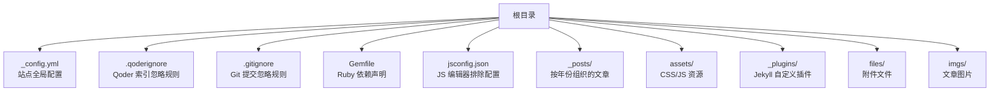
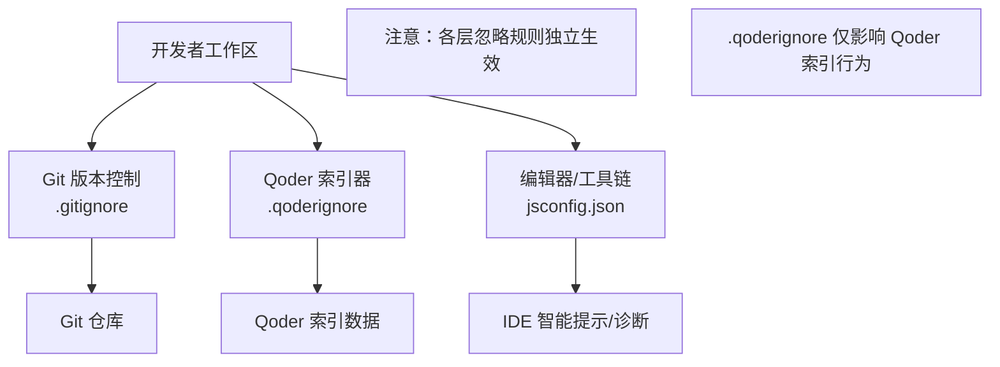
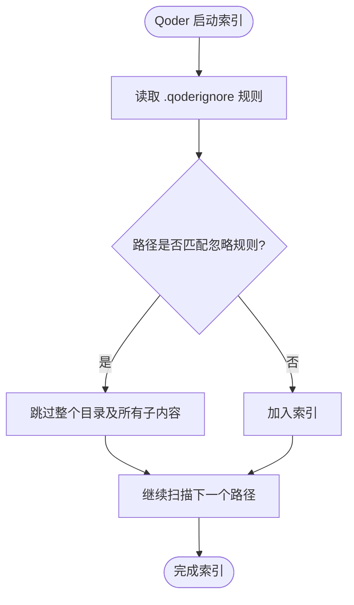
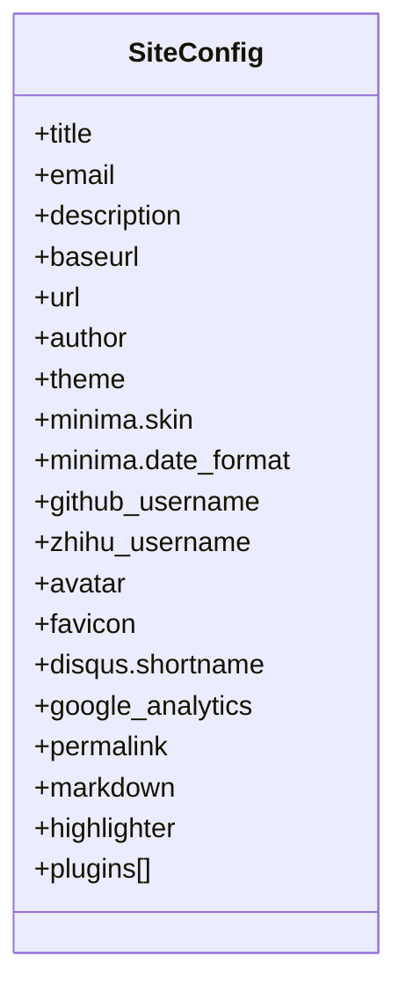
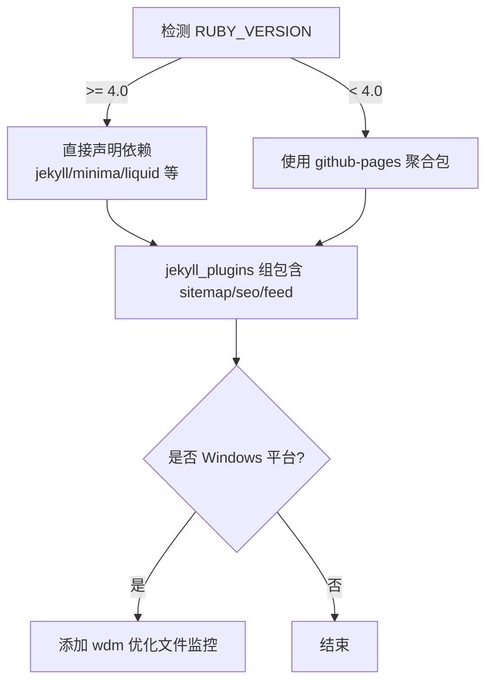
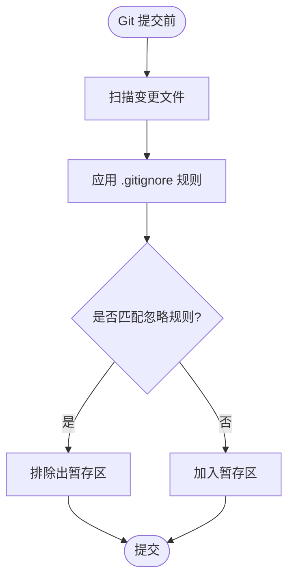
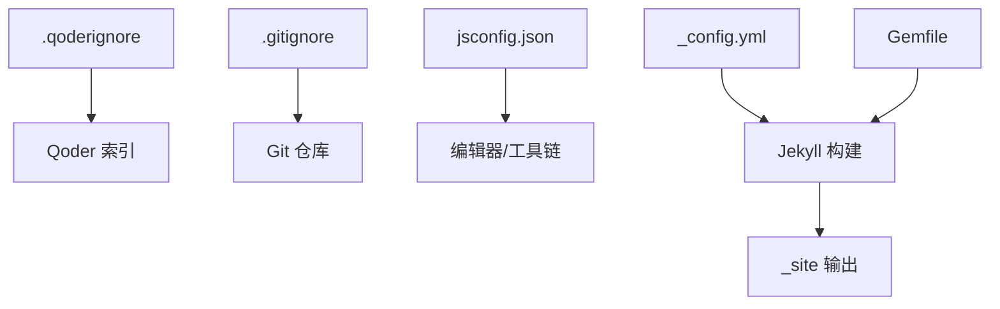

# Qoder 忽略配置

<cite>
**本文引用的文件**   
- [.qoderignore](file://.qoderignore)
- [_config.yml](file://_config.yml)
- [Gemfile](file://Gemfile)
- [README.md](file://README.md)
- [.gitignore](file://.gitignore)
- [jsconfig.json](file://jsconfig.json)
</cite>

## 更新摘要
**所做更改**   
- 更新了 .qoderignore 配置中 repowiki 排除模式的描述，从文件级匹配改为目录级匹配
- 增强了索引控制粒度的说明，反映更全面的排除策略优化
- 更新了相关章节以体现新的目录级排除模式带来的性能改进效果

## 目录
1. [简介](#简介)
2. [项目结构](#项目结构)
3. [核心组件](#核心组件)
4. [架构总览](#架构总览)
5. [详细组件分析](#详细组件分析)
6. [依赖关系分析](#依赖关系分析)
7. [性能与构建特性](#性能与构建特性)
8. [故障排查指南](#故障排查指南)
9. [结论](#结论)

## 简介
本仓库是一个基于 GitHub Pages + Jekyll 的个人博客站点，主题基于官方 Minima 并做了深度定制。本文聚焦于"Qoder 忽略配置"，即通过 .qoderignore 控制 Qoder 在索引时忽略的文件或文件夹，从而减少无关内容对索引体积、搜索质量以及构建/预览体验的影响。同时结合项目的其他关键配置文件（如 _config.yml、Gemfile、.gitignore、jsconfig.json）给出整体上下文，帮助读者理解忽略策略在整个工程中的作用与边界。

## 项目结构
该仓库采用典型的 Jekyll 静态站点组织方式：
- 站点配置位于根目录的 _config.yml
- 文章按年份分目录存放于 _posts
- 前端资源与脚本位于 assets
- 自定义插件位于 _plugins
- 附件与图片分别位于 files 与 imgs
- 根级存在多个忽略与配置类文件，包括 .gitignore、.qoderignore、Gemfile、jsconfig.json 等



图表来源
- [_config.yml:1-45](file://_config.yml#L1-L45)
- [.qoderignore:1-3](file://.qoderignore#L1-L3)
- [.gitignore:1-143](file://.gitignore#L1-L143)
- [Gemfile:1-25](file://Gemfile#L1-L25)
- [jsconfig.json:1-5](file://jsconfig.json#L1-L5)

章节来源
- [README.md:26-62](file://README.md#L26-L62)

## 核心组件
- Qoder 忽略配置（.qoderignore）
  - 作用：指定 Qoder 在索引时要忽略的文件或文件夹，匹配规则与 .gitignore 一致，支持通配符模式。
  - **更新**：当前规则使用 `.qoder/repowiki/` 目录级匹配模式，完全排除 repowiki 目录及其所有子内容和文件，提供更高效的索引控制粒度。
- 站点配置（_config.yml）
  - 作用：定义站点元信息、主题、社交链接、评论与分析、构建设置与插件列表等。
- Ruby 依赖（Gemfile）
  - 作用：声明 Jekyll、Minima 主题及相关插件；针对本地 Ruby 版本分支处理依赖，保证兼容性与可构建性。
- Git 忽略（.gitignore）
  - 作用：排除构建产物、缓存、虚拟环境、IDE 配置等，保持仓库整洁。
- JS 配置（jsconfig.json）
  - 作用：为编辑器/工具链提供 JS 编译选项与排除项，例如排除 search.js 以避免不必要的类型检查。

章节来源
- [.qoderignore:1-3](file://.qoderignore#L1-L3)
- [_config.yml:1-45](file://_config.yml#L1-L45)
- [Gemfile:1-25](file://Gemfile#L1-L25)
- [.gitignore:1-143](file://.gitignore#L1-L143)
- [jsconfig.json:1-5](file://jsconfig.json#L1-L5)

## 架构总览
从"忽略配置"的角度看，本项目涉及三层忽略/排除机制：
- 版本控制层（.gitignore）：决定哪些文件不进入 Git 仓库
- 索引/工具层（.qoderignore）：决定 Qoder 在索引时跳过哪些路径
- 编辑器/工具层（jsconfig.json）：决定 JS 工具链在处理源码时跳过哪些文件



[此图为概念图，无需图表来源]

## 详细组件分析

### Qoder 忽略配置（.qoderignore）
- 目标：减少索引体积，提升检索效率，避免无关内容干扰搜索结果。
- **更新**：规则说明已优化，采用更高效的目录级匹配模式：
  - 注释行以 # 开头，用于说明规则用途。
  - 支持类似 .gitignore 的通配符与路径匹配。
  - **当前规则**：使用 `.qoder/repowiki/` 目录级匹配模式，完全排除 repowiki 目录及其所有子内容和文件。这种策略提供了更好的索引性能，通过完全跳过整个生成文档目录来减少索引时间和内存占用。
- 适用场景：
  - 大型文档/知识库目录
  - 临时生成的中间产物
  - 第三方库或缓存目录



图表来源
- [.qoderignore:1-3](file://.qoderignore#L1-L3)

章节来源
- [.qoderignore:1-3](file://.qoderignore#L1-L3)

### 站点配置（_config.yml）
- 站点元信息：标题、描述、作者、邮箱、URL、Base URL 等
- 主题与皮肤：使用 Minima 主题，皮肤设置为 auto，日期格式固定
- 社交与头像：GitHub、知乎用户名，头像与 favicon 路径
- 评论与分析：Disqus shortname、Google Analytics ID
- 构建设置：永久链接格式、Markdown 解析器、代码高亮
- 插件列表：sitemap、SEO tag、feed



图表来源
- [_config.yml:1-45](file://_config.yml#L1-L45)

章节来源
- [_config.yml:1-45](file://_config.yml#L1-L45)

### Ruby 依赖（Gemfile）
- 版本分支逻辑：当本地 Ruby 版本 >= 4.0 时，直接声明 jekyll、minima、liquid 等依赖；否则使用 github-pages 聚合包
- 插件分组：jekyll-sitemap、jekyll-seo-tag、jekyll-feed 放入 jekyll_plugins 组
- Windows 优化：wdm 仅在 Windows 平台启用以提升文件监控性能



图表来源
- [Gemfile:1-25](file://Gemfile#L1-L25)

章节来源
- [Gemfile:1-25](file://Gemfile#L1-L25)

### Git 忽略（.gitignore）
- 排除构建产物与缓存：_site、.jekyll-cache、.jekyll-metadata、vendor 等
- 排除环境与工具：.env、.venv、.idea、.bundle 等
- 特殊说明：不提交 Gemfile.lock，让 GitHub Pages 线上 Ruby 自行解析依赖，避免本地与线上版本不一致



图表来源
- [.gitignore:1-143](file://.gitignore#L1-L143)

章节来源
- [.gitignore:1-143](file://.gitignore#L1-L143)

### JS 配置（jsconfig.json）
- 编译器选项：空对象，表示使用默认配置
- 排除项：assets/js/search.js 被排除，避免编辑器进行不必要的类型检查或诊断

```mermaid
flowchart TD
Load["加载 jsconfig.json"] --> Options["compilerOptions: {}"]
Load --> Excludes["exclude: [\"assets/js/search.js\"]"]
Options --> IDE["编辑器/工具链行为"]
Excludes --> IDE
```

图表来源
- [jsconfig.json:1-5](file://jsconfig.json#L1-L5)

章节来源
- [jsconfig.json:1-5](file://jsconfig.json#L1-L5)

## 依赖关系分析
- 忽略配置的层次关系
  - .gitignore 作用于 Git 版本控制，决定仓库内容
  - .qoderignore 作用于 Qoder 索引，决定索引范围
  - jsconfig.json 作用于编辑器/工具链，决定 JS 处理范围
- 与站点构建的关系
  - _config.yml 与 Gemfile 共同决定站点构建行为与输出
  - README.md 提供了构建与运行说明，强调使用 bundle exec jekyll serve 确保依赖一致性



图表来源
- [.qoderignore:1-3](file://.qoderignore#L1-L3)
- [.gitignore:1-143](file://.gitignore#L1-L143)
- [jsconfig.json:1-5](file://jsconfig.json#L1-L5)
- [_config.yml:1-45](file://_config.yml#L1-L45)
- [Gemfile:1-25](file://Gemfile#L1-L25)

章节来源
- [README.md:265-294](file://README.md#L265-L294)

## 性能与构建特性
- 索引性能
  - **更新**：通过 .qoderignore 使用 `.qoder/repowiki/` 目录级匹配模式，可以更全面地排除整个 repowiki 目录及其所有内容，显著减少索引时间与内存占用，提升整体索引效率。
- 构建稳定性
  - Gemfile 针对不同 Ruby 版本的分支处理，避免依赖冲突
  - 不提交 Gemfile.lock，由 GitHub Pages 在线环境解析依赖，降低本地与线上差异
- 开发体验
  - jsconfig.json 排除特定 JS 文件，减少编辑器误报与卡顿
  - README 中建议清理 _site 后重新构建，解决增量构建导致的缓存问题

章节来源
- [Gemfile:1-25](file://Gemfile#L1-L25)
- [README.md:281-294](file://README.md#L281-L294)

## 故障排查指南
- Qoder 索引异常
  - 检查 .qoderignore 是否正确匹配目标路径
  - **更新**：确认 `.qoder/repowiki/` 目录级匹配模式是否正确排除了整个 repowiki 目录及其所有子内容
- 构建产物未更新
  - 删除 _site 目录后重新执行 bundle exec jekyll serve
- 依赖版本不一致
  - 始终使用 bundle exec jekyll 命令，确保与 Gemfile 一致
  - 若本地 Ruby 版本较高，参考 Gemfile 中的分支逻辑调整依赖

章节来源
- [.qoderignore:1-3](file://.qoderignore#L1-L3)
- [README.md:281-294](file://README.md#L281-L294)
- [Gemfile:1-25](file://Gemfile#L1-L25)

## 结论
- **.qoderignore 是控制 Qoder 索引范围的关键配置，能有效提升索引效率与结果质量**
  - **更新**：采用 `.qoder/repowiki/` 目录级匹配模式提供了更全面的排除能力，通过完全跳过整个生成文档目录来优化索引性能
- 与 .gitignore、jsconfig.json 配合，形成"版本控制—索引—编辑器"三层忽略体系
- 结合 _config.yml 与 Gemfile 的构建与依赖管理，保障站点的稳定与可维护性
- 建议在新增大型目录或生成物时，及时更新 .qoderignore，避免索引膨胀
- **最佳实践**：对于大型生成目录，优先使用目录级匹配模式（如 `directory/`）而非文件级匹配，以获得更好的性能优化效果