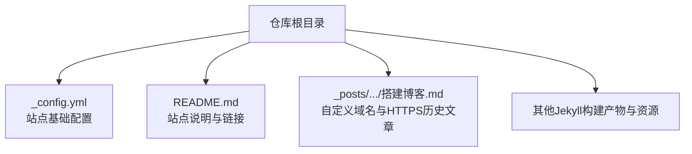
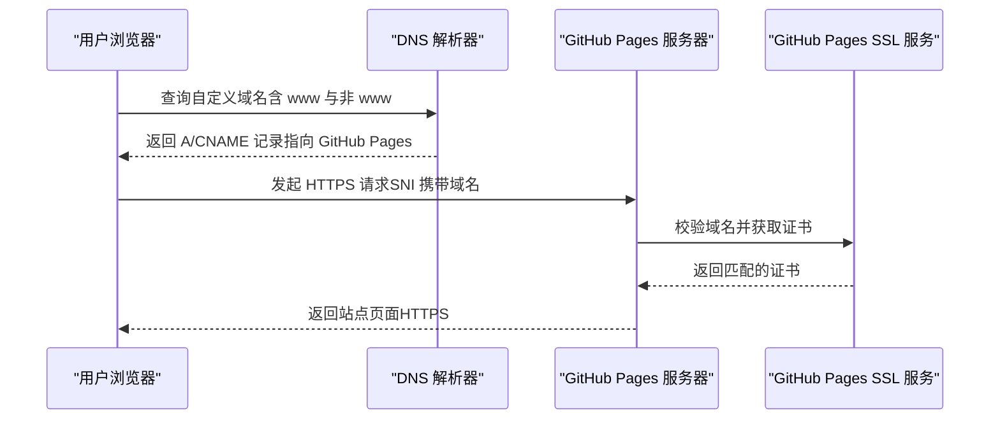
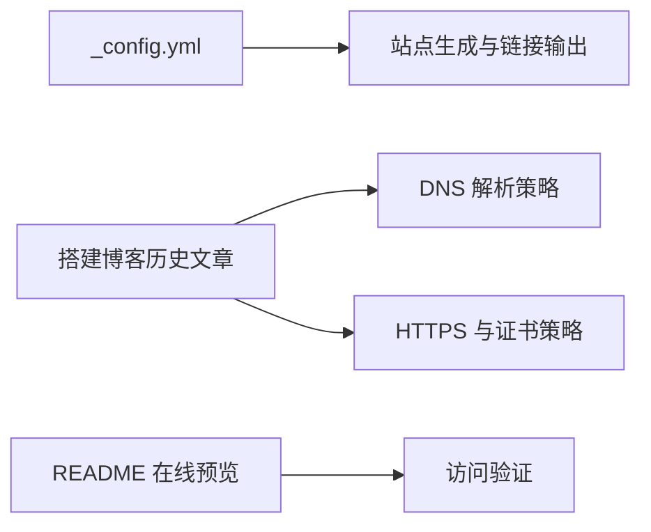

# 域名配置

<cite>
**本文引用的文件**   
- [_config.yml](file://_config.yml)
- [README.md](file://README.md)
- [2019-12-27-通过-GitHub-Pages-+-JeKyll-搭建自己的博客.md](file://_posts/2019/2019-12-27-通过-GitHub-Pages-+-JeKyll-搭建自己的博客.md)
</cite>

## 目录
1. [简介](#简介)
2. [项目结构](#项目结构)
3. [核心组件](#核心组件)
4. [架构总览](#架构总览)
5. [详细组件分析](#详细组件分析)
6. [依赖关系分析](#依赖关系分析)
7. [性能与可用性建议](#性能与可用性建议)
8. [故障排除指南](#故障排除指南)
9. [结论](#结论)
10. [附录：常见服务商配置步骤](#附录常见服务商配置步骤)

## 简介
本指南面向使用 GitHub Pages 托管的 Jekyll 博客，提供“自定义域名 + HTTPS”的完整落地方案。内容涵盖：
- CNAME 文件创建方法（可选）
- DNS 解析记录设置（A 记录、CNAME 记录）
- HTTPS 证书自动配置与 GitHub Pages SSL 支持机制
- 绑定后的访问测试方法与 CDN 加速建议
- 常见域名服务商（阿里云、腾讯云、Cloudflare）的具体配置步骤
- 解析生效时间与缓存清理方法
- 域名故障排除（DNS 查询工具、网络连通性测试等）

说明：仓库中未包含 CNAME 文件，但提供了站点默认 URL 与一篇关于自定义域名的历史文章，可作为参考依据。

## 项目结构
该仓库为典型的 Jekyll 静态站点结构，根目录包含站点配置、主题、布局、插件、文章与资源等。与域名配置直接相关的信息主要位于站点配置文件与历史文章中。

图表来源
- [_config.yml:1-45](file://_config.yml#L1-L45)
- [README.md:1-10](file://README.md#L1-L10)
- [2019-12-27-通过-GitHub-Pages-+-JeKyll-搭建自己的博客.md:39-71](file://_posts/2019/2019-12-27-通过-GitHub-Pages-+-JeKyll-搭建自己的博客.md#L39-L71)

章节来源
- [_config.yml:1-45](file://_config.yml#L1-L45)
- [README.md:1-10](file://README.md#L1-L10)

## 核心组件
- 站点基础配置：站点标题、作者、社交链接、Favicon、Disqus、Google Analytics、永久链接格式、插件列表等。其中 url 字段用于生成绝对链接，在启用自定义域名后需更新为目标域名。
- 历史文章：记录了自定义域名与 HTTPS 的配置思路与注意事项，包括 GitHub Pages 官方提供的 IPv4 地址段、www 子域 CNAME 指向、以及证书申请流程要点。

章节来源
- [_config.yml:1-45](file://_config.yml#L1-L45)
- [2019-12-27-通过-GitHub-Pages-+-JeKyll-搭建自己的博客.md:39-71](file://_posts/2019/2019-12-27-通过-GitHub-Pages-+-JeKyll-搭建自己的博客.md#L39-L71)

## 架构总览
下图展示了用户访问自定义域名时，从浏览器到 GitHub Pages 的端到端路径，以及 DNS 解析的关键节点。

图表来源
- [2019-12-27-通过-GitHub-Pages-+-JeKyll-搭建自己的博客.md:44-57](file://_posts/2019/2019-12-27-通过-GitHub-Pages-+-JeKyll-搭建自己的博客.md#L44-L57)

## 详细组件分析

### 自定义域名与 DNS 解析
- 在 GitHub 仓库 Settings 中开启“Custom domain”，填入你的主域名（例如 example.com）。
- 在域名服务商控制台添加以下解析记录：
  - 非 www 主域名：添加多条 A 记录，分别指向 GitHub Pages 官方提供的 IPv4 地址段（可多选，提高可用性）。
  - www 子域名：添加一条 CNAME 记录，指向 yourname.github.io（即你的 GitHub Pages 站点名）。
- 注意：若需要 IPv6 支持，还需增加 AAAA 记录解析（仓库内已有相关提示）。

章节来源
- [2019-12-27-通过-GitHub-Pages-+-JeKyll-搭建自己的博客.md:44-57](file://_posts/2019/2019-12-27-通过-GitHub-Pages-+-JeKyll-搭建自己的博客.md#L44-L57)
- [2019-12-27-通过-GitHub-Pages-+-JeKyll-搭建自己的博客.md:665-665](file://_posts/2019/2019-12-27-通过-GitHub-Pages-+-JeKyll-搭建自己的博客.md#L665-L665)

### CNAME 文件（可选）
- 传统做法是在仓库根目录放置名为 CNAME 的文件，内容为自定义域名。当前仓库未包含该文件；在 GitHub Pages 上启用 Custom domain 后，平台会自动处理域名绑定，无需手动维护 CNAME 文件。
- 若你仍希望显式声明，可在仓库根目录新增一个名为 CNAME 的文件，写入你的自定义域名（不含协议和路径），然后提交推送。

章节来源
- [2019-12-27-通过-GitHub-Pages-+-JeKyll-搭建自己的博客.md:43-43](file://_posts/2019/2019-12-27-通过-GitHub-Pages-+-JeKyll-搭建自己的博客.md#L43-L43)

### HTTPS 证书与 SSL 支持
- GitHub Pages 对自定义域名提供免费的 HTTPS 支持，并在启用 Custom domain 后自动签发与续期证书。
- 仓库历史文章提到“强制使用 https 时使用 GitHub 的证书，与我们的域名不匹配”的风险场景，这通常发生在仅开启强制 HTTPS 但未正确完成自定义域名绑定时。按本文步骤完成域名绑定后，GitHub 将自动为你的域名签发证书，无需自行上传证书。
- 若你曾尝试通过第三方云厂商申请证书并上传至自建服务，对于 GitHub Pages 并不适用；请遵循 GitHub 的自动证书机制。

章节来源
- [2019-12-27-通过-GitHub-Pages-+-JeKyll-搭建自己的博客.md:54-57](file://_posts/2019/2019-12-27-通过-GitHub-Pages-+-JeKyll-搭建自己的博客.md#L54-L57)

### 站点 URL 与相对路径
- 站点配置文件中的 url 字段用于生成绝对链接。启用自定义域名后，建议将其更新为目标域名，以确保站内链接、SEO 标签、RSS 等输出正确。
- 同时检查 Favicon、头像等资源路径是否以根路径开头，避免在自定义域名下出现 404。

章节来源
- [_config.yml:1-45](file://_config.yml#L1-L45)

### 访问测试与验证
- 本地或远程均可进行如下验证：
  - 使用浏览器访问 http 与 https 两种协议，确认均能正常打开且无证书警告。
  - 使用命令行工具执行 DNS 查询，确认 A/CNAME 记录已生效。
  - 使用 curl 或浏览器开发者工具查看响应头，确认返回状态码为 200 且 Content-Type 正确。
- 若出现证书错误，优先检查：
  - GitHub 仓库中是否已填写正确的 Custom domain。
  - DNS 是否已将主域名与 www 子域正确解析。
  - 是否启用了 GitHub Pages 的“Enforce HTTPS”。

章节来源
- [2019-12-27-通过-GitHub-Pages-+-JeKyll-搭建自己的博客.md:54-57](file://_posts/2019/2019-12-27-通过-GitHub-Pages-+-JeKyll-搭建自己的博客.md#L54-L57)

### CDN 加速与缓存策略
- GitHub Pages 本身由 GitHub 全球基础设施提供服务，具备较好的全球可达性与缓存能力。
- 若需进一步加速或精细化控制缓存，可在域名服务商处启用其 CDN/边缘缓存功能（如 Cloudflare 的代理模式），并将域名解析交由其管理。此时需注意：
  - 确保代理模式下仍能将流量正确转发到 GitHub Pages。
  - 合理设置缓存 TTL，避免频繁更新导致旧版本长期命中。
  - 关注 SNI 与 TLS 握手行为，避免中间层干扰证书校验。

[本节为通用建议，不直接分析具体代码文件]

## 依赖关系分析
- 站点配置与历史文章共同构成域名与 HTTPS 配置的实践依据。
- README 提供在线预览链接，便于快速验证自定义域名是否生效。

图表来源
- [_config.yml:1-45](file://_config.yml#L1-L45)
- [2019-12-27-通过-GitHub-Pages-+-JeKyll-搭建自己的博客.md:39-71](file://_posts/2019/2019-12-27-通过-GitHub-Pages-+-JeKyll-搭建自己的博客.md#L39-L71)
- [README.md:1-10](file://README.md#L1-L10)

章节来源
- [_config.yml:1-45](file://_config.yml#L1-L45)
- [2019-12-27-通过-GitHub-Pages-+-JeKyll-搭建自己的博客.md:39-71](file://_posts/2019/2019-12-27-通过-GitHub-Pages-+-JeKyll-搭建自己的博客.md#L39-L71)
- [README.md:1-10](file://README.md#L1-L10)

## 性能与可用性建议
- 多 IP 解析：为非 www 主域名添加多条 A 记录，提升容灾与就近接入能力。
- 双域覆盖：同时配置主域名与 www 子域，避免用户输入差异导致的跳转与缓存不一致。
- 全站 HTTPS：在 GitHub 仓库设置中启用“Enforce HTTPS”，确保所有请求走加密通道。
- 资源路径规范：统一使用根路径开头的资源引用，避免在自定义域名下出现 404。
- 缓存策略：结合 CDN 的缓存规则与浏览器缓存头，平衡更新时效与加载速度。

[本节为通用建议，不直接分析具体代码文件]

## 故障排除指南
- DNS 查询工具
  - Windows：nslookup、Resolve-DnsName（PowerShell）、dig（安装后可用）
  - macOS/Linux：dig、nslookup、host
  - 在线工具：多个公共 DNS 查询网站
- 连通性测试
  - ping 目标域名，观察延迟与丢包
  - curl -I https://yourdomain.com 查看响应头与状态码
  - 浏览器开发者工具 Network 面板查看请求链路与证书信息
- 常见问题定位
  - 证书不匹配：检查 GitHub 仓库 Custom domain 是否正确、DNS 是否已生效、是否启用了 Enforce HTTPS。
  - 解析未生效：等待 DNS 传播（通常几分钟到数小时），必要时更换公共 DNS（如 1.1.1.1、8.8.8.8）重试。
  - 缓存问题：清除浏览器缓存、DNS 缓存（ipconfig /flushdns 或 sudo dscacheutil -flushcache），或使用无痕模式访问。
  - IPv6 支持：如需 IPv6，请在 DNS 中添加 AAAA 记录（仓库内已有相关提示）。

章节来源
- [2019-12-27-通过-GitHub-Pages-+-JeKyll-搭建自己的博客.md:665-665](file://_posts/2019/2019-12-27-通过-GitHub-Pages-+-JeKyll-搭建自己的博客.md#L665-L665)

## 结论
- 自定义域名绑定与 HTTPS 在 GitHub Pages 上是开箱即用的：在仓库设置中填写 Custom domain，并在 DNS 中添加 A/CNAME 记录即可。
- 站点配置文件中的 url 字段应随域名变更同步更新，保证站内链接与 SEO 正确。
- 若需更灵活的缓存与加速策略，可借助域名服务商的 CDN 能力，但需确保与 GitHub Pages 的 TLS/SNI 兼容。
- 遇到证书或解析问题时，优先从 DNS 与 GitHub 设置两端排查，并结合常用诊断工具逐步定位。

[本节为总结性内容，不直接分析具体代码文件]

## 附录：常见服务商配置步骤

### 阿里云
- 登录阿里云控制台，进入“云解析 DNS”。
- 为主域名添加多条 A 记录，分别指向 GitHub Pages 官方 IPv4 地址段（可多选）。
- 为 www 子域添加一条 CNAME 记录，指向 yourname.github.io。
- 保存后等待解析生效，随后在 GitHub 仓库设置中启用 Custom domain 与 Enforce HTTPS。

[本节为通用操作指引，不直接分析具体代码文件]

### 腾讯云
- 登录腾讯云控制台，进入“云解析 DNS”。
- 为主域名添加多条 A 记录，分别指向 GitHub Pages 官方 IPv4 地址段（可多选）。
- 为 www 子域添加一条 CNAME 记录，指向 yourname.github.io。
- 保存后等待解析生效，随后在 GitHub 仓库设置中启用 Custom domain 与 Enforce HTTPS。

[本节为通用操作指引，不直接分析具体代码文件]

### Cloudflare
- 登录 Cloudflare，选择对应域名，进入“DNS”管理。
- 为主域名添加多条 A 记录，分别指向 GitHub Pages 官方 IPv4 地址段（可多选）。
- 为 www 子域添加一条 CNAME 记录，指向 yourname.github.io。
- 开启“代理”（橙色云朵）以启用 CDN 与缓存优化；按需调整缓存 TTL。
- 在“SSL/TLS”中选择合适模式（推荐 Full 或 Full (strict)），并确保上游证书有效。
- 保存后等待生效，随后在 GitHub 仓库设置中启用 Custom domain 与 Enforce HTTPS。

[本节为通用操作指引，不直接分析具体代码文件]