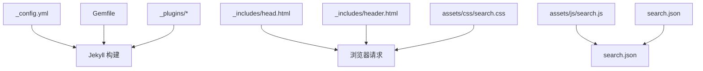
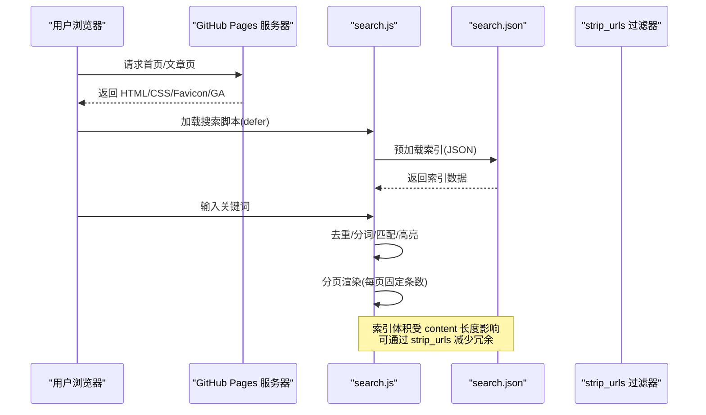
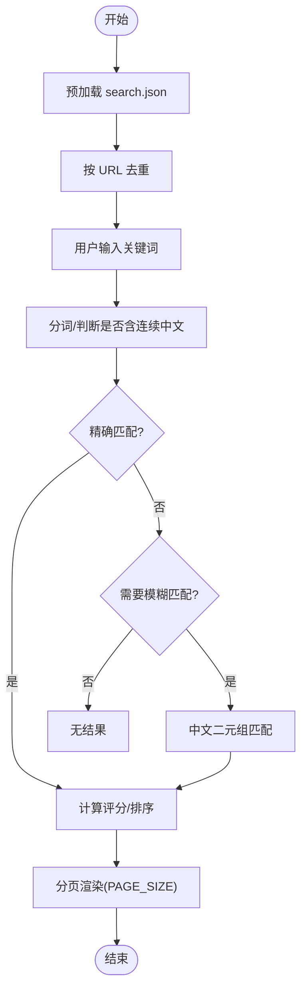
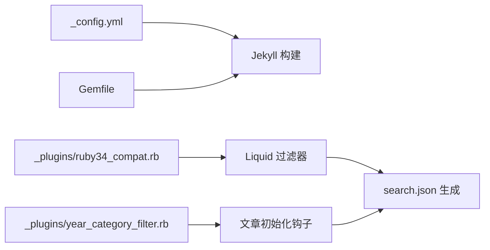

# 性能优化

<cite>
**本文引用的文件列表**
- [_config.yml](file://_config.yml)
- [Gemfile](file://Gemfile)
- [_includes/head.html](file://_includes/head.html)
- [_includes/header.html](file://_includes/header.html)
- [assets/js/search.js](file://assets/js/search.js)
- [assets/css/search.css](file://assets/css/search.css)
- [search.json](file://search.json)
- [_plugins/ruby34_compat.rb](file://_plugins/ruby34_compat.rb)
- [_plugins/year_category_filter.rb](file://_plugins/year_category_filter.rb)
- [README.md](file://README.md)
</cite>

## 目录
1. [简介](#简介)
2. [项目结构](#项目结构)
3. [核心组件](#核心组件)
4. [架构总览](#架构总览)
5. [详细组件分析](#详细组件分析)
6. [依赖分析](#依赖分析)
7. [性能考量](#性能考量)
8. [故障排查指南](#故障排查指南)
9. [结论](#结论)
10. [附录](#附录)

## 简介
本指南面向基于 Jekyll + GitHub Pages 的博客站点，聚焦构建期与运行期的性能调优。内容覆盖：Jekyll 构建优化（插件加载、资源压缩）、前端资源优化（CSS/JS 合并、图片压缩、懒加载）、搜索功能优化（索引大小控制、分页加载策略）、字体加载优化（Google Fonts 预连接与本地回退）、页面加载速度测试（含 Lighthouse 审计）、CDN 加速与浏览器缓存策略、移动端与首屏加载优化方案。所有建议均结合仓库现有实现进行说明，并给出可落地的配置位置与参考路径。

## 项目结构
该博客采用 Jekyll 静态站点生成，主题基于 Minima 深度定制，包含全文搜索、分类归档、代码块折叠、TOC 侧边栏等特性。关键目录与职责如下：
- _config.yml：站点全局配置（主题、插件、SEO、Analytics、Favicon 等）
- Gemfile：Ruby 依赖声明（Jekyll、Minima、Liquid、kramdown 等）
- _includes/head.html：页面头部注入（字体预连接、CSS、Favicon、GA、搜索脚本）
- _includes/header.html：顶部导航与搜索框入口
- assets/js/search.js：客户端全文搜索逻辑（索引加载、去重、模糊匹配、分页渲染）
- assets/css/search.css：搜索弹窗与全站样式（设计令牌、暗色模式、响应式）
- search.json：Jekyll 生成的搜索索引（标题、正文、分类、日期）
- _plugins/*：自定义 Liquid 过滤器与钩子（URL 清理、分类过滤、Ruby 兼容）

图表来源
- [_config.yml:1-45](file://_config.yml#L1-L45)
- [Gemfile:1-25](file://Gemfile#L1-L25)
- [_includes/head.html:1-27](file://_includes/head.html#L1-L27)
- [_includes/header.html:1-11](file://_includes/header.html#L1-L11)
- [assets/js/search.js:1-573](file://assets/js/search.js#L1-L573)
- [assets/css/search.css:1-1306](file://assets/css/search.css#L1-L1306)
- [search.json:1-13](file://search.json#L1-L13)
- [_plugins/ruby34_compat.rb:1-22](file://_plugins/ruby34_compat.rb#L1-L22)
- [_plugins/year_category_filter.rb:1-13](file://_plugins/year_category_filter.rb#L1-L13)

章节来源
- [README.md:26-62](file://README.md#L26-L62)

## 核心组件
- 站点配置与插件
  - 通过 _config.yml 启用 jekyll-sitemap、jekyll-seo-tag、jekyll-feed；主题使用 minima，皮肤 auto，支持暗色模式。
  - Gemfile 针对 Ruby 4+ 分支直接声明 jekyll/minima/liquid/kramdown-parser-gfm/webrick/csv/base64/bigdecimal，并在 Windows 下引入 wdm 提升文件监控性能。
- 页面头部与资源加载
  - head.html 中为 Google Fonts 添加 preconnect/crossorigin，并加载 Inter 字体与主 CSS、搜索 CSS、Favicon 集、生产环境 GA 统计与搜索脚本（defer）。
- 搜索系统
  - header.html 提供搜索输入框，data-search-url 指向 /search.json。
  - search.js 负责预加载索引、去重、关键词匹配（英文单词边界、中文子串/二元组模糊）、结果高亮、分页加载、弹窗交互与滚动锁定。
  - search.json 由 Jekyll 生成，遍历 posts，剥离 HTML 标签与 URL，输出 title/url/content/categories/date。
- 自定义插件
  - ruby34_compat.rb：兼容 Ruby 3.4+ 的 String#untaint 缺失问题，注册 strip_urls 过滤器用于索引内容清洗。
  - year_category_filter.rb：移除自动从 _posts 子目录注入的分类，仅保留 front matter 显式定义。

章节来源
- [_config.yml:10-45](file://_config.yml#L10-L45)
- [Gemfile:1-25](file://Gemfile#L1-L25)
- [_includes/head.html:1-27](file://_includes/head.html#L1-L27)
- [_includes/header.html:1-11](file://_includes/header.html#L1-L11)
- [assets/js/search.js:1-573](file://assets/js/search.js#L1-L573)
- [search.json:1-13](file://search.json#L1-L13)
- [_plugins/ruby34_compat.rb:1-22](file://_plugins/ruby34_compat.rb#L1-L22)
- [_plugins/year_category_filter.rb:1-13](file://_plugins/year_category_filter.rb#L1-L13)

## 架构总览
下图展示从浏览器到 Jekyll 构建产物与运行时资源的关键链路，以及搜索功能的调用序列。

图表来源
- [_includes/head.html:1-27](file://_includes/head.html#L1-L27)
- [assets/js/search.js:1-573](file://assets/js/search.js#L1-L573)
- [search.json:1-13](file://search.json#L1-L13)
- [_plugins/ruby34_compat.rb:1-22](file://_plugins/ruby34_compat.rb#L1-L22)

## 详细组件分析

### Jekyll 构建优化
- 插件加载优化
  - 在 _config.yml 的 plugins 列表中仅启用必要插件（sitemap、seo-tag、feed），避免无关插件增加构建时间。
  - 在 Gemfile 中按 Ruby 版本分支管理依赖，确保线上与本地一致，减少安装失败与回滚成本。
- 资源压缩与构建产物
  - 当前未启用 CSS/JS 压缩或哈希化。可在构建阶段引入外部工具（如 cssnano、terser、html-minifier）对 assets 下的资源进行压缩与指纹化，再替换引用路径。
  - 若使用 GitHub Actions 替代 GitHub Pages 内置构建，可灵活集成更多优化步骤。
- Markdown 与语法高亮
  - 使用 kramdown + rouge，合理控制代码块数量与大小，避免过长代码块导致 DOM 过大。
- 图片处理
  - 建议在 CI 流程中对 imgs/ 中的图片执行无损/有损压缩（如 pngquant、jpegoptim、svgo），并按需转换为 WebP/AVIF。

章节来源
- [_config.yml:35-45](file://_config.yml#L35-L45)
- [Gemfile:1-25](file://Gemfile#L1-L25)

### 前端资源优化
- CSS/JS 合并与按需加载
  - 当前 search.css 与 search.js 独立引入。可将通用样式与搜索样式合并，减少 HTTP 请求；将非首屏脚本改为 defer 或 async（当前搜索脚本已使用 defer）。
- 字体加载优化
  - head.html 已为 fonts.googleapis.com 与 gstatic 设置 preconnect 与 crossorigin，并采用 display=swap 降低 FOIT。
  - 建议补充本地字体回退：将常用字重以本地字体文件形式提供，并通过 @font-face 指定本地源，优先命中本地以减少网络往返。
- 图片优化与懒加载
  - 建议为 imgs/ 中的图片统一压缩与格式转换，并在文章内容中使用 loading="lazy" 与合适的 width/height 以避免布局偏移。
  - 对于首屏可见图，使用 fetchpriority="high" 提升优先级。
- 缓存策略
  - 为静态资源设置长期缓存（Cache-Control: public, max-age=31536000, immutable），并对变更后的资源使用文件名哈希，确保强缓存命中。

章节来源
- [_includes/head.html:6-11](file://_includes/head.html#L6-L11)
- [assets/css/search.css:1-1306](file://assets/css/search.css#L1-L1306)
- [assets/js/search.js:1-573](file://assets/js/search.js#L1-L573)

### 搜索功能优化
- 索引文件大小控制
  - search.json 会包含每篇文章的完整正文内容，随文章增长而增大。建议：
    - 使用 strip_urls 过滤器去除链接与图片占位，减小体积（已在插件中注册）。
    - 限制 content 最大字符数或仅摘要入库，以降低 JSON 体积。
    - 定期审查长文，拆分或精简正文。
- 分页加载策略
  - search.js 默认每页加载 PAGE_SIZE 条结果，并在面板滚动到底部时触发 loadMore，避免一次性渲染大量节点。
  - 建议根据平均文章量与设备性能调整 PAGE_SIZE，平衡首屏速度与滚动体验。
- 匹配算法与性能
  - 英文采用单词边界匹配，中文采用子串匹配与二元组模糊评分，兼顾准确率与性能。
  - 对超长文本进行 snippet 截取与高亮，减少 DOM 操作开销。

图表来源
- [assets/js/search.js:1-573](file://assets/js/search.js#L1-L573)
- [search.json:1-13](file://search.json#L1-L13)
- [_plugins/ruby34_compat.rb:1-22](file://_plugins/ruby34_compat.rb#L1-L22)

章节来源
- [assets/js/search.js:1-573](file://assets/js/search.js#L1-L573)
- [search.json:1-13](file://search.json#L1-L13)
- [_plugins/ruby34_compat.rb:1-22](file://_plugins/ruby34_compat.rb#L1-L22)

### Google Fonts 字体加载优化与本地回退
- 预连接与跨域
  - head.html 已配置 rel="preconnect" 与 crossorigin，有助于缩短 DNS/TLS 握手时间。
- 本地回退方案
  - 建议将常用字重（如 400/500/600/700/800）以本地字体文件提供，并在 CSS 中通过 @font-face 声明本地源，同时保留 Google Fonts 作为降级源。
  - 使用 font-display: swap 避免字体阻塞首屏渲染。
- 字体裁剪
  - 若仅需部分字形，可使用字体裁剪工具减少字体体积。

章节来源
- [_includes/head.html:6-8](file://_includes/head.html#L6-L8)

### CDN 加速与浏览器缓存策略
- CDN 接入
  - 将静态资源（CSS/JS/图片/字体）托管至 CDN，利用边缘节点就近分发，降低延迟。
  - 在 head.html 中将资源路径切换为 CDN 域名，并确保开启 HTTPS。
- 缓存头设置
  - 对不变资源设置长期缓存（例如一年），并使用文件名哈希保证更新后强制刷新。
  - 对 HTML 文档设置较短缓存或 no-cache，确保新部署及时生效。
- 并发与复用
  - 启用 HTTP/2 多路复用，减少队头阻塞；开启 Keep-Alive 复用连接。

[本节为通用指导，不直接分析具体文件]

### 移动端与首屏加载优化
- 首屏关键资源内联
  - 将极小且关键的 CSS 内联到 HTML，减少一次往返；其余 CSS 保持异步加载。
- 图片与字体优先级
  - 首屏图片使用 fetchpriority="high"，非首屏图片 lazy 加载；字体使用 display=swap。
- 减少重排重绘
  - 为图片设置宽高，避免布局抖动；合理使用 will-change 与 transform 提升动画性能。
- 交互优化
  - 搜索弹窗在打开时锁定背景滚动，关闭后恢复，避免页面跳动。

章节来源
- [assets/js/search.js:148-192](file://assets/js/search.js#L148-L192)
- [assets/css/search.css:64-76](file://assets/css/search.css#L64-L76)

## 依赖分析
- 构建期依赖
  - Jekyll 3.9 + Minima 2.5，Liquid >= 4.0.4，kramdown-parser-gfm，webrick（开发服务），wdm（Windows 文件监控）。
- 运行时依赖
  - 浏览器原生能力：fetch、requestAnimationFrame、IntersectionObserver（如需懒加载扩展）。
- 插件依赖关系
  - ruby34_compat.rb 向 Liquid 注册 strip_urls 过滤器，供 search.json 模板使用。
  - year_category_filter.rb 在文章初始化钩子中清理自动注入的分类，避免分类膨胀。

图表来源
- [_config.yml:35-45](file://_config.yml#L35-L45)
- [Gemfile:1-25](file://Gemfile#L1-L25)
- [_plugins/ruby34_compat.rb:1-22](file://_plugins/ruby34_compat.rb#L1-L22)
- [_plugins/year_category_filter.rb:1-13](file://_plugins/year_category_filter.rb#L1-L13)
- [search.json:1-13](file://search.json#L1-L13)

章节来源
- [Gemfile:1-25](file://Gemfile#L1-L25)
- [_plugins/ruby34_compat.rb:1-22](file://_plugins/ruby34_compat.rb#L1-L22)
- [_plugins/year_category_filter.rb:1-13](file://_plugins/year_category_filter.rb#L1-L13)

## 性能考量
- 构建时间
  - 精简插件、减少不必要的预处理；在 CI 中缓存依赖与构建产物。
- 资源体积
  - 压缩 CSS/JS、图片与字体；按需加载与懒加载；合并请求。
- 搜索体验
  - 控制索引体积、合理分页、优化匹配算法与渲染批次。
- 网络与缓存
  - 启用 CDN、HTTP/2、合理的 Cache-Control 与文件名哈希。
- 移动端
  - 首屏关键资源最小化、图片与字体优先级管理、避免布局抖动。

[本节为通用指导，不直接分析具体文件]

## 故障排查指南
- 搜索索引无法加载
  - 检查 search.json 是否存在且可访问；确认 data-search-url 路径正确。
  - 查看控制台错误信息，确认 fetch 成功与 JSON 解析正常。
- 搜索结果重复或异常
  - 确认索引去重逻辑生效；检查 strip_urls 是否正确移除链接与图片占位。
- 字体显示异常
  - 检查 preconnect/crossorigin 配置；确认本地字体回退路径与格式正确。
- 构建失败或依赖冲突
  - 核对 Gemfile 与 Ruby 版本；清理 _site 后重新构建；必要时升级/降级相关 gem。

章节来源
- [_includes/header.html:5-7](file://_includes/header.html#L5-L7)
- [assets/js/search.js:127-141](file://assets/js/search.js#L127-L141)
- [_plugins/ruby34_compat.rb:1-22](file://_plugins/ruby34_compat.rb#L1-L22)

## 结论
通过对 Jekyll 构建、前端资源、搜索系统与字体加载的系统性优化，并结合 CDN 与缓存策略，可显著提升博客站点的加载速度与用户体验。建议优先实施索引体积控制、资源压缩与 CDN 接入，随后逐步完善本地字体回退与移动端首屏优化。

[本节为总结，不直接分析具体文件]

## 附录
- 页面加载速度测试方法
  - 使用 Chrome DevTools Network 面板观察 TTFB、FCP、LCP、CLS 等指标。
  - 使用 Lighthouse 进行全维度审计，关注 Performance、Accessibility、Best Practices、SEO 四项得分与建议。
  - 在不同网络条件与设备模式下复测，确保移动端体验达标。

[本节为通用指导，不直接分析具体文件]