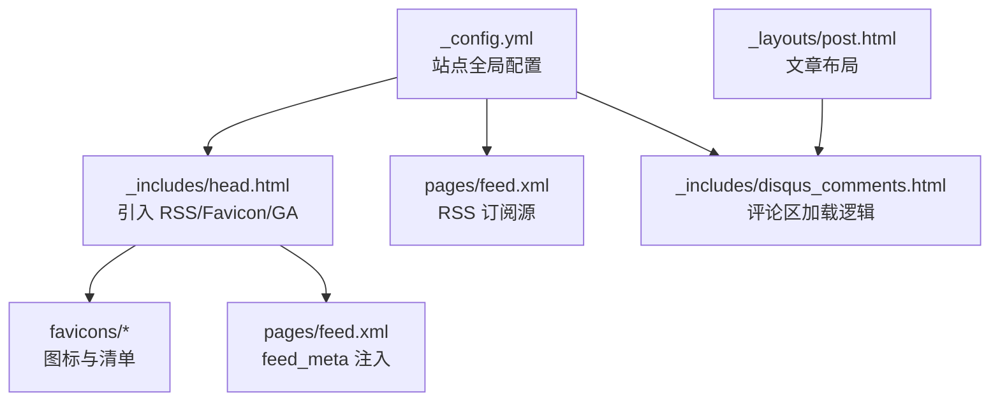
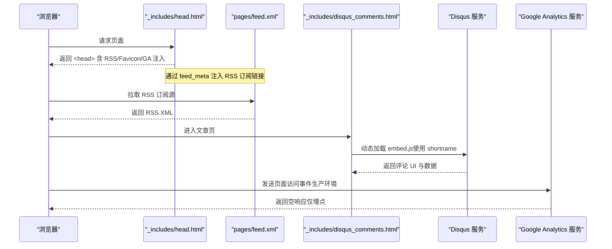
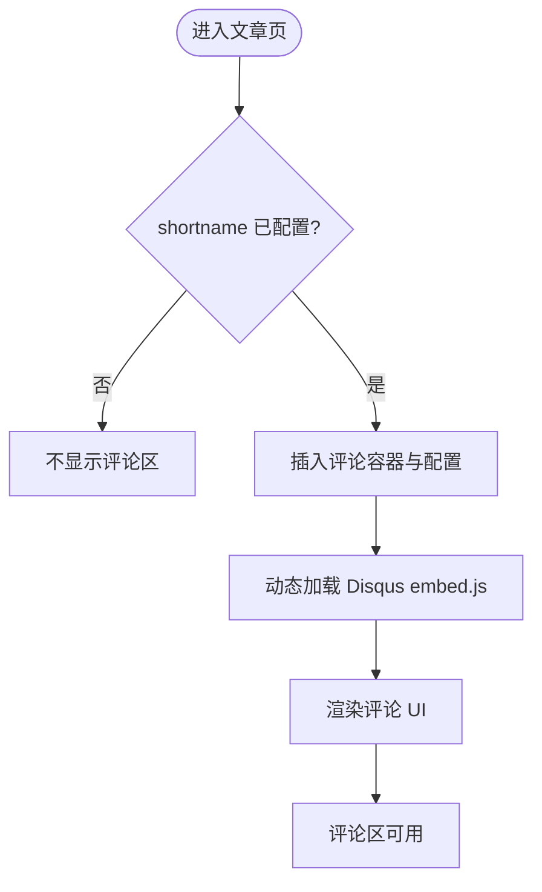
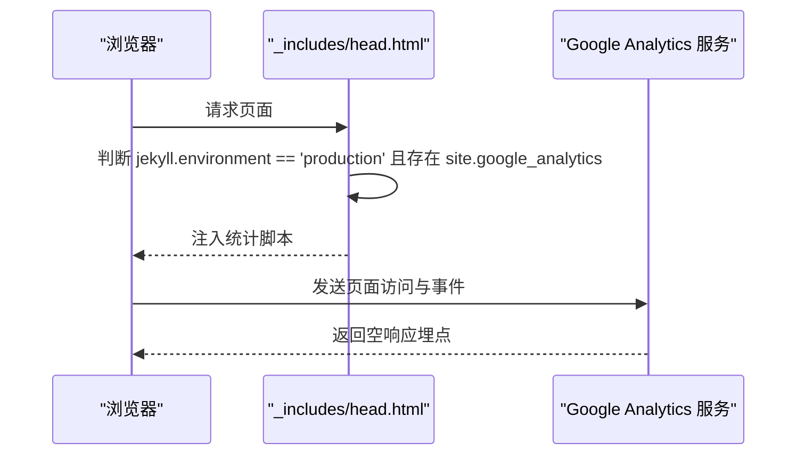
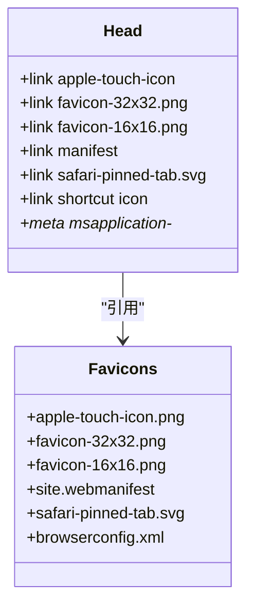
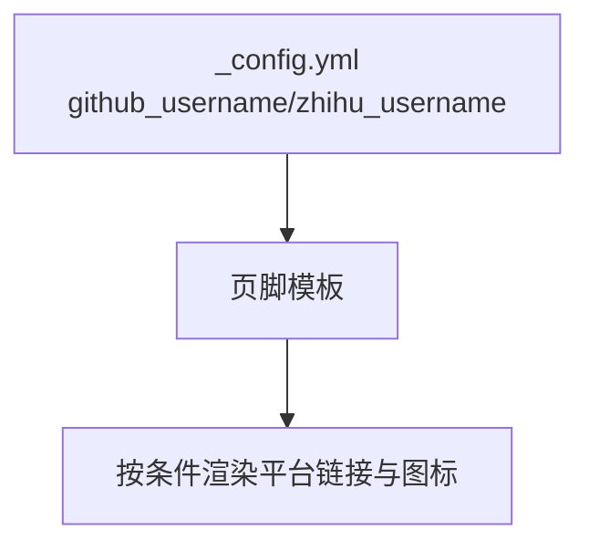
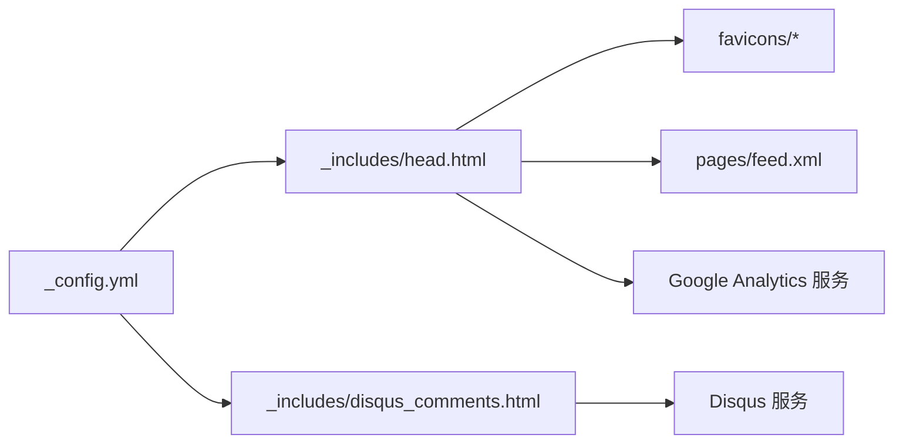

# 第三方服务集成

<cite>
**本文引用的文件**   
- [_config.yml](file://_config.yml)
- [_includes/head.html](file://_includes/head.html)
- [_includes/disqus_comments.html](file://_includes/disqus_comments.html)
- [pages/feed.xml](file://pages/feed.xml)
- [favicons/README.md](file://favicons/README.md)
- [favicons/browserconfig.xml](file://favicons/browserconfig.xml)
- [favicons/site.webmanifest](file://favicons/site.webmanifest)
- [google885a265086f3db62.html](file://google885a265086f3db62.html)
- [README.md](file://README.md)
</cite>

## 目录
1. [简介](#简介)
2. [项目结构](#项目结构)
3. [核心组件](#核心组件)
4. [架构总览](#架构总览)
5. [详细组件分析](#详细组件分析)
6. [依赖关系分析](#依赖关系分析)
7. [性能与可用性考虑](#性能与可用性考虑)
8. [故障排除指南](#故障排除指南)
9. [结论](#结论)
10. [附录](#附录)

## 简介
本指南面向博客站点的第三方服务集成，覆盖评论系统、站点统计、RSS 订阅源、Favicon 图标集以及社交媒体链接配置。文档基于仓库现有实现进行说明，并提供可操作的步骤、流程图与排错建议，帮助读者快速完成配置并稳定运行。

## 项目结构
本项目为 Jekyll + GitHub Pages 博客，第三方服务通过站点配置与模板片段注入到页面中：
- 站点配置集中在 _config.yml（包含 Disqus shortname、Google Analytics ID、社交账号等）
- 页面头部统一在 _includes/head.html 引入 RSS、Favicon 与 GA 脚本
- 评论区由 _includes/disqus_comments.html 提供，文章布局按需引入
- RSS 订阅源位于 pages/feed.xml
- Favicon 资源与清单位于 favicons/ 目录
- 社交媒体链接在页脚中根据配置渲染



图表来源
- [_config.yml:1-45](file://_config.yml#L1-L45)
- [_includes/head.html:1-26](file://_includes/head.html#L1-L26)
- [pages/feed.xml:1-31](file://pages/feed.xml#L1-L31)
- [_includes/disqus_comments.html:1-21](file://_includes/disqus_comments.html#L1-L21)

章节来源
- [_config.yml:1-45](file://_config.yml#L1-L45)
- [_includes/head.html:1-26](file://_includes/head.html#L1-L26)
- [pages/feed.xml:1-31](file://pages/feed.xml#L1-L31)
- [_includes/disqus_comments.html:1-21](file://_includes/disqus_comments.html#L1-L21)

## 核心组件
- 评论系统（Disqus）：通过短名 shortname 控制启用与加载，文章页自动注入评论脚本。
- 站点统计（Google Analytics）：生产环境条件注入统计脚本；同时提供 Google Site Verification 验证文件。
- RSS 订阅源：自定义 feed.xml，输出最近文章条目，并在 head 中通过 feed_meta 注入订阅链接。
- Favicon 图标集：多尺寸图标与清单文件，兼容 iOS、Android、Safari、Windows 磁贴等。
- 社交媒体链接：GitHub、知乎等账号在配置中声明，页脚按配置渲染。

章节来源
- [_config.yml:20-34](file://_config.yml#L20-L34)
- [_includes/head.html:11-24](file://_includes/head.html#L11-L24)
- [pages/feed.xml:1-31](file://pages/feed.xml#L1-L31)
- [favicons/README.md:1-9](file://favicons/README.md#L1-L9)
- [favicons/browserconfig.xml:1-12](file://favicons/browserconfig.xml#L1-L12)
- [favicons/site.webmanifest:1-22](file://favicons/site.webmanifest#L1-L22)
- [google885a265086f3db62.html:1-1](file://google885a265086f3db62.html#L1-L1)

## 架构总览
下图展示第三方服务在站点中的集成点与数据流向：



图表来源
- [_includes/head.html:11-24](file://_includes/head.html#L11-L24)
- [pages/feed.xml:1-31](file://pages/feed.xml#L1-L31)
- [_includes/disqus_comments.html:1-21](file://_includes/disqus_comments.html#L1-L21)

## 详细组件分析

### Disqus 评论系统
- 启用方式：在站点配置中设置 shortname，文章布局会按需引入评论片段。
- 加载流程：文章页判断是否启用后，动态创建 script 标签加载 Disqus 嵌入脚本，并设置当前页面的 URL 与标识符。
- 本地预览：本地运行时也可加载 Disqus，但需网络可达。



图表来源
- [_includes/disqus_comments.html:1-21](file://_includes/disqus_comments.html#L1-L21)
- [_config.yml:28-31](file://_config.yml#L28-L31)

章节来源
- [_config.yml:28-31](file://_config.yml#L28-L31)
- [_includes/disqus_comments.html:1-21](file://_includes/disqus_comments.html#L1-L21)
- [README.md:296-308](file://README.md#L296-L308)

### Google Analytics 统计集成
- 注入位置：在页面头部，仅在“生产环境”且配置了 GA ID 时注入统计脚本。
- 验证站点：根目录放置 Google Site Verification 文件用于站点所有权验证。
- 隐私与合规：建议在 GA 后台开启数据保留策略、广告功能关闭、IP 匿名化等选项以满足隐私要求。



图表来源
- [_includes/head.html:22-24](file://_includes/head.html#L22-L24)
- [_config.yml:32-33](file://_config.yml#L32-L33)
- [google885a265086f3db62.html:1-1](file://google885a265086f3db62.html#L1-L1)

章节来源
- [_includes/head.html:22-24](file://_includes/head.html#L22-L24)
- [_config.yml:32-33](file://_config.yml#L32-L33)
- [google885a265086f3db62.html:1-1](file://google885a265086f3db62.html#L1-L1)

### RSS 订阅源配置
- 生成规则：自定义 feed.xml 输出最近若干篇文章，包含标题、描述、发布时间、链接、分类与标签。
- 订阅入口：在页面头部通过 feed_meta 注入订阅链接，便于阅读器发现。
- 兼容性：遵循 RSS 2.0 与 Atom 命名空间，主流阅读器均可订阅。

```mermaid
flowchart TD
Build["Jekyll 构建"] --> GenXML["生成 pages/feed.xml"]
GenXML --> HeadMeta["head 中 feed_meta 注入订阅链接"]
HeadMeta --> Reader["阅读器拉取 feed.xml"]
Reader --> >Reader["解析条目并展示"]
```

图表来源
- [pages/feed.xml:1-31](file://pages/feed.xml#L1-L31)
- [_includes/head.html:11](file://_includes/head.html#L11)

章节来源
- [pages/feed.xml:1-31](file://pages/feed.xml#L1-L31)
- [_includes/head.html:11](file://_includes/head.html#L11)

### Favicon 图标集配置
- 资源组织：favicons 目录下包含多尺寸 PNG、SVG、Web Manifest 与 Windows 磁贴配置。
- 页面引用：在 head 中通过 link 与 meta 标签声明各平台所需图标与主题色。
- 替换方法：使用在线工具重新生成图标集，并将路径指向 /favicons/，随后更新 head 中的引用。



图表来源
- [_includes/head.html:13-20](file://_includes/head.html#L13-L20)
- [favicons/browserconfig.xml:1-12](file://favicons/browserconfig.xml#L1-L12)
- [favicons/site.webmanifest:1-22](file://favicons/site.webmanifest#L1-L22)
- [favicons/README.md:1-9](file://favicons/README.md#L1-L9)

章节来源
- [_includes/head.html:13-20](file://_includes/head.html#L13-L20)
- [favicons/README.md:1-9](file://favicons/README.md#L1-L9)
- [favicons/browserconfig.xml:1-12](file://favicons/browserconfig.xml#L1-L12)
- [favicons/site.webmanifest:1-22](file://favicons/site.webmanifest#L1-L22)

### 社交媒体链接配置
- 配置项：在站点配置中声明 GitHub、知乎等平台用户名。
- 渲染位置：页脚根据配置项渲染对应平台的链接与图标。
- 扩展建议：如需新增平台，可在页脚模板中添加条件渲染与 SVG 图标引用。



图表来源
- [_config.yml:20-23](file://_config.yml#L20-L23)

章节来源
- [_config.yml:20-23](file://_config.yml#L20-L23)

## 依赖关系分析
- 配置驱动：_config.yml 集中管理 Disqus、GA、社交账号、Favicon 路径等关键参数。
- 模板注入：_includes/head.html 负责引入 RSS、Favicon 与 GA 脚本；文章布局按需引入 Disqus。
- 外部服务：Disqus 与 GA 为外部依赖，需在构建产物中正确注入。



图表来源
- [_config.yml:1-45](file://_config.yml#L1-L45)
- [_includes/head.html:1-26](file://_includes/head.html#L1-L26)
- [_includes/disqus_comments.html:1-21](file://_includes/disqus_comments.html#L1-L21)
- [pages/feed.xml:1-31](file://pages/feed.xml#L1-L31)
- [favicons/README.md:1-9](file://favicons/README.md#L1-L9)

章节来源
- [_config.yml:1-45](file://_config.yml#L1-L45)
- [_includes/head.html:1-26](file://_includes/head.html#L1-L26)
- [_includes/disqus_comments.html:1-21](file://_includes/disqus_comments.html#L1-L21)
- [pages/feed.xml:1-31](file://pages/feed.xml#L1-L31)
- [favicons/README.md:1-9](file://favicons/README.md#L1-L9)

## 性能与可用性考虑
- 首屏优化：Favicon 与字体预连接已在 head 中声明，有助于减少跨域握手开销。
- 条件加载：GA 脚本仅在“生产环境”注入，避免本地开发时的不必要请求。
- 资源体积：RSS 默认限制条目数量，避免过大响应影响阅读器体验。
- 缓存策略：静态资源（CSS/JS/图片）应配合 CDN 或浏览器缓存策略提升加载速度。

[本节为通用指导，无需代码来源]

## 故障排除指南
- Disqus 无法加载
  - 检查 shortname 是否正确配置
  - 确认文章布局已引入评论片段
  - 本地预览需确保网络可达 Disqus 服务
- GA 未上报数据
  - 确认站点处于“生产环境”且配置了 GA ID
  - 检查 head 中是否注入了统计脚本
  - 核对 Google Site Verification 文件是否放置在站点根目录
- RSS 无法订阅
  - 确认 feed.xml 可被公开访问
  - 检查 head 中是否通过 feed_meta 注入订阅链接
  - 使用标准 RSS 阅读器验证 XML 格式
- Favicon 不显示
  - 确认 favicons 目录下的文件齐全且路径正确
  - 检查 head 中各 link/meta 标签的 href 与 color 值
  - 清理浏览器缓存后重试

章节来源
- [_config.yml:28-33](file://_config.yml#L28-L33)
- [_includes/head.html:11-24](file://_includes/head.html#L11-L24)
- [pages/feed.xml:1-31](file://pages/feed.xml#L1-L31)
- [favicons/README.md:1-9](file://favicons/README.md#L1-L9)
- [google885a265086f3db62.html:1-1](file://google885a265086f3db62.html#L1-L1)

## 结论
通过将第三方服务以“配置驱动 + 模板注入”的方式集成，本项目实现了评论、统计、订阅、图标与社交链接的统一管理与可控加载。遵循本文的配置与排错指引，可快速完成部署并保障稳定性与用户体验。

[本节为总结性内容，无需代码来源]

## 附录
- 相关参考
  - 站点配置与特性说明见 README
  - 评论与统计的启用方式见 README 对应章节

章节来源
- [README.md:1-331](file://README.md#L1-L331)