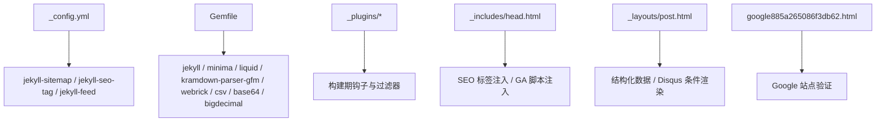
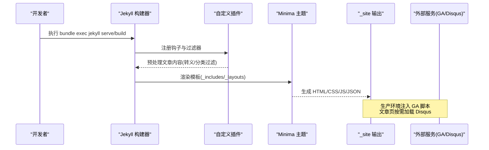
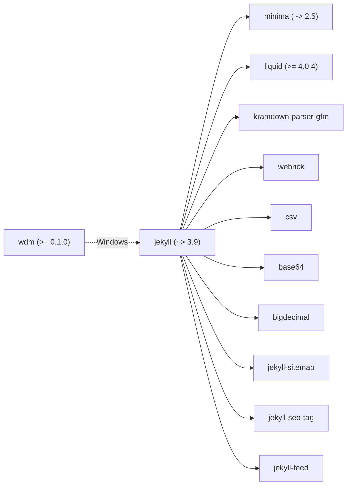
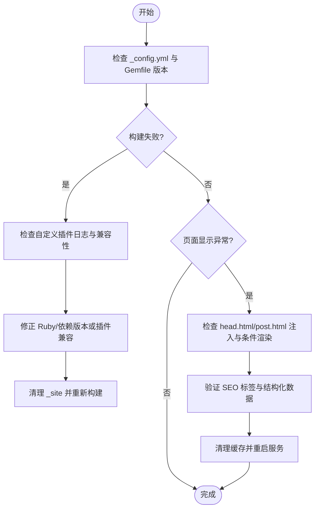

# 维护与故障排除

<cite>
**本文引用的文件**   
- [_config.yml](file://_config.yml)
- [Gemfile](file://Gemfile)
- [README.md](file://README.md)
- [_plugins/ruby34_compat.rb](file://_plugins/ruby34_compat.rb)
- [_plugins/escape_code_liquid.rb](file://_plugins/escape_code_liquid.rb)
- [_plugins/year_category_filter.rb](file://_plugins/year_category_filter.rb)
- [_includes/head.html](file://_includes/head.html)
- [_layouts/post.html](file://_layouts/post.html)
- [_includes/disqus_comments.html](file://_includes/disqus_comments.html)
- [google885a265086f3db62.html](file://google885a265086f3db62.html)
</cite>

## 目录
1. [简介](#简介)
2. [项目结构](#项目结构)
3. [核心组件](#核心组件)
4. [架构总览](#架构总览)
5. [详细组件分析](#详细组件分析)
6. [依赖关系分析](#依赖关系分析)
7. [性能与构建优化](#性能与构建优化)
8. [故障排除指南](#故障排除指南)
9. [版本升级流程](#版本升级流程)
10. [备份与恢复策略](#备份与恢复策略)
11. [SEO 优化检查](#seo-优化检查)
12. [安全维护建议](#安全维护建议)
13. [监控与告警](#监控与告警)
14. [结论](#结论)

## 简介
本指南面向博客的运维与排障，覆盖日常维护、构建缓存管理、增量构建问题排查、版本升级、备份恢复、常见错误诊断、SEO 检查、安全加固以及监控告警等主题。文档内容基于仓库现有配置与实现进行说明，确保可操作且可追溯。

## 项目结构
本项目为 Jekyll + Minima 主题的个人博客，关键目录与职责如下：
- _config.yml：站点全局配置（标题、社交链接、Disqus、Google Analytics、插件列表、permalink 等）
- Gemfile：Ruby 依赖声明（Jekyll、Minima、Liquid、kramdown-parser-gfm、webrick、csv、base64、bigdecimal 及 jekyll-sitemap/jekyll-seo-tag/jekyll-feed 插件）
- _plugins：自定义 Ruby 插件（Ruby 3.4+ 兼容、代码块 Liquid 转义、分类过滤）
- _includes/_layouts：页面片段与布局（head、post、disqus 评论等）
- assets/files/imgs：前端资源、附件、图片
- pages/search.json：搜索索引（由 Jekyll 生成）
- google885a265086f3db62.html：Google 站点验证文件

图表来源
- [_config.yml:1-45](file://_config.yml#L1-L45)
- [Gemfile:1-25](file://Gemfile#L1-L25)
- [_includes/head.html:1-27](file://_includes/head.html#L1-L27)
- [_layouts/post.html:1-37](file://_layouts/post.html#L1-L37)
- [google885a265086f3db62.html:1-1](file://google885a265086f3db62.html#L1-L1)

章节来源
- [README.md:26-62](file://README.md#L26-L62)
- [_config.yml:1-45](file://_config.yml#L1-L45)
- [Gemfile:1-25](file://Gemfile#L1-L25)

## 核心组件
- 站点配置与插件
  - 站点元信息、主题、皮肤、头像、Favicon、Disqus shortname、Google Analytics ID、permalink、markdown/highlighter、插件列表均在 _config.yml 中集中管理。
  - 插件启用 jekyll-sitemap、jekyll-seo-tag、jekyll-feed，分别负责站点地图、SEO 标签增强与 RSS 订阅源。
- 依赖与环境
  - Gemfile 针对 Ruby 4.0+ 分支直接声明 jekyll/minima/liquid/kramdown-parser-gfm/webrick/csv/base64/bigdecimal；在较低 Ruby 版本下使用 github-pages 聚合包。Windows 平台额外引入 wdm 以优化文件监控。
- 自定义插件
  - ruby34_compat.rb：兼容 Ruby 3.4+（移除 String#untaint），并提供 strip_urls 过滤器用于搜索索引清理。
  - escape_code_liquid.rb：在 posts 预渲染阶段自动处理有序列表内围栏代码块、代码块与行内代码中的 {{ }} 转义，避免 Liquid 冲突。
  - year_category_filter.rb：移除由 _posts 子目录自动注入的分类，仅保留 front matter 显式定义的分类。
- 模板与集成
  - head.html：注入 SEO 标签、字体、样式、Favicon、GA 脚本（生产环境）。
  - post.html：文章结构化数据（Schema.org BlogPosting）、时间戳、作者、Disqus 条件渲染、TOC 侧边栏与代码工具栏交互逻辑。
  - disqus_comments.html：根据 page.comments 与 site.disqus.shortname 条件加载评论区。

章节来源
- [_config.yml:1-45](file://_config.yml#L1-L45)
- [Gemfile:1-25](file://Gemfile#L1-L25)
- [_plugins/ruby34_compat.rb:1-22](file://_plugins/ruby34_compat.rb#L1-L22)
- [_plugins/escape_code_liquid.rb:1-62](file://_plugins/escape_code_liquid.rb#L1-L62)
- [_plugins/year_category_filter.rb:1-13](file://_plugins/year_category_filter.rb#L1-L13)
- [_includes/head.html:1-27](file://_includes/head.html#L1-L27)
- [_layouts/post.html:1-37](file://_layouts/post.html#L1-L37)
- [_includes/disqus_comments.html:1-20](file://_includes/disqus_comments.html#L1-L20)

## 架构总览
下图展示了从源码到静态站点的构建与运行路径，包括插件、模板、第三方服务集成点。

图表来源
- [_plugins/escape_code_liquid.rb:12-61](file://_plugins/escape_code_liquid.rb#L12-L61)
- [_plugins/year_category_filter.rb:5-12](file://_plugins/year_category_filter.rb#L5-L12)
- [_includes/head.html:21-24](file://_includes/head.html#L21-L24)
- [_layouts/post.html:31-34](file://_layouts/post.html#L31-L34)

## 详细组件分析

### 构建缓存管理与 _site 清理
- 增量构建机制
  - Jekyll 默认采用增量构建以提升本地开发体验。当修改 _config.yml 或大量增删文件后，增量构建可能产生缓存不一致，导致页面未更新、样式错乱或 header 重复显示等问题。
- 清理方法
  - 停止当前服务后删除历史构建目录，再重新构建并启动。
  - 建议在重大变更（如主题升级、插件调整、大量资源变动）后执行一次全量清理。
- 参考路径
  - README 中提供了清理与重建步骤说明。

章节来源
- [README.md:281-294](file://README.md#L281-L294)

### 增量构建问题排查
- 典型症状
  - 修改配置后不生效、新增/删除文章后未反映、样式异常、头部重复。
- 排查步骤
  - 确认是否修改了 _config.yml 或大量文件。
  - 执行全量清理后重启服务。
  - 若仍异常，检查自定义插件是否在预渲染阶段对内容做了转换（例如代码块转义、分类过滤）。
- 相关插件行为
  - 代码块 Liquid 转义插件会在 posts 预渲染阶段改写内容，影响最终渲染结果。
  - 分类过滤插件会移除由目录结构自动注入的分类，确保分类仅来自 front matter。

章节来源
- [_plugins/escape_code_liquid.rb:12-61](file://_plugins/escape_code_liquid.rb#L12-L61)
- [_plugins/year_category_filter.rb:5-12](file://_plugins/year_category_filter.rb#L5-L12)
- [README.md:281-294](file://README.md#L281-L294)

### 版本升级流程（Jekyll 与主题）
- 升级前准备
  - 记录当前 Gemfile 与 _config.yml 的关键项（主题、插件、permalink、analytics、disqus 等）。
  - 备份 _site 与本地构建产物，必要时回滚。
- 升级步骤
  - 更新 Gemfile 中 jekyll/minima/liquid 等版本约束，或在低 Ruby 环境下切换至 github-pages 聚合包。
  - 执行依赖安装与构建测试，确认无报错。
  - 若使用 Ruby 4.0+，注意 Liquid 兼容性要求（>= 4.0.4）。
- 注意事项
  - 主题升级可能引入新的配置项或模板差异，需对照主题文档逐项核对。
  - Windows 平台建议使用 wdm 提升文件监控性能。
- 参考路径
  - Gemfile 中对不同 Ruby 版本的分支策略与依赖声明。

章节来源
- [Gemfile:1-25](file://Gemfile#L1-L25)
- [README.md:322-331](file://README.md#L322-L331)

### 备份与恢复策略
- 文章内容备份
  - 将 _posts 目录纳入版本控制与定期备份策略，确保 Markdown 源文件可恢复。
- 配置文件管理
  - _config.yml 集中管理站点元信息、插件、第三方服务配置，应纳入版本控制并严格审查敏感字段。
- 静态资源备份
  - assets、files、imgs、favicons 等目录作为静态资源，应纳入备份范围。
- 恢复流程
  - 从备份还原源码与资源，执行依赖安装与构建，验证站点功能与链接完整性。

章节来源
- [_config.yml:1-45](file://_config.yml#L1-L45)
- [README.md:26-62](file://README.md#L26-L62)

### 常见错误诊断方法
- 构建失败日志分析
  - 关注 Ruby 版本与依赖冲突（特别是 Liquid 与旧版 Jekyll 的兼容性）。
  - 检查自定义插件是否存在语法错误或运行时异常。
- 页面显示异常排查
  - 确认 _includes/head.html 是否正确注入 SEO 与 GA 脚本。
  - 检查 _layouts/post.html 的结构化数据与 Disqus 条件渲染逻辑。
- 参考路径
  - ruby34_compat.rb 提供 Ruby 3.4+ 兼容补丁，避免旧版 Liquid/Jekyll 报错。
  - escape_code_liquid.rb 在预渲染阶段改写内容，若出现代码块或 Liquid 冲突，优先检查该插件。

章节来源
- [_plugins/ruby34_compat.rb:1-22](file://_plugins/ruby34_compat.rb#L1-L22)
- [_plugins/escape_code_liquid.rb:12-61](file://_plugins/escape_code_liquid.rb#L12-L61)
- [_includes/head.html:21-24](file://_includes/head.html#L21-L24)
- [_layouts/post.html:31-34](file://_layouts/post.html#L31-L34)

### SEO 优化检查
- Meta 标签验证
  - 通过 jekyll-seo-tag 插件注入标准 SEO 标签，可在 head.html 中使用 seo 标签。
  - 检查 title、description、author、canonical 等字段是否符合预期。
- 结构化数据测试
  - post.html 使用 Schema.org BlogPosting 标记，包含标题、正文、发布时间、作者等属性。
  - 可使用 Google Rich Results Test 或 Structured Data Testing Tool 验证。
- 站点地图与 RSS
  - jekyll-sitemap 自动生成 sitemap.xml，jekyll-feed 生成 feed.xml。
- 站点验证
  - google885a265086f3db62.html 用于 Google 站点验证。

章节来源
- [_includes/head.html:5-11](file://_includes/head.html#L5-L11)
- [_layouts/post.html:4-37](file://_layouts/post.html#L4-L37)
- [_config.yml:41-44](file://_config.yml#L41-L44)
- [google885a265086f3db62.html:1-1](file://google885a265086f3db62.html#L1-L1)

### 安全维护建议
- 敏感信息保护
  - _config.yml 中包含邮箱、Disqus shortname、Google Analytics ID 等，应避免在公开仓库中泄露敏感值；必要时使用环境变量或 CI 密钥管理。
- 依赖包安全检查
  - 定期检查 Gemfile.lock 与第三方依赖更新，关注已知漏洞与安全公告。
  - 在 Ruby 4.0+ 环境下，确保 Liquid >= 4.0.4 以满足兼容性要求。
- 最小权限原则
  - 仅在必要位置引入第三方脚本（如 GA），并确保在生产环境才注入。

章节来源
- [_config.yml:1-45](file://_config.yml#L1-L45)
- [Gemfile:1-25](file://Gemfile#L1-L25)
- [_includes/head.html:21-24](file://_includes/head.html#L21-L24)

### 监控与告警
- 站点可用性检测
  - 使用 UptimeRobot、Pingdom 或自建健康检查端点定时探测站点可达性。
- 访问统计分析
  - 生产环境通过 head.html 注入 GA 脚本，结合 Google Analytics 控制台进行流量与用户行为分析。
- 构建状态监控
  - 在 CI/CD 流水线中捕获构建日志与失败告警，确保发布质量。

章节来源
- [_includes/head.html:21-24](file://_includes/head.html#L21-L24)

## 依赖关系分析
- 直接依赖
  - jekyll、minima、liquid、kramdown-parser-gfm、webrick、csv、base64、bigdecimal
  - jekyll-sitemap、jekyll-seo-tag、jekyll-feed（插件组）
  - Windows 平台 wdm
- 版本分支策略
  - Ruby >= 4.0.0：直接声明各依赖，解决 commonmarker 限制与 Liquid 兼容问题
  - Ruby < 4.0.0：使用 github-pages 聚合包简化依赖管理

图表来源
- [Gemfile:1-25](file://Gemfile#L1-L25)

章节来源
- [Gemfile:1-25](file://Gemfile#L1-L25)

## 性能与构建优化
- 增量构建
  - 本地开发保持 jekyll serve 运行，利用增量构建快速预览。
  - 重大变更后执行全量清理，避免缓存冲突。
- 文件监控优化
  - Windows 平台引入 wdm 提升文件监听性能。
- 资源加载优化
  - 使用 preconnect 预连接字体域名，减少首屏延迟。
  - 按需加载 GA 脚本（生产环境），避免开发环境污染。

章节来源
- [README.md:281-294](file://README.md#L281-L294)
- [Gemfile:24-25](file://Gemfile#L24-L25)
- [_includes/head.html:6-10](file://_includes/head.html#L6-L10)
- [_includes/head.html:21-24](file://_includes/head.html#L21-L24)

## 故障排除指南
- 构建失败
  - 检查 Ruby 版本与 Gemfile 分支策略是否匹配。
  - 查看自定义插件日志，确认预渲染钩子与过滤器无异常。
- 页面异常
  - 确认 SEO 标签与 GA 脚本注入条件正确。
  - 检查 Disqus 条件渲染与 shortname 配置。
- 常见问题定位流程图

[此图为概念流程，无需图表来源]

章节来源
- [_plugins/ruby34_compat.rb:1-22](file://_plugins/ruby34_compat.rb#L1-L22)
- [_plugins/escape_code_liquid.rb:12-61](file://_plugins/escape_code_liquid.rb#L12-L61)
- [_includes/head.html:21-24](file://_includes/head.html#L21-L24)
- [_layouts/post.html:31-34](file://_layouts/post.html#L31-L34)
- [README.md:281-294](file://README.md#L281-L294)

## 版本升级流程
- Jekyll 与主题升级
  - 更新 Gemfile 中 jekyll/minima/liquid 版本约束，或在低 Ruby 版本下切换至 github-pages。
  - 执行 bundle install 与构建测试，确认无报错。
  - 对照主题文档检查新配置项与模板差异。
- 注意事项
  - Ruby 4.0+ 需要 Liquid >= 4.0.4 以修复 untaint 兼容问题。
  - Windows 平台建议保留 wdm 依赖。

章节来源
- [Gemfile:1-25](file://Gemfile#L1-L25)
- [README.md:322-331](file://README.md#L322-L331)

## 备份与恢复策略
- 备份范围
  - 源码（_posts、_config.yml、_plugins、_includes、_layouts、assets、files、imgs、favicons）
  - 构建产物（_site，可选）
- 恢复步骤
  - 从备份还原源码与资源
  - 安装依赖并构建
  - 验证站点功能与链接完整性

章节来源
- [_config.yml:1-45](file://_config.yml#L1-L45)
- [README.md:26-62](file://README.md#L26-L62)

## SEO 优化检查
- Meta 标签
  - 使用 jekyll-seo-tag 注入标准 SEO 标签，确保 title/description/author/canonical 正确。
- 结构化数据
  - post.html 使用 Schema.org BlogPosting，包含 articleBody、datePublished、author 等。
- 站点地图与 RSS
  - jekyll-sitemap 生成 sitemap.xml，jekyll-feed 生成 feed.xml。
- 站点验证
  - 放置 google885a265086f3db62.html 完成 Google 站点验证。

章节来源
- [_includes/head.html:5-11](file://_includes/head.html#L5-L11)
- [_layouts/post.html:4-37](file://_layouts/post.html#L4-L37)
- [_config.yml:41-44](file://_config.yml#L41-L44)
- [google885a265086f3db62.html:1-1](file://google885a265086f3db62.html#L1-L1)

## 安全维护建议
- 敏感信息保护
  - _config.yml 中的邮箱、shortname、Analytics ID 等应谨慎管理，避免泄露。
- 依赖安全检查
  - 定期更新依赖，关注安全公告与漏洞修复。
  - 在 Ruby 4.0+ 环境下确保 Liquid 版本满足兼容性要求。
- 最小权限原则
  - 仅在生产环境注入 GA 脚本，避免开发环境污染。

章节来源
- [_config.yml:1-45](file://_config.yml#L1-L45)
- [Gemfile:1-25](file://Gemfile#L1-L25)
- [_includes/head.html:21-24](file://_includes/head.html#L21-L24)

## 监控与告警
- 可用性检测
  - 使用外部监控服务定时探测站点可达性。
- 访问统计
  - 生产环境注入 GA 脚本，结合控制台分析流量与用户行为。
- 构建监控
  - 在 CI/CD 中捕获构建日志与失败告警，确保发布质量。

章节来源
- [_includes/head.html:21-24](file://_includes/head.html#L21-L24)

## 结论
通过系统化的维护与排障流程，结合构建缓存管理、版本升级规范、备份恢复策略、SEO 检查、安全加固与监控告警，可有效保障博客的稳定运行与持续演进。建议在日常工作中遵循本文档的操作指引，并在重大变更前做好备份与测试，以降低风险与提高恢复效率。