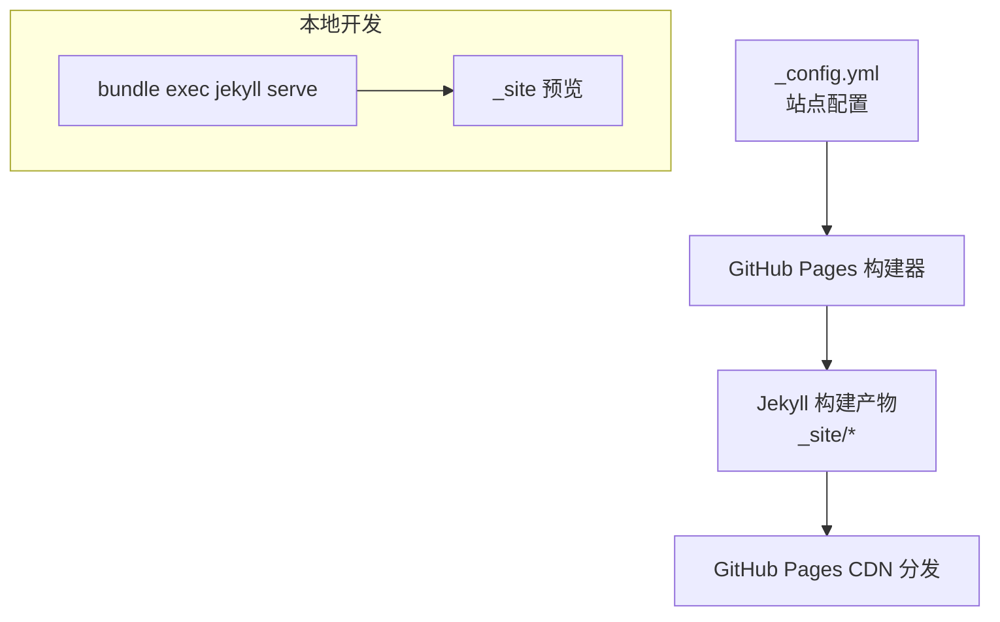
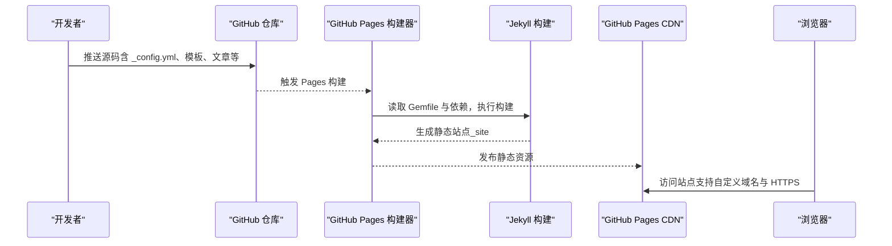
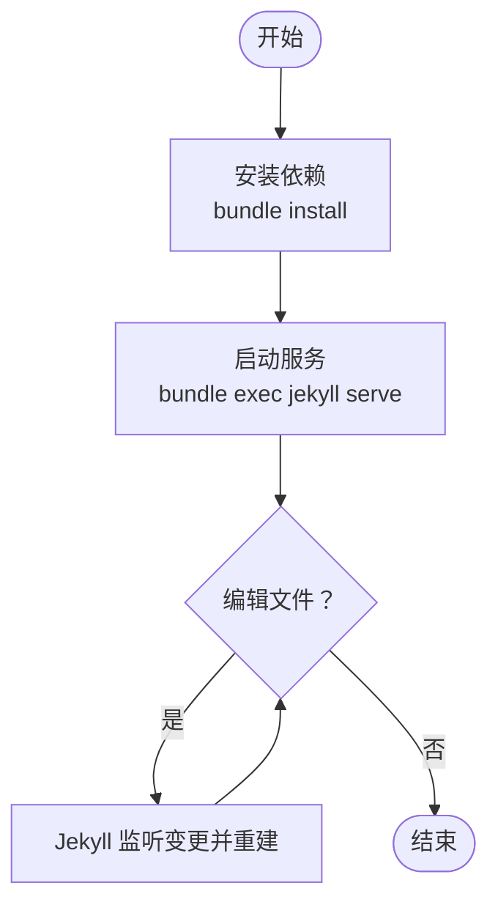
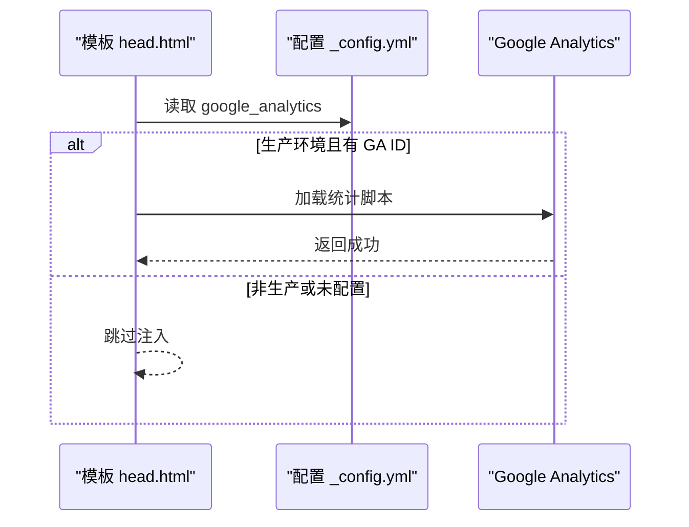
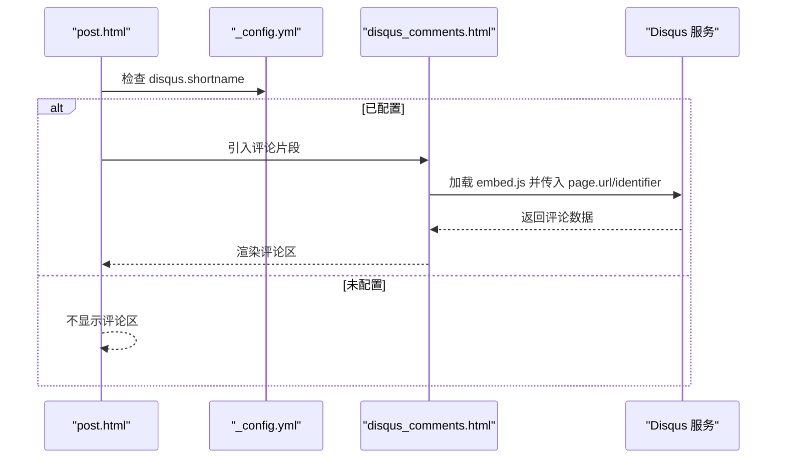
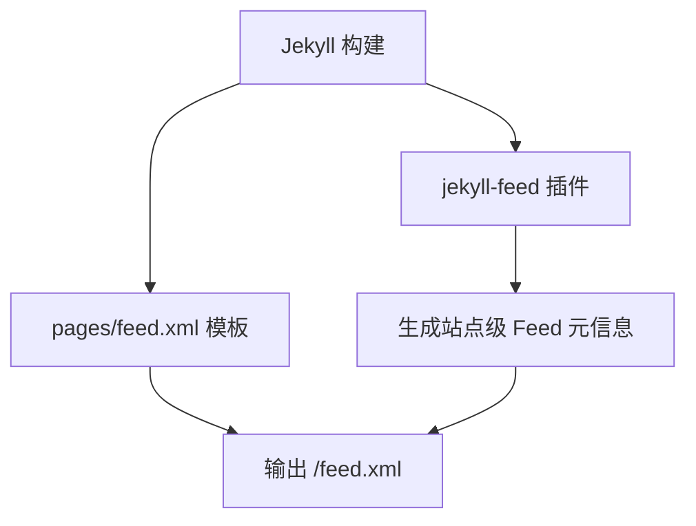
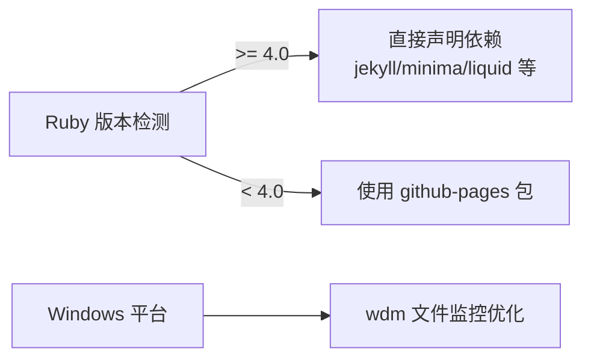

# 部署与维护

<cite>
**本文引用的文件**   
- [_config.yml](file://_config.yml)
- [Gemfile](file://Gemfile)
- [Gemfile.lock](file://Gemfile.lock)
- [README.md](file://README.md)
- [_includes/head.html](file://_includes/head.html)
- [_includes/disqus_comments.html](file://_includes/disqus_comments.html)
- [_layouts/post.html](file://_layouts/post.html)
- [pages/feed.xml](file://pages/feed.xml)
- [_plugins/ruby34_compat.rb](file://_plugins/ruby34_compat.rb)
</cite>

## 目录
1. [简介](#简介)
2. [项目结构](#项目结构)
3. [核心组件](#核心组件)
4. [架构总览](#架构总览)
5. [详细组件分析](#详细组件分析)
6. [依赖分析](#依赖分析)
7. [性能考虑](#性能考虑)
8. [故障排除指南](#故障排除指南)
9. [结论](#结论)
10. [附录](#附录)

## 简介
本指南面向将本博客站点部署到 GitHub Pages 并长期维护的读者，覆盖自动化构建流程、自定义域名与 HTTPS、本地构建缓存管理、常见问题诊断、性能与 SEO 优化、Google Analytics 统计集成、Disqus 评论系统配置与管理、RSS 订阅设置、版本管理与备份恢复策略等。文档内容严格基于仓库现有实现与说明进行提炼与组织，便于快速上手与持续运维。

## 项目结构
本项目为 Jekyll + Minima 主题的博客站点，采用 GitHub Pages 自动构建。关键目录与职责如下：
- _config.yml：站点全局配置（标题、描述、作者、主题、插件、SEO/Feed/Sitemap、Disqus、GA 等）
- Gemfile/Gemfile.lock：Ruby 依赖声明与锁定，兼容 GitHub Pages 与本地 Ruby 环境差异
- _includes/_layouts：可复用片段与页面布局（含 Disqus 嵌入、文章页 TOC 与代码工具栏）
- pages/feed.xml：RSS 订阅源模板
- _plugins：Jekyll 自定义插件（Ruby 3.4+ 兼容、URL 清理过滤器等）
- assets/imgs/files：前端资源、图片与附件

图表来源
- [_config.yml:1-45](file://_config.yml#L1-L45)
- [Gemfile:1-25](file://Gemfile#L1-L25)
- [README.md:26-62](file://README.md#L26-L62)

章节来源
- [README.md:26-62](file://README.md#L26-L62)

## 核心组件
- 站点配置与元数据
  - 站点基础信息、主题与皮肤、头像与 favicon、永久链接格式、Markdown 与高亮引擎、插件列表等均在配置文件中集中管理。
- 构建与运行
  - 通过 Gemfile 声明依赖，使用 bundle 安装；本地以 bundle exec jekyll serve 启动，GitHub Pages 在推送后自动构建。
- 页面与模板
  - 文章页包含创建/更新时间、作者、正文、Disqus 评论、TOC 侧边栏与代码块工具栏。
  - 头部引入 SEO、字体、样式、Favicon、Feed 与生产环境的 Google Analytics。
- 插件与扩展
  - 提供 Ruby 3.4+ 兼容补丁与搜索索引用的 URL 清理过滤器。
- 订阅与 SEO
  - 启用 sitemap、SEO tag、feed 插件，并在 pages/feed.xml 中生成 RSS。

章节来源
- [_config.yml:1-45](file://_config.yml#L1-L45)
- [Gemfile:1-25](file://Gemfile#L1-L25)
- [_includes/head.html:1-27](file://_includes/head.html#L1-L27)
- [_layouts/post.html:1-194](file://_layouts/post.html#L1-L194)
- [_plugins/ruby34_compat.rb:1-21](file://_plugins/ruby34_compat.rb#L1-L21)
- [pages/feed.xml:1-31](file://pages/feed.xml#L1-L31)

## 架构总览
下图展示从源码提交到线上访问的关键路径，以及本地开发与线上构建的差异点。

图表来源
- [Gemfile:1-25](file://Gemfile#L1-L25)
- [_config.yml:1-45](file://_config.yml#L1-L45)
- [README.md:26-62](file://README.md#L26-L62)

## 详细组件分析

### 自动化构建与本地开发
- 本地环境
  - 使用 bundle 安装依赖，确保与线上一致；Windows 下额外安装 wdm 提升文件监控性能。
  - 通过 bundle exec jekyll serve 启动本地服务，修改后实时预览。
- 线上构建
  - GitHub Pages 根据 Gemfile 解析依赖并构建；当本地 Ruby 版本高于线上时，Gemfile 分支直接声明必要 gem，避免 github-pages 包版本冲突。
- 构建缓存
  - 若出现样式错乱或增量构建异常，删除 _site 后重新构建可解决。

图表来源
- [Gemfile:1-25](file://Gemfile#L1-L25)
- [README.md:265-294](file://README.md#L265-L294)

章节来源
- [Gemfile:1-25](file://Gemfile#L1-L25)
- [README.md:265-294](file://README.md#L265-L294)

### 自定义域名与 HTTPS
- 自定义域名
  - 在仓库 Settings 中设置 Custom domain，并在 DNS 中添加指向 GitHub Pages 的 A 记录与 www 别名。
- HTTPS
  - GitHub Pages 默认对自定义域名提供 HTTPS；如存在证书不匹配提示，请确认 DNS 解析与域名绑定正确。
- 参考步骤
  - 仓库内历史博文提供了详细的自定义域名与 HTTPS 配置截图与步骤，可作为操作参考。

章节来源
- [README.md:26-62](file://README.md#L26-L62)
- [_posts/2019/2019-12-27-通过-GitHub-Pages-+-JeKyll-搭建自己的博客.md:39-71](file://_posts/2019/2019-12-27-通过-GitHub-Pages-+-JeKyll-搭建自己的博客.md#L39-L71)

### Google Analytics 统计集成
- 条件注入
  - 仅在 production 环境且配置了 GA ID 时注入统计脚本，避免本地调试污染数据。
- 配置位置
  - 站点配置中填写 GA ID；头部模板负责条件渲染。

图表来源
- [_includes/head.html:22-24](file://_includes/head.html#L22-L24)
- [_config.yml:32-34](file://_config.yml#L32-L34)

章节来源
- [_includes/head.html:1-27](file://_includes/head.html#L1-L27)
- [_config.yml:32-34](file://_config.yml#L32-L34)

### Disqus 评论系统
- 启用与关闭
  - 在配置中设置 shortname 即可启用；留空或删除该配置块则关闭。
- 模板逻辑
  - 文章布局判断是否配置短名，再引入评论片段；片段动态设置当前页面 URL 标识。
- 本地预览
  - 本地运行时也可加载 Disqus，需保证网络可达。

图表来源
- [_layouts/post.html:32-34](file://_layouts/post.html#L32-L34)
- [_includes/disqus_comments.html:1-21](file://_includes/disqus_comments.html#L1-L21)
- [_config.yml:28-31](file://_config.yml#L28-L31)

章节来源
- [_layouts/post.html:1-194](file://_layouts/post.html#L1-L194)
- [_includes/disqus_comments.html:1-21](file://_includes/disqus_comments.html#L1-L21)
- [_config.yml:28-31](file://_config.yml#L28-L31)
- [README.md:296-308](file://README.md#L296-L308)

### RSS 订阅
- 生成方式
  - 启用 jekyll-feed 插件，同时在 pages/feed.xml 中定义 RSS 模板，输出最近若干篇文章。
- 订阅地址
  - 站点根路径下的 feed.xml 即为订阅源，可在阅读器中订阅。

图表来源
- [_config.yml:40-45](file://_config.yml#L40-L45)
- [pages/feed.xml:1-31](file://pages/feed.xml#L1-L31)

章节来源
- [_config.yml:40-45](file://_config.yml#L40-L45)
- [pages/feed.xml:1-31](file://pages/feed.xml#L1-L31)

### SEO 与 Sitemap
- SEO 标签
  - 启用 jekyll-seo-tag，在 <head> 中通过 seo 标签注入结构化元数据。
- Sitemap
  - 启用 jekyll-sitemap 自动生成站点地图，利于搜索引擎收录。

章节来源
- [_config.yml:40-45](file://_config.yml#L40-L45)
- [_includes/head.html:5-5](file://_includes/head.html#L5-L5)

### 附件在线预览与全文搜索
- 附件预览
  - 提供 file-viewer 页面用于文本类附件在线查看，文章中通过参数化链接引用。
- 全文搜索
  - 前端 search.js 加载 search.json 索引，实现弹窗式分页结果展示。

章节来源
- [README.md:48-61](file://README.md#L48-L61)

## 依赖分析
- 平台差异处理
  - 当本地 Ruby 版本较高时，Gemfile 直接声明 jekyll/minima/liquid 等依赖，避免 github-pages 包在新版 Ruby 上的兼容问题。
- Windows 优化
  - 引入 wdm 提升文件监听性能，改善本地开发体验。
- 锁定版本
  - Gemfile.lock 固定各 gem 版本，保障构建一致性。

图表来源
- [Gemfile:1-25](file://Gemfile#L1-L25)
- [Gemfile.lock:77-92](file://Gemfile.lock#L77-L92)

章节来源
- [Gemfile:1-25](file://Gemfile#L1-L25)
- [Gemfile.lock:77-92](file://Gemfile.lock#L77-L92)

## 性能考虑
- 构建与缓存
  - 增量构建可能受缓存影响，遇到异常时清理 _site 目录后重建。
- 资源加载
  - 预连接外部字体与 CSS/JS 资源，减少首屏阻塞；按需加载搜索脚本。
- 插件开销
  - 仅启用必要的插件（sitemap、seo-tag、feed），控制构建时间。
- 本地体验
  - Windows 下启用 wdm 提升监听性能；必要时切换镜像源加速依赖下载。

[本节为通用建议，无需特定文件来源]

## 故障排除指南
- 本地构建失败或依赖缺失
  - 确认 Ruby 与 Bundler 安装，使用 bundle install 安装依赖；Windows 下按 README 指引安装开发工具链。
- 页面未更新或样式错乱
  - 停止服务，删除 _site 目录后重新启动 jekyll serve。
- Disqus 无法加载
  - 检查 _config.yml 中的 shortname 是否正确；本地需能访问 Disqus 服务。
- GA 未上报数据
  - 确认仅在 production 环境注入；本地不会注入统计脚本。
- 自定义域名 HTTPS 报错
  - 检查 DNS A 记录与 www 别名是否指向 GitHub Pages；确认仓库中 Custom domain 设置正确。

章节来源
- [README.md:64-132](file://README.md#L64-L132)
- [README.md:281-294](file://README.md#L281-L294)
- [README.md:296-308](file://README.md#L296-L308)
- [_includes/head.html:22-24](file://_includes/head.html#L22-L24)
- [_posts/2019/2019-12-27-通过-GitHub-Pages-+-JeKyll-搭建自己的博客.md:39-71](file://_posts/2019/2019-12-27-通过-GitHub-Pages-+-JeKyll-搭建自己的博客.md#L39-L71)

## 结论
本项目基于 Jekyll + Minima，结合 GitHub Pages 的自动化构建能力，实现了开箱即用的博客站点。通过合理的依赖管理、模板与插件配置，完成了 SEO、Sitemap、RSS、Disqus 与 GA 等常用功能。遵循本指南的流程与排障建议，可稳定完成部署与日常维护，并在此基础上持续优化性能与用户体验。

[本节为总结性内容，无需特定文件来源]

## 附录

### 版本管理与最佳实践
- 分支策略
  - 主分支保持可发布状态；新功能在独立分支开发，合并前本地验证构建与预览。
- 提交规范
  - 提交信息清晰描述变更范围；涉及配置与依赖变更时附带简要说明。
- 依赖锁定
  - 始终提交 Gemfile.lock，确保线上与本地构建一致。
- 回滚策略
  - 利用 Git 历史快速回滚至上一稳定版本；必要时重建 _site 后再次发布。

[本节为通用建议，无需特定文件来源]

### 备份与恢复策略
- 源码备份
  - 仓库本身即为主备份；定期打 Tag 标记重要版本。
- 附件与图片
  - 将 imgs/ 与 files/ 纳入版本控制，确保资源与内容同步。
- 配置与依赖
  - 保留 _config.yml、Gemfile、Gemfile.lock 的变更记录，便于跨环境恢复。

[本节为通用建议，无需特定文件来源]