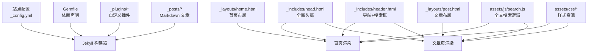
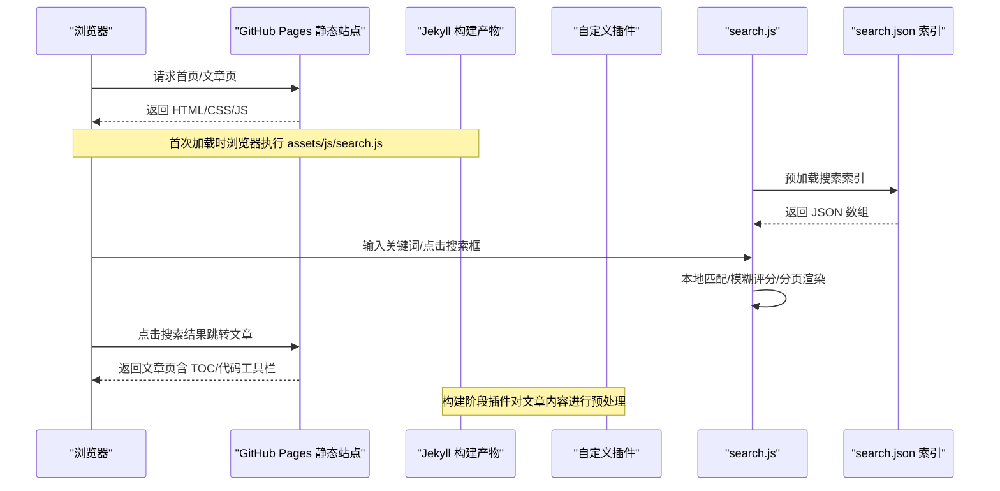
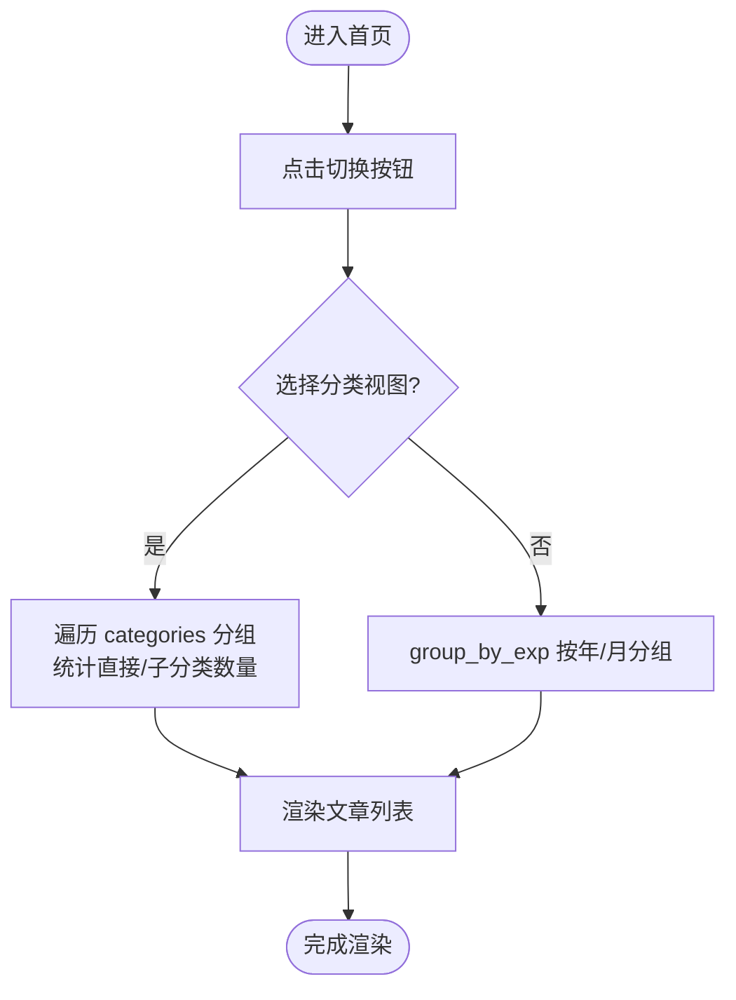
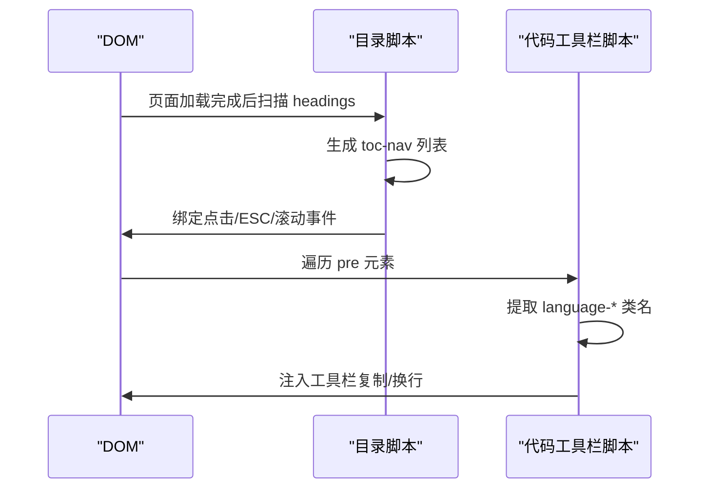
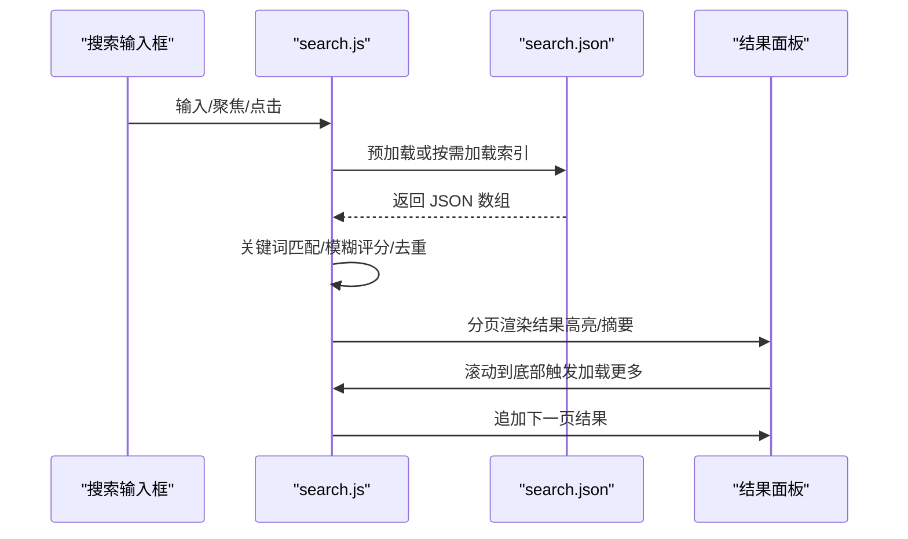
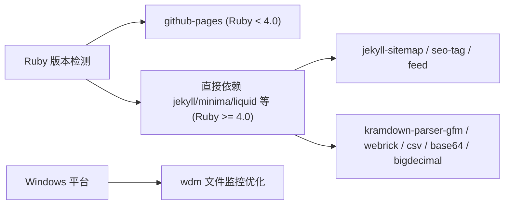

# 项目概述

<cite>
**本文引用的文件**   
- [README.md](file://README.md)
- [_config.yml](file://_config.yml)
- [Gemfile](file://Gemfile)
- [index.md](file://index.md)
- [_layouts/home.html](file://_layouts/home.html)
- [_layouts/post.html](file://_layouts/post.html)
- [_includes/head.html](file://_includes/head.html)
- [_includes/header.html](file://_includes/header.html)
- [_plugins/escape_code_liquid.rb](file://_plugins/escape_code_liquid.rb)
- [_plugins/year_category_filter.rb](file://_plugins/year_category_filter.rb)
- [_plugins/ruby34_compat.rb](file://_plugins/ruby34_compat.rb)
- [assets/js/search.js](file://assets/js/search.js)
</cite>

## 目录
1. [简介](#简介)
2. [项目结构](#项目结构)
3. [核心组件](#核心组件)
4. [架构总览](#架构总览)
5. [详细组件分析](#详细组件分析)
6. [依赖关系分析](#依赖关系分析)
7. [性能与体验优化](#性能与体验优化)
8. [故障排查指南](#故障排查指南)
9. [结论](#结论)
10. [附录：使用场景示例](#附录使用场景示例)

## 简介
本项目是一个基于 GitHub Pages + Jekyll 构建的个人博客，主题采用官方 Minima 并深度定制为“简约清爽”风格。整体设计以黑白灰为主色调、蓝色强调色，配合大量留白与柔和圆角，提供现代易读的阅读体验。站点具备全文搜索、分类/日期双视图、代码块增强（折叠、复制、换行切换）、响应式布局与暗色模式等特性，并通过自定义插件提升写作与构建体验。

## 项目结构
仓库遵循 Jekyll 标准目录约定，同时扩展了前端资源与自定义插件：
- 配置与入口
  - _config.yml：站点元信息、主题、插件、SEO、统计等
  - Gemfile：Ruby 依赖声明与版本约束
  - index.md：首页内容（通过 home 布局渲染）
- 模板与片段
  - _layouts：页面级布局（首页、文章页）
  - _includes：可复用片段（head、header、footer、评论等）
- 内容与资源
  - _posts：按年份子目录组织文章
  - assets：前端资源（CSS/JS），如搜索弹窗样式与脚本
  - files：附件在线预览资源
  - imgs：文章配图
  - favicons：多平台图标集
- 自定义插件
  - _plugins：Liquid 转义、分类过滤、Ruby 兼容等



图表来源
- [_config.yml:1-45](file://_config.yml#L1-L45)
- [Gemfile:1-25](file://Gemfile#L1-L25)
- [_layouts/home.html:1-153](file://_layouts/home.html#L1-L153)
- [_layouts/post.html:1-194](file://_layouts/post.html#L1-L194)
- [_includes/head.html:1-27](file://_includes/head.html#L1-L27)
- [_includes/header.html:1-11](file://_includes/header.html#L1-L11)
- [assets/js/search.js:1-573](file://assets/js/search.js#L1-L573)
- [_plugins/escape_code_liquid.rb:1-62](file://_plugins/escape_code_liquid.rb#L1-L62)
- [_plugins/year_category_filter.rb:1-13](file://_plugins/year_category_filter.rb#L1-L13)
- [_plugins/ruby34_compat.rb:1-22](file://_plugins/ruby34_compat.rb#L1-L22)

章节来源
- [README.md:26-62](file://README.md#L26-L62)
- [_config.yml:1-45](file://_config.yml#L1-L45)
- [Gemfile:1-25](file://Gemfile#L1-L25)

## 核心组件
- 站点配置与主题
  - 站点标题、作者、社交链接、头像与 favicon 路径、Minima 皮肤与日期格式、永久链接格式、Markdown 解析器与高亮器、插件列表等均在配置中集中管理。
- 首页布局（分类/日期双视图）
  - 支持在“分类归档”和“时间线”两种视图间切换；分类按首字母排序，默认折叠，二级子分类自动聚合。
- 文章布局（TOC 侧边栏与代码工具栏）
  - 自动生成 h1~h6 目录树，滚动高亮当前章节；代码块工具栏支持复制与换行切换。
- 全文搜索
  - 预加载 search.json 索引，支持中英文混合匹配、中文二元组模糊匹配、分页加载与结果高亮。
- 自定义插件
  - Liquid 语法自动转义（避免代码中的 {{ }} 冲突）、有序列表内围栏代码块兼容、分类过滤（去除由目录结构注入的分类）、Ruby 3.4+ 兼容与 strip_urls 过滤器。

章节来源
- [_config.yml:1-45](file://_config.yml#L1-L45)
- [_layouts/home.html:1-153](file://_layouts/home.html#L1-L153)
- [_layouts/post.html:1-194](file://_layouts/post.html#L1-L194)
- [_includes/head.html:1-27](file://_includes/head.html#L1-L27)
- [_includes/header.html:1-11](file://_includes/header.html#L1-L11)
- [assets/js/search.js:1-573](file://assets/js/search.js#L1-L573)
- [_plugins/escape_code_liquid.rb:1-62](file://_plugins/escape_code_liquid.rb#L1-L62)
- [_plugins/year_category_filter.rb:1-13](file://_plugins/year_category_filter.rb#L1-L13)
- [_plugins/ruby34_compat.rb:1-22](file://_plugins/ruby34_compat.rb#L1-L22)

## 架构总览
下图展示了从用户访问到页面渲染的关键流程，包括搜索交互与插件处理链路。



图表来源
- [_includes/head.html:1-27](file://_includes/head.html#L1-L27)
- [_layouts/post.html:1-194](file://_layouts/post.html#L1-L194)
- [assets/js/search.js:1-573](file://assets/js/search.js#L1-L573)
- [_plugins/escape_code_liquid.rb:1-62](file://_plugins/escape_code_liquid.rb#L1-L62)
- [_plugins/year_category_filter.rb:1-13](file://_plugins/year_category_filter.rb#L1-L13)
- [_plugins/ruby34_compat.rb:1-22](file://_plugins/ruby34_compat.rb#L1-L22)

## 详细组件分析

### 首页布局（分类/日期双视图）
- 功能要点
  - 顶部提供“分类/日期”切换按钮，点击后动态显示对应视图。
  - 分类视图：按首字母排序，统计直接文章数与二级子分类文章总数，默认折叠。
  - 日期视图：按年-月分组，展示每篇文章的日期与标题。
- 关键实现
  - 使用 Liquid 遍历 site.categories 与 group_by_exp 分组。
  - 通过 data-view 属性与 class 切换控制显示隐藏。



图表来源
- [_layouts/home.html:1-153](file://_layouts/home.html#L1-L153)

章节来源
- [_layouts/home.html:1-153](file://_layouts/home.html#L1-L153)

### 文章布局（TOC 侧边栏与代码工具栏）
- 功能要点
  - 自动生成目录树（h1~h6），支持 ESC 关闭、移动端点击后收起、滚动高亮当前章节。
  - 代码块工具栏：显示语言标签、一键复制、切换换行/不换行。
- 关键实现
  - 扫描 .post-content 下的 headings，生成 toc-nav 列表。
  - 监听 scroll 事件计算 active 项；pre 元素注入 toolbar 并绑定事件。



图表来源
- [_layouts/post.html:1-194](file://_layouts/post.html#L1-L194)

章节来源
- [_layouts/post.html:1-194](file://_layouts/post.html#L1-L194)

### 全文搜索（前端）
- 功能要点
  - 预加载 search.json 索引，支持中英文混合匹配、中文二元组模糊匹配、分页加载与结果高亮。
  - 弹窗式结果展示，锁定背景滚动，支持 ESC 关闭与遮罩点击关闭。
- 关键实现
  - 去重索引、正则转义、关键词分词、snippet 截取与高亮。
  - 滚动到底部触发 loadMore，requestAnimationFrame 批量渲染。



图表来源
- [_includes/header.html:1-11](file://_includes/header.html#L1-L11)
- [_includes/head.html:1-27](file://_includes/head.html#L1-L27)
- [assets/js/search.js:1-573](file://assets/js/search.js#L1-L573)

章节来源
- [_includes/header.html:1-11](file://_includes/header.html#L1-L11)
- [_includes/head.html:1-27](file://_includes/head.html#L1-L27)
- [assets/js/search.js:1-573](file://assets/js/search.js#L1-L573)

### 自定义插件（构建期）
- escape_code_liquid.rb
  - 将有序列表内的 ``` 转换为 ~~~，避免 kramdown 缩进问题。
  - 在围栏代码块与行内代码中自动包裹 ，防止 Liquid 解析冲突。
- year_category_filter.rb
  - 移除由 _posts 子目录自动注入的分类，仅保留 front matter 显式定义。
- ruby34_compat.rb
  - 兼容 Ruby 3.4+（String#untaint 已移除）。
  - 注册 strip_urls 过滤器用于清理 URL/图片/链接以提升搜索质量。

```mermaid
classDiagram
class EscapeCodeLiquid {
+register( : posts, : pre_render)
+处理有序列表内围栏代码块
+自动转义 {{ }} 在代码中
}
class YearCategoryFilter {
+register( : posts, : post_init)
+移除目录结构注入的分类
}
class Ruby34Compat {
+兼容 String#untaint
+注册 strip_urls 过滤器
}
EscapeCodeLiquid --> Jekyll : : Hooks : "注册钩子"
YearCategoryFilter --> Jekyll : : Hooks : "注册钩子"
Ruby34Compat --> Liquid : : Template : "注册过滤器"
```

图表来源
- [_plugins/escape_code_liquid.rb:1-62](file://_plugins/escape_code_liquid.rb#L1-L62)
- [_plugins/year_category_filter.rb:1-13](file://_plugins/year_category_filter.rb#L1-L13)
- [_plugins/ruby34_compat.rb:1-22](file://_plugins/ruby34_compat.rb#L1-L22)

章节来源
- [_plugins/escape_code_liquid.rb:1-62](file://_plugins/escape_code_liquid.rb#L1-L62)
- [_plugins/year_category_filter.rb:1-13](file://_plugins/year_category_filter.rb#L1-L13)
- [_plugins/ruby34_compat.rb:1-22](file://_plugins/ruby34_compat.rb#L1-L22)

## 依赖关系分析
- 运行时与构建环境
  - 线上：GitHub Pages 使用 Ruby 3.3.4，安装 github-pages 232（包含 liquid 4.0.4）。
  - 本地：若 Ruby 4.0+，则直接声明 jekyll、minima、liquid、kramdown-parser-gfm 等依赖，确保兼容性。
- 插件与工具链
  - jekyll-sitemap、jekyll-seo-tag、jekyll-feed 作为构建插件启用。
  - webrick、csv、base64、bigdecimal 等基础库按需引入。
  - Windows 下启用 wdm 优化文件监控。



图表来源
- [Gemfile:1-25](file://Gemfile#L1-L25)

章节来源
- [Gemfile:1-25](file://Gemfile#L1-L25)

## 性能与体验优化
- 字体与样式
  - 使用 Google Fonts 预连接 Inter 字体，减少加载延迟；CSS 变量体系统一设计令牌，支持明暗模式自动切换。
- 搜索体验
  - 预加载索引，输入防抖 200ms，分页加载（每页 8 条），滚动到底部自动加载更多。
  - 中文二元组模糊匹配提高容错率；结果 snippet 智能截取与高亮。
- 代码可读性
  - 代码块语言标签、复制与换行切换，长代码自动折叠（通过 CSS 控制），保持页面整洁。
- 构建效率
  - 使用 bundle exec 固定依赖版本，避免增量构建缓存冲突；必要时清理 _site 重新构建。

[本节为通用指导，不直接分析具体文件]

## 故障排查指南
- 页面未更新/样式错乱
  - 清理历史构建并重启服务：删除 _site 后运行 bundle exec jekyll serve。
- 搜索无法加载索引
  - 检查 search.json 是否生成且可访问；确认网络能访问 CDN 与 Google Fonts。
- Disqus 评论不显示
  - 检查 _config.yml 中 disqus.shortname 是否正确；本地需能访问 Disqus 服务。
- 代码中 {{ }} 被误解析
  - 确认插件已启用；必要时在 Markdown 中使用原生代码围栏或 HTML code 标签。
- 分类异常（出现年份目录作为分类）
  - 确认 year_category_filter 插件生效，仅保留 front matter 定义的分类。

章节来源
- [README.md:281-294](file://README.md#L281-L294)
- [_config.yml:28-33](file://_config.yml#L28-L33)
- [_plugins/year_category_filter.rb:1-13](file://_plugins/year_category_filter.rb#L1-L13)
- [_plugins/escape_code_liquid.rb:1-62](file://_plugins/escape_code_liquid.rb#L1-L62)

## 结论
该项目以 Jekyll + Minima 为核心，通过深度定制与自研插件实现了简洁高效的个人博客体验。其技术选型兼顾兼容性与可维护性，前端交互注重易用性与性能，适合初学者快速上手，也为有经验的开发者提供了清晰的扩展点与优化空间。

[本节为总结性内容，不直接分析具体文件]

## 附录：使用场景示例
- 写文章
  - 在 _posts 下新建 Markdown 文件，设置 front matter（layout、title、create_time、update_time、categories）。
  - 图片放入 imgs/ 目录，文章中引用相对路径即可本地预览。
- 引用本站文章
  - 使用 post_url 标签引用文章，构建时自动解析链接，不存在会报错。
- 附件在线预览
  - 将配置文件或脚本放入 files/ 目录，文章中使用 file-viewer 链接打开在线查看器。
- 本地开发工作流
  - 启动 jekyll serve，修改文章即时刷新；新增图片无需 commit 即可本地显示。
  - 修改 _config.yml 后需重启服务；遇到缓存问题可清理 _site 再构建。

章节来源
- [README.md:134-294](file://README.md#L134-L294)
- [index.md:1-17](file://index.md#L1-L17)