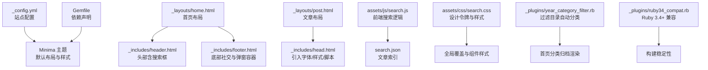
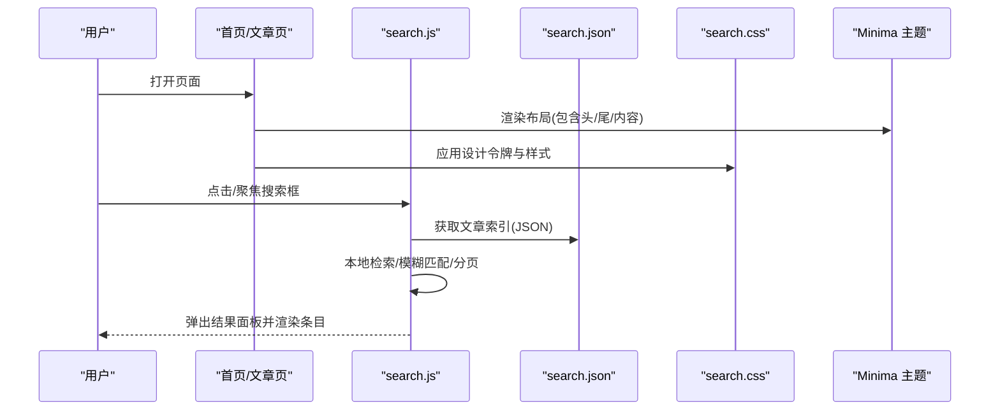
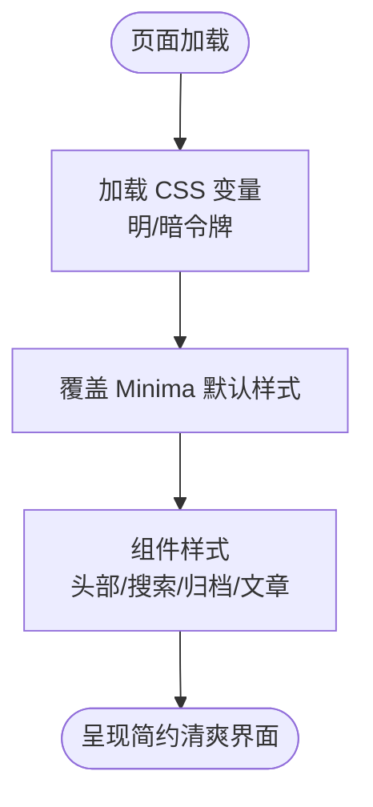
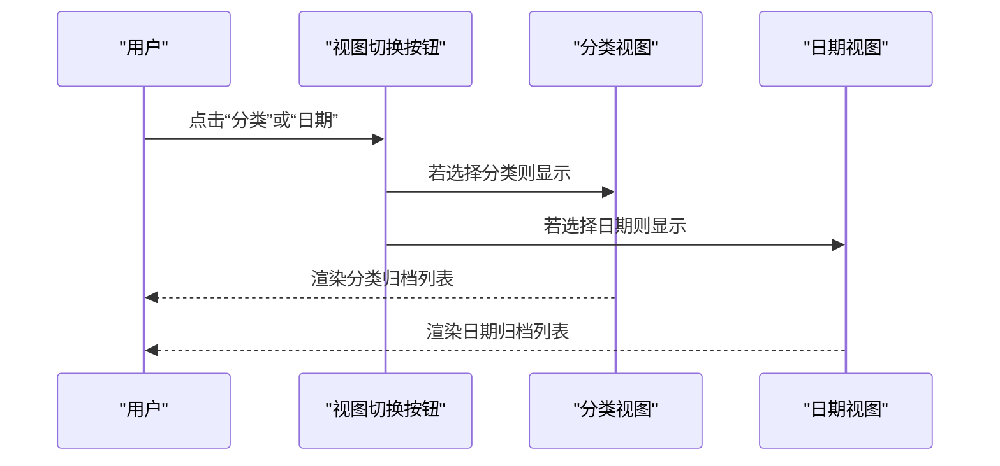
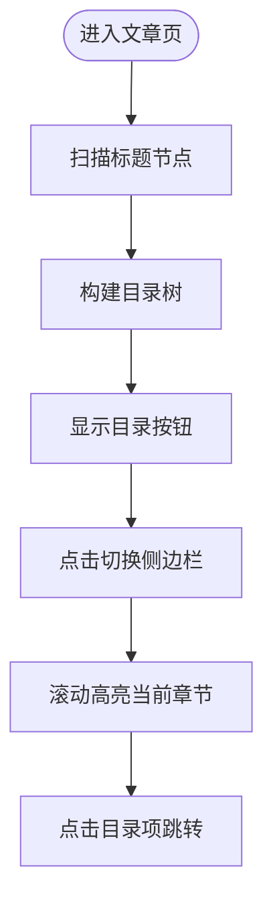
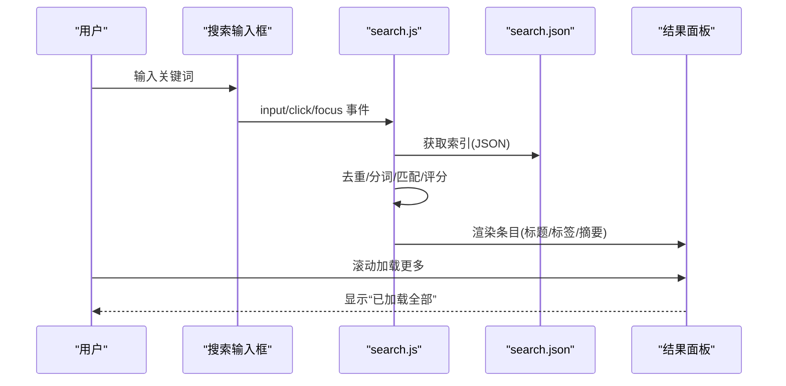
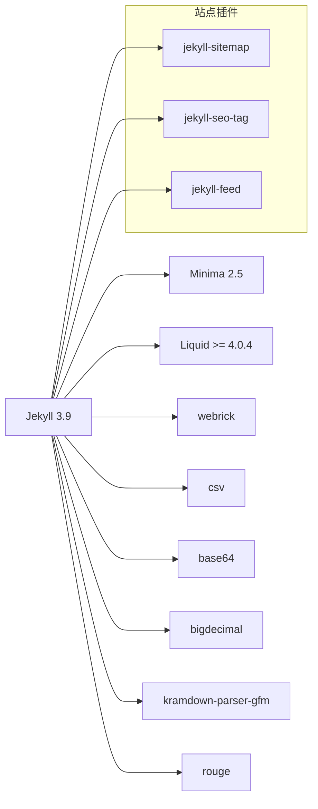

# 项目概述

<cite>
**本文引用的文件**
- [_config.yml](file://_config.yml)
- [README.md](file://README.md)
- [Gemfile](file://Gemfile)
- [index.md](file://index.md)
- [_includes/head.html](file://_includes/head.html)
- [_includes/header.html](file://_includes/header.html)
- [_includes/footer.html](file://_includes/footer.html)
- [_layouts/home.html](file://_layouts/home.html)
- [_layouts/post.html](file://_layouts/post.html)
- [_plugins/year_category_filter.rb](file://_plugins/year_category_filter.rb)
- [_plugins/ruby34_compat.rb](file://_plugins/ruby34_compat.rb)
- [assets/js/search.js](file://assets/js/search.js)
- [assets/css/search.css](file://assets/css/search.css)
- [search.json](file://search.json)
</cite>

## 目录
1. [简介](#简介)
2. [项目结构](#项目结构)
3. [核心组件](#核心组件)
4. [架构总览](#架构总览)
5. [详细组件分析](#详细组件分析)
6. [依赖分析](#依赖分析)
7. [性能考虑](#性能考虑)
8. [故障排查指南](#故障排查指南)
9. [结论](#结论)
10. [附录](#附录)

## 简介
本项目是一个基于 GitHub Pages + Jekyll 的个人博客，主题基于官方 Minima 进行深度定制，整体风格追求“简约清爽”：以黑白灰为基底、蓝色作为强调色，搭配 Inter 字体与大量留白、柔和圆角，营造干净现代的阅读体验。项目提供全文搜索、分类/日期双视图归档、响应式布局与暗色模式等核心能力，并通过 CSS 变量构建统一的设计令牌体系，便于亮/暗主题一致地切换与维护。

在线演示：https://lzc6244.github.io/

## 项目结构
仓库采用 Jekyll 标准目录组织方式，结合自定义的布局、包含块与插件，形成清晰的前端渲染与内容生成链路：
- 配置与站点元信息：_config.yml、Gemfile
- 页面与布局：index.md、_layouts/*.html、_includes/*.html
- 文章与资源：_posts/*、assets/*、imgs/*、files/*
- 功能增强：_plugins/*（Jekyll 钩子与兼容补丁）、search.json（前端索引）
- 站点图标与 SEO：favicons/*、head.html 中注入的预连接与资源



图表来源
- [_config.yml:1-45](file://_config.yml#L1-L45)
- [Gemfile:1-17](file://Gemfile#L1-L17)
- [_layouts/home.html:1-135](file://_layouts/home.html#L1-L135)
- [_layouts/post.html:1-105](file://_layouts/post.html#L1-L105)
- [_includes/head.html:1-27](file://_includes/head.html#L1-L27)
- [_includes/header.html:1-10](file://_includes/header.html#L1-L10)
- [_includes/footer.html:1-34](file://_includes/footer.html#L1-L34)
- [assets/js/search.js:1-526](file://assets/js/search.js#L1-L526)
- [assets/css/search.css:1-800](file://assets/css/search.css#L1-L800)
- [search.json:1-13](file://search.json#L1-L13)
- [_plugins/year_category_filter.rb:1-13](file://_plugins/year_category_filter.rb#L1-L13)
- [_plugins/ruby34_compat.rb:1-19](file://_plugins/ruby34_compat.rb#L1-L19)

章节来源
- [README.md:1-157](file://README.md#L1-L157)
- [_config.yml:1-45](file://_config.yml#L1-L45)
- [Gemfile:1-17](file://Gemfile#L1-L17)
- [index.md:1-17](file://index.md#L1-L17)

## 核心组件
- 站点配置与主题
  - 使用 Minima 主题并开启 auto 皮肤，支持系统级明暗偏好；定义标题、作者、社交链接、Favicon、评论与分析等。
  - 构建选项包括固定链接格式、Markdown 解析器与代码高亮引擎。
- 布局与包含
  - 首页布局实现分类/日期双视图切换与折叠归档；文章布局展示元信息与目录侧边栏。
  - head/header/footer 分别负责资源注入、导航与搜索入口、社交与弹窗容器。
- 搜索系统
  - search.json 在构建期生成文章索引（去除代码块与 URL），前端通过 assets/js/search.js 加载并执行本地检索、模糊匹配与分页加载。
- 插件与兼容性
  - year_category_filter.rb 移除由 _posts 子目录自动注入的分类，仅保留 front matter 显式声明的分类。
  - ruby34_compat.rb 修复 Ruby 3.4+ 下 Liquid/Jekyll 的兼容问题，并提供 strip_urls 过滤器用于索引清理。
- 视觉与可访问性
  - assets/css/search.css 定义 CSS 变量设计令牌，统一明/暗主题；Inter 字体与响应式断点提升可读性与适配性。

章节来源
- [_config.yml:1-45](file://_config.yml#L1-L45)
- [_layouts/home.html:1-135](file://_layouts/home.html#L1-L135)
- [_layouts/post.html:1-105](file://_layouts/post.html#L1-L105)
- [_includes/head.html:1-27](file://_includes/head.html#L1-L27)
- [_includes/header.html:1-10](file://_includes/header.html#L1-L10)
- [_includes/footer.html:1-34](file://_includes/footer.html#L1-L34)
- [assets/js/search.js:1-526](file://assets/js/search.js#L1-L526)
- [assets/css/search.css:1-800](file://assets/css/search.css#L1-L800)
- [search.json:1-13](file://search.json#L1-L13)
- [_plugins/year_category_filter.rb:1-13](file://_plugins/year_category_filter.rb#L1-L13)
- [_plugins/ruby34_compat.rb:1-19](file://_plugins/ruby34_compat.rb#L1-L19)

## 架构总览
下图展示了从浏览器到静态生成的关键交互路径：用户输入触发前端搜索，读取构建期生成的索引，完成本地匹配与结果渲染；同时，首页与文章页通过布局模板组合包含块，最终由 Minima 主题输出 HTML。



图表来源
- [_layouts/home.html:1-135](file://_layouts/home.html#L1-L135)
- [_layouts/post.html:1-105](file://_layouts/post.html#L1-L105)
- [_includes/header.html:1-10](file://_includes/header.html#L1-L10)
- [_includes/footer.html:1-34](file://_includes/footer.html#L1-L34)
- [assets/js/search.js:1-526](file://assets/js/search.js#L1-L526)
- [assets/css/search.css:1-800](file://assets/css/search.css#L1-L800)
- [search.json:1-13](file://search.json#L1-L13)

## 详细组件分析

### 设计与主题体系（Minima 深度定制）
- 设计理念
  - 黑白灰基底 + 蓝色强调色，大量留白与柔和圆角，突出内容本身。
  - Inter 字体提升现代感与可读性；CSS 变量集中管理颜色、圆角、阴影、字体与过渡时长，确保明/暗主题一致性。
- 关键实现
  - 通过 :root 与 @media (prefers-color-scheme: dark) 切换设计令牌。
  - 覆盖 Minima 默认排版（如 h1~h6 字重、链接下划线偏移、引用块样式、表格与代码块）。
  - 吸顶头部与毛玻璃背景，提升导航可用性。



图表来源
- [assets/css/search.css:1-800](file://assets/css/search.css#L1-L800)
- [_includes/head.html:1-27](file://_includes/head.html#L1-L27)

章节来源
- [assets/css/search.css:1-800](file://assets/css/search.css#L1-L800)
- [_includes/head.html:1-27](file://_includes/head.html#L1-L27)

### 首页与归档（分类/日期双视图）
- 功能要点
  - 顶部提供“分类/日期”切换按钮，点击后动态显示对应视图。
  - 分类视图按一级分类分组，二级分类可折叠；日期视图按年/月分组，首项默认展开。
  - 列表项显示标题与日期（日期视图），支持 RSS 订阅。
- 交互逻辑
  - 通过 data-view 属性切换 active 状态与 display 控制。
  - 使用 details/summary 原生折叠语义，利于无障碍与 SEO。



图表来源
- [_layouts/home.html:1-135](file://_layouts/home.html#L1-L135)

章节来源
- [_layouts/home.html:1-135](file://_layouts/home.html#L1-L135)

### 文章页与目录侧边栏
- 功能要点
  - 文章头展示标题、创建/更新时间、发布时间与作者等元信息。
  - 自动生成目录侧边栏，支持滚动高亮当前章节、点击平滑跳转与移动端收起。
- 交互逻辑
  - 扫描 .post-content 下的 h1~h6 生成目录树，监听滚动事件计算当前可见章节并高亮。



图表来源
- [_layouts/post.html:1-105](file://_layouts/post.html#L1-L105)

章节来源
- [_layouts/post.html:1-105](file://_layouts/post.html#L1-L105)

### 全文搜索（前端本地检索）
- 数据源
  - search.json 在构建期遍历 site.posts，剥离代码块与 URL，生成标题、URL、正文、分类与日期的 JSON 数组。
- 检索策略
  - 英文关键词使用单词边界匹配，中文关键词使用子串匹配；对连续中文启用二元组模糊评分，提高容错率。
  - 多词查询时，所有词需满足基本匹配条件，再根据命中位置生成摘要片段并高亮。
- 交互体验
  - 点击/聚焦搜索框即弹出全屏遮罩，内置同步输入框与计数提示。
  - 结果分页加载（默认每页 8 条），滚动到底部自动加载更多；无结果或错误时给出友好提示。
  - 预加载索引以提升首次交互速度。



图表来源
- [assets/js/search.js:1-526](file://assets/js/search.js#L1-L526)
- [search.json:1-13](file://search.json#L1-L13)

章节来源
- [assets/js/search.js:1-526](file://assets/js/search.js#L1-L526)
- [search.json:1-13](file://search.json#L1-L13)

### 插件与兼容性
- 分类过滤
  - 移除由 _posts 子目录自动注入的分类，保证分类仅来自 front matter，避免归档混乱。
- Ruby 3.4+ 兼容
  - 提供 String#untaint 空实现以兼容旧版 Liquid/Jekyll；注册 strip_urls 过滤器，用于索引构建时剔除 URL。

```mermaid
classDiagram
class YearCategoryFilter {
+hook(posts, post_init)
-removeDirCategories(post)
}
class Ruby34Compat {
+String#untaint()
+strip_urls(input)
}
YearCategoryFilter --> Jekyll : : Hooks : "注册钩子"
Ruby34Compat --> Liquid : : Template : "注册过滤器"
```

图表来源
- [_plugins/year_category_filter.rb:1-13](file://_plugins/year_category_filter.rb#L1-L13)
- [_plugins/ruby34_compat.rb:1-19](file://_plugins/ruby34_compat.rb#L1-L19)

章节来源
- [_plugins/year_category_filter.rb:1-13](file://_plugins/year_category_filter.rb#L1-L13)
- [_plugins/ruby34_compat.rb:1-19](file://_plugins/ruby34_compat.rb#L1-L19)

### 概念总览（非代码映射）
- 设计令牌体系优势
  - 单一事实来源：颜色、圆角、阴影、字体、过渡等集中在 :root，便于维护与扩展。
  - 主题一致性：明/暗主题通过媒体查询切换令牌，无需改动业务样式。
  - 可扩展性：新增组件只需引用现有令牌，降低样式碎片化风险。

[本节为概念说明，不直接分析具体文件]

## 依赖分析
- 运行时与构建
  - Jekyll 3.9 与 Minima 2.5 为核心；Liquid 版本要求修复 Ruby 3.4+ 兼容；webrick/csv/base64/bigdecimal 为 Ruby 3.0+/3.4+ 所需。
  - Markdown 解析使用 kramdown 与 GFM 解析器；代码高亮使用 rouge。
- 站点插件
  - jekyll-sitemap、jekyll-seo-tag、jekyll-feed 提供 SEO、站点地图与 RSS 能力。
- 外部资源
  - Google Fonts 预连接与 Inter 字体；Favicon 与 Web Manifest 完善多平台图标体验。



图表来源
- [Gemfile:1-17](file://Gemfile#L1-L17)
- [_config.yml:1-45](file://_config.yml#L1-L45)

章节来源
- [Gemfile:1-17](file://Gemfile#L1-L17)
- [_config.yml:1-45](file://_config.yml#L1-L45)

## 性能考虑
- 构建期优化
  - 索引构建时剥离代码块与 URL，减少前端处理体积与噪声。
  - 使用 requestAnimationFrame 与 DocumentFragment 批量插入 DOM，降低重排开销。
- 前端交互优化
  - 预加载 search.json，提升首次搜索响应速度。
  - 分页加载与滚动触底加载更多，避免一次性渲染大量条目。
  - 防抖输入事件，减少频繁检索。
- 样式与渲染
  - 使用 CSS 变量与 prefers-color-scheme 切换主题，避免额外 JS 判断。
  - 吸顶头部 backdrop-filter 适度使用，注意低端设备性能。

[本节为通用指导，不直接分析具体文件]

## 故障排查指南
- 构建缓存导致样式/布局异常
  - 清理 _site 目录后重新构建，避免增量构建残留冲突。
- 搜索无结果或无法加载索引
  - 确认 search.json 存在且可访问；检查网络请求是否被拦截；查看控制台是否有跨域或语法错误。
- 分类归档不符合预期
  - 检查 front matter 中的 categories 字段；确认 year_category_filter.rb 生效，未受 _posts 子目录影响。
- 评论/统计未显示
  - 核对 _config.yml 中 disqus.shortname 与 google_analytics 配置是否正确。

章节来源
- [README.md:128-141](file://README.md#L128-L141)
- [_config.yml:28-34](file://_config.yml#L28-L34)
- [_plugins/year_category_filter.rb:1-13](file://_plugins/year_category_filter.rb#L1-L13)

## 结论
本项目在 Minima 基础上实现了高度一致的“简约清爽”风格，借助 CSS 变量与 Inter 字体打造现代阅读体验；通过前端本地检索与分类/日期双视图归档，兼顾易用性与可发现性；插件层保证了分类纯净度与 Ruby 3.4+ 环境稳定运行。整体架构清晰、扩展性强，适合个人知识沉淀与技术分享。

[本节为总结，不直接分析具体文件]

## 附录
- 快速上手
  - 在线预览：https://lzc6244.github.io/
  - 本地开发：安装 Ruby 与 Jekyll，bundle install 后 bundle exec jekyll serve。
- 写作规范
  - 在 _posts 下新建 年-月-日-标题.md，front matter 指定 layout=post、title、categories 等字段。
- 常用命令
  - 启动服务：bundle exec jekyll serve
  - 清理重建：rm -rf _site && bundle exec jekyll serve

章节来源
- [README.md:1-157](file://README.md#L1-L157)
- [index.md:1-17](file://index.md#L1-L17)