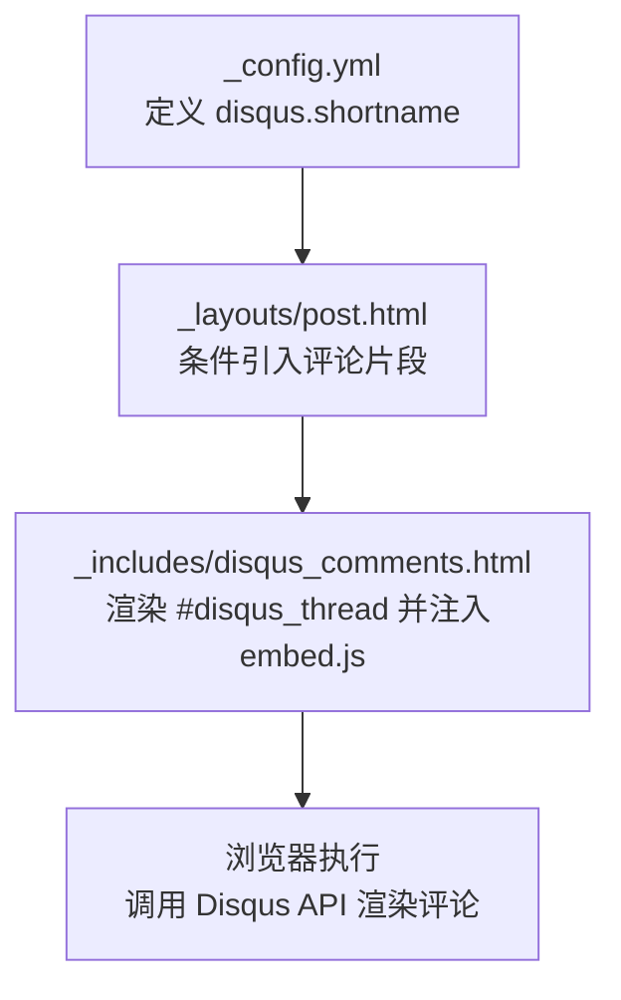
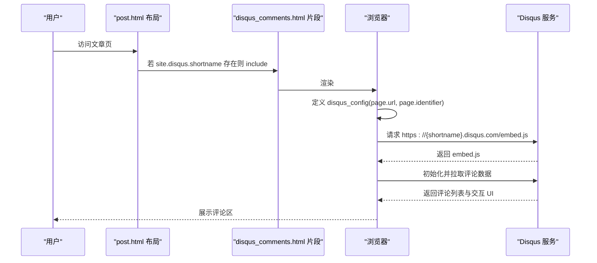
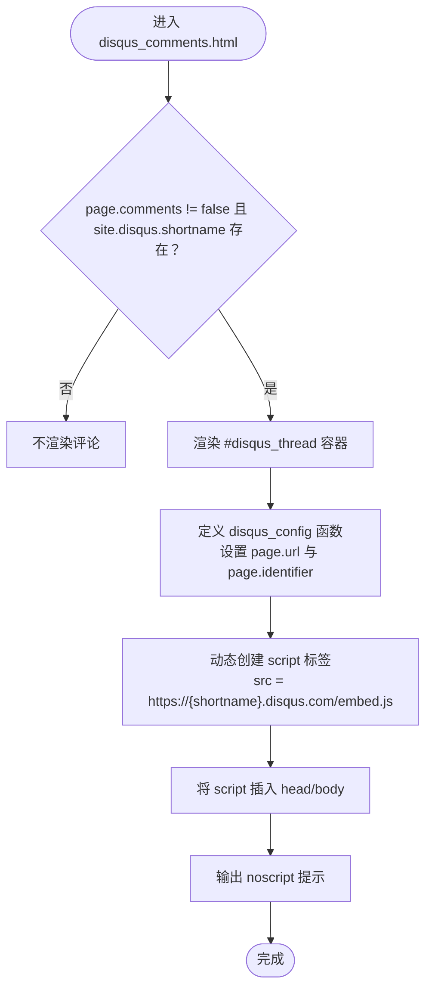
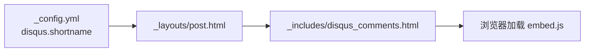

# Disqus 评论系统

<cite>
**本文引用的文件**   
- [_config.yml](file://_config.yml)
- [_includes/disqus_comments.html](file://_includes/disqus_comments.html)
- [_layouts/post.html](file://_layouts/post.html)
- [README.md](file://README.md)
</cite>

## 目录
1. [简介](#简介)
2. [项目结构](#项目结构)
3. [核心组件](#核心组件)
4. [架构总览](#架构总览)
5. [详细组件分析](#详细组件分析)
6. [依赖关系分析](#依赖关系分析)
7. [性能与加载机制](#性能与加载机制)
8. [常见问题排查](#常见问题排查)
9. [结论](#结论)
10. [附录：配置项速查](#附录配置项速查)

## 简介
本文件面向在 Jekyll 博客中集成 Disqus 评论系统的读者，结合当前仓库的实际实现，说明如何启用、配置与定制 Disqus 评论功能。内容涵盖站点级 shortname 配置、文章页嵌入评论组件、disqus_config 对象的使用（页面 URL 与标识符）、脚本注入流程、样式与多语言等高级选项的接入方式，以及常见问题与性能优化建议。

## 项目结构
本项目采用 Jekyll 标准目录组织，Disqus 相关逻辑集中在以下位置：
- 站点配置：_config.yml 中的 disqus.shortname
- 文章布局：_layouts/post.html 引入评论片段
- 评论片段：_includes/disqus_comments.html 负责渲染评论容器与动态注入 Disqus 脚本

图表来源
- [_config.yml:28-31](file://_config.yml#L28-L31)
- [_layouts/post.html:31-34](file://_layouts/post.html#L31-L34)
- [_includes/disqus_comments.html:1-20](file://_includes/disqus_comments.html#L1-L20)

章节来源
- [_config.yml:1-45](file://_config.yml#L1-L45)
- [_layouts/post.html:1-37](file://_layouts/post.html#L1-L37)
- [_includes/disqus_comments.html:1-21](file://_includes/disqus_comments.html#L1-L21)
- [README.md:296-308](file://README.md#L296-L308)

## 核心组件
- 站点级配置：在 _config.yml 中设置 disqus.shortname，用于指定 Disqus 站点的短名。
- 文章布局：_layouts/post.html 根据是否配置了 shortname 决定是否引入评论片段。
- 评论片段：_includes/disqus_comments.html 负责：
  - 渲染一个占位容器 

  - 定义 disqus_config 函数，设置 page.url 与 page.identifier
  - 动态创建 <script src=".../embed.js"> 并插入到文档头或体中
  - 提供 noscript 提示

章节来源
- [_config.yml:28-31](file://_config.yml#L28-L31)
- [_layouts/post.html:31-34](file://_layouts/post.html#L31-L34)
- [_includes/disqus_comments.html:1-20](file://_includes/disqus_comments.html#L1-L20)

## 架构总览
下图展示了从站点配置到浏览器渲染评论的完整链路。

图表来源
- [_layouts/post.html:31-34](file://_layouts/post.html#L31-L34)
- [_includes/disqus_comments.html:1-20](file://_includes/disqus_comments.html#L1-L20)

## 详细组件分析

### 站点配置（_config.yml）
- 作用：集中管理站点元信息与第三方服务配置，其中包含 Disqus 的 shortname。
- 关键点：
  - disqus.shortname 为必填项以启用评论；留空或删除该块将禁用评论。
  - 其他如 url、permalink 会影响 page.url 的生成，从而间接影响 Disqus 的页面识别。

章节来源
- [_config.yml:1-45](file://_config.yml#L1-L45)

### 文章布局（_layouts/post.html）
- 作用：文章页骨架，控制何时引入评论片段。
- 关键点：
  - 通过判断 site.disqus.shortname 是否存在来决定是否 include disqus_comments.html。
  - 评论区域位于文章内容之后，便于阅读后参与讨论。

章节来源
- [_layouts/post.html:1-37](file://_layouts/post.html#L1-L37)

### 评论片段（_includes/disqus_comments.html）
- 作用：渲染评论容器与动态注入 Disqus 脚本。
- 关键点：
  - 条件渲染：当 page.comments 不为 false 且 site.disqus.shortname 存在时显示评论。
  - 容器：使用固定 id 的 div 作为挂载点。
  - 配置对象：定义 disqus_config 函数，设置 page.url 与 page.identifier。
  - 脚本注入：动态创建 script 标签，src 指向 {shortname}.disqus.com/embed.js，并追加到 head 或 body。
  - 降级体验：noscript 提示需要启用 JavaScript。

图表来源
- [_includes/disqus_comments.html:1-20](file://_includes/disqus_comments.html#L1-L20)

章节来源
- [_includes/disqus_comments.html:1-20](file://_includes/disqus_comments.html#L1-L20)

### 页面标识与唯一性
- 当前实现将 page.url 同时赋给 page.url 与 page.identifier。
- 效果：每篇文章基于其绝对 URL 作为唯一标识，确保评论按页面隔离。
- 注意：若自定义 permalink 或部署路径变化，需保证 URL 稳定，否则可能导致评论迁移或重复。

章节来源
- [_includes/disqus_comments.html:5-8](file://_includes/disqus_comments.html#L5-L8)
- [_config.yml:36](file://_config.yml#L36)

## 依赖关系分析
- 模板层依赖：
  - post.html 依赖 disqus_comments.html 片段。
  - disqus_comments.html 依赖站点配置 site.disqus.shortname 与页面上下文 page.url。
- 运行时依赖：
  - 浏览器侧依赖 Disqus 远程脚本 embed.js 与网络可达性。
- 构建期依赖：
  - Jekyll 在构建时将 Liquid 变量替换为实际值（如 absolute_url）。

图表来源
- [_config.yml:28-31](file://_config.yml#L28-L31)
- [_layouts/post.html:31-34](file://_layouts/post.html#L31-L34)
- [_includes/disqus_comments.html:10-17](file://_includes/disqus_comments.html#L10-L17)

章节来源
- [_config.yml:28-31](file://_config.yml#L28-L31)
- [_layouts/post.html:31-34](file://_layouts/post.html#L31-L34)
- [_includes/disqus_comments.html:10-17](file://_includes/disqus_comments.html#L10-L17)

## 性能与加载机制
- 异步加载策略：
  - 通过动态创建 script 标签并追加到 DOM，避免阻塞首屏渲染。
  - 使用 data-timestamp 属性可帮助浏览器区分缓存版本，减少重复加载问题。
- 资源体积与延迟：
  - embed.js 由 Disqus 托管，受网络质量与 CDN 影响较大。
  - 建议在关键路径之外加载，当前实现已满足此要求。
- 本地预览：
  - 本地 jekyll serve 下也可正常加载 Disqus，但需确保能访问外网。

章节来源
- [_includes/disqus_comments.html:10-17](file://_includes/disqus_comments.html#L10-L17)
- [README.md:306-308](file://README.md#L306-L308)

## 常见问题排查
- 评论未显示
  - 检查 _config.yml 中 disqus.shortname 是否正确填写。
  - 确认 _layouts/post.html 中条件判断生效（即 shortname 存在）。
  - 浏览器控制台查看是否有跨域或脚本加载失败错误。
- 评论错乱或重复
  - 检查 page.url 与 page.identifier 是否一致且稳定。
  - 若变更 permalink 或部署路径，需在 Disqus 后台进行页面映射迁移。
- 本地无法加载
  - 确认本地环境可访问外网。
  - 清理构建缓存后重新构建（参考 README 清理步骤）。
- 无 JavaScript 时的体验
  - 已提供 noscript 提示，引导用户启用 JS。

章节来源
- [_config.yml:28-31](file://_config.yml#L28-L31)
- [_layouts/post.html:31-34](file://_layouts/post.html#L31-L34)
- [_includes/disqus_comments.html:1-20](file://_includes/disqus_comments.html#L1-L20)
- [README.md:281-294](file://README.md#L281-L294)

## 结论
本项目对 Disqus 的集成简洁而稳健：通过站点配置启用、在文章布局中按需引入、在片段中动态注入脚本并设置页面标识。整体实现遵循“最小侵入”原则，易于维护与扩展。如需更丰富的能力（如多语言、主题定制、审核工作流），可在现有基础上扩展 disqus_config 与外部样式覆盖。

## 附录：配置项速查
- 启用/关闭评论
  - 启用：在 _config.yml 中设置 disqus.shortname。
  - 关闭：删除或留空 disqus.shortname。
- 页面标识
  - 当前默认使用 page.url 作为 page.url 与 page.identifier。
  - 如需自定义标识，可在 disqus_config 中修改 page.identifier。
- 多语言支持
  - 可通过在 disqus_config 中设置语言相关字段（例如 language）来切换界面语言。
- 样式定制
  - 通过覆盖 Disqus 提供的 CSS 或使用浏览器开发者工具定位元素进行样式调整。
- 评论审核
  - 登录 Disqus 后台，在站点设置中开启审核模式，并对评论进行审批。

章节来源
- [_config.yml:28-31](file://_config.yml#L28-L31)
- [_includes/disqus_comments.html:5-8](file://_includes/disqus_comments.html#L5-L8)
- [README.md:296-308](file://README.md#L296-L308)