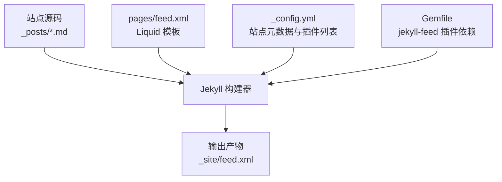
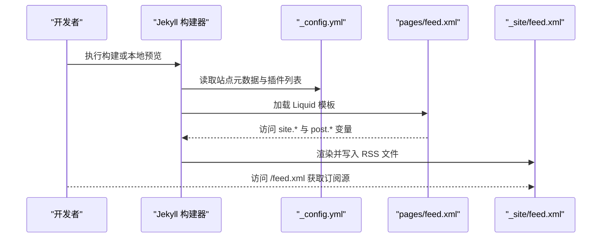
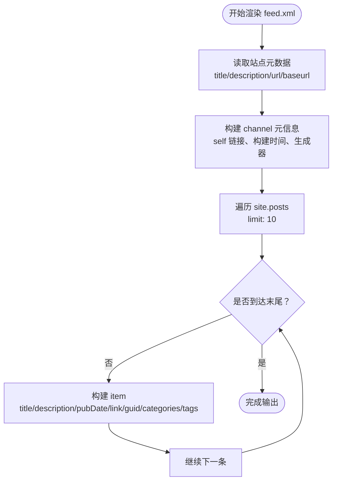
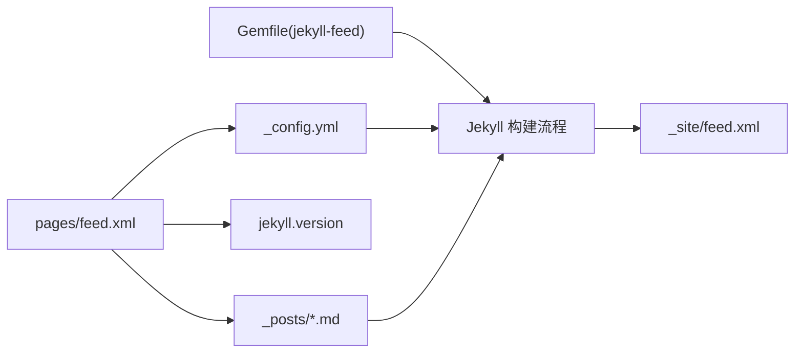

# RSS 订阅源

<cite>
**本文引用的文件**
- [pages/feed.xml](file://pages/feed.xml)
- [_config.yml](file://_config.yml)
- [Gemfile](file://Gemfile)
- [README.md](file://README.md)
</cite>

## 目录
1. [简介](#简介)
2. [项目结构](#项目结构)
3. [核心组件](#核心组件)
4. [架构总览](#架构总览)
5. [详细组件分析](#详细组件分析)
6. [依赖关系分析](#依赖关系分析)
7. [性能与更新策略](#性能与更新策略)
8. [验证与 SEO 优化](#验证与-seo-优化)
9. [常见阅读器集成示例](#常见阅读器集成示例)
10. [故障排除指南](#故障排除指南)
11. [结论](#结论)

## 简介
本文件面向使用 Jekyll 的站点，提供一份完整的 RSS 订阅源配置与使用说明。内容涵盖：
- Jekyll 如何自动生成 feed.xml 的结构与字段含义
- 在站点配置中启用 RSS 功能、设置标题/描述/链接等元数据
- 生成机制、更新策略与内容过滤规则
- 订阅源验证方法与 SEO 优化技巧
- 主流 RSS 阅读器的集成方式与常见问题排查

## 项目结构
本项目采用“页面即模板”的方式实现 RSS：在 pages 目录下放置一个 Liquid 模板 feed.xml，构建时由 Jekyll 渲染为最终的 XML 文档。同时通过 Gemfile 引入 jekyll-feed 插件，并在 _config.yml 中声明启用。

图表来源
- [pages/feed.xml:1-31](file://pages/feed.xml#L1-L31)
- [_config.yml:1-45](file://_config.yml#L1-L45)
- [Gemfile:1-25](file://Gemfile#L1-L25)

章节来源
- [README.md:250-292](file://README.md#L250-L292)

## 核心组件
- feed.xml 模板：定义 RSS 2.0 根节点、channel 元信息以及 item 列表，包含标题、描述、发布时间、链接、GUID、分类与标签等字段。
- 站点配置 _config.yml：提供 site.title、site.description、site.url、site.baseurl 等全局元数据，并声明启用 jekyll-feed 插件。
- 插件依赖 Gemfile：在 jekyll_plugins 组中引入 jekyll-feed，确保构建环境可用。

章节来源
- [pages/feed.xml:1-31](file://pages/feed.xml#L1-L31)
- [_config.yml:1-45](file://_config.yml#L1-L45)
- [Gemfile:1-25](file://Gemfile#L1-L25)

## 架构总览
下图展示了从源码到最终 RSS 输出的关键路径与数据流向。

图表来源
- [_config.yml:1-45](file://_config.yml#L1-L45)
- [pages/feed.xml:1-31](file://pages/feed.xml#L1-L31)

## 详细组件分析

### feed.xml 模板结构与字段说明
- 根节点与命名空间
  - 使用 RSS 2.0 根节点，并引入 Atom 命名空间以支持自引用链接。
- channel 元信息
  - title/description/link：来自站点配置的全局信息。
  - atom:link self：指向当前 feed.xml 的自引用链接，便于阅读器发现。
  - pubDate/lastBuildDate：站点构建时间，RFC822 格式。
  - generator：标注生成器版本。
- item 列表
  - 遍历 site.posts，默认限制最近 10 条（可通过 limit 调整）。
  - 每个 item 包含：
    - title：文章标题
    - description：文章内容（HTML），注意对特殊字符进行转义
    - pubDate：文章发布日期
    - link/guid：文章永久链接，guid 标记为可永久链接
    - category：文章 tags 与 categories 均作为分类项输出

图表来源
- [pages/feed.xml:1-31](file://pages/feed.xml#L1-L31)

章节来源
- [pages/feed.xml:1-31](file://pages/feed.xml#L1-L31)

### 站点配置与元数据
- 基础元数据
  - title、description、author、email：用于 feed 与 SEO 展示。
  - url、baseurl：决定 feed 与文章链接的绝对路径拼接。
- 主题与皮肤
  - theme/minima.skin/date_format：影响页面呈现与日期格式。
- 插件列表
  - plugins 中包含 jekyll-feed，使站点具备 RSS 能力；同时启用 sitemap 与 SEO 标签插件。
- 其他
  - permalink、markdown、highlighter 等构建选项。

章节来源
- [_config.yml:1-45](file://_config.yml#L1-L45)

### 插件与依赖
- jekyll-feed 插件
  - 在 Gemfile 的 jekyll_plugins 组中声明，确保构建环境安装该插件。
  - 在 _config.yml 的 plugins 列表中启用。
- 相关依赖
  - jekyll、minima、liquid、kramdown-parser-gfm 等。

章节来源
- [Gemfile:1-25](file://Gemfile#L1-L25)
- [_config.yml:1-45](file://_config.yml#L1-L45)

## 依赖关系分析
- feed.xml 模板依赖：
  - 站点全局变量 site.*（title、description、url、baseurl、time）
  - 文章集合 site.posts（post.title、post.content、post.date、post.url、post.tags、post.categories）
  - 构建上下文 jekyll.version
- 构建期依赖：
  - jekyll-feed 插件（Gemfile 与 _config.yml 共同启用）
  - Liquid 模板引擎（>= 4.0.4）

图表来源
- [pages/feed.xml:1-31](file://pages/feed.xml#L1-L31)
- [_config.yml:1-45](file://_config.yml#L1-L45)
- [Gemfile:1-25](file://Gemfile#L1-L25)

章节来源
- [Gemfile:1-25](file://Gemfile#L1-L25)
- [_config.yml:1-45](file://_config.yml#L1-L45)
- [pages/feed.xml:1-31](file://pages/feed.xml#L1-L31)

## 性能与更新策略
- 生成时机
  - 每次构建都会重新渲染 feed.xml，因此新增/修改文章后需要触发构建才会更新订阅源。
- 内容数量控制
  - 模板中使用 limit:10 限制条目数，避免过大响应体积。可根据需求调整。
- 增量构建
  - 本地开发时使用 jekyll serve 自动监听变更并重建，RSS 会即时更新。
- 缓存与清理
  - 若出现未更新或异常，建议清理 _site 目录后重新构建。

章节来源
- [README.md:250-292](file://README.md#L250-L292)
- [pages/feed.xml:14-28](file://pages/feed.xml#L14-L28)

## 验证与 SEO 优化
- 验证方法
  - 浏览器直接访问 https://你的域名/feed.xml，检查是否为合法 RSS XML。
  - 使用在线 RSS 校验工具（如 W3C Feed Validation Service）进行语法校验。
  - 在站点首页或头部添加自引用链接，便于阅读器自动发现。
- SEO 优化
  - 确保 site.title 与 site.description 准确且简洁。
  - 保持每篇文章的 title、date、categories/tags 完整。
  - 使用绝对链接（基于 site.url + site.baseurl），避免相对路径导致阅读器无法解析。
  - 合理设置 lastBuildDate，提升阅读器刷新效率。

章节来源
- [_config.yml:1-45](file://_config.yml#L1-L45)
- [pages/feed.xml:7-13](file://pages/feed.xml#L7-L13)

## 常见阅读器集成示例
- 通用步骤
  - 将站点的 feed.xml 地址复制到任意 RSS 阅读器即可订阅。
- 示例
  - Inoreader：添加订阅源 URL 为 https://你的域名/feed.xml
  - Feedly：点击“Add Feed”，粘贴上述地址
  - Reeder（iOS/macOS）：新建订阅，输入上述地址
  - NetNewsWire：添加订阅源，填入上述地址
  - Thunderbird：新建邮件账户时选择“订阅新闻组”，或使用“订阅源”功能添加上述地址

[本节为概念性说明，不直接分析具体代码文件]

## 故障排除指南
- 问题：访问 /feed.xml 返回 404
  - 确认 pages/feed.xml 存在且未被忽略
  - 确认已启用 jekyll-feed 插件（Gemfile 与 _config.yml）
  - 确认站点 baseurl 为空或正确配置
- 问题：RSS 内容未更新
  - 本地开发需重启 jekyll serve 或等待自动重建
  - 线上部署后确认 GitHub Pages 构建成功
  - 清理 _site 目录后重新构建
- 问题：XML 解析错误
  - 检查文章 content 中是否存在未转义的 XML 特殊字符（模板已做 xml_escape）
  - 检查 title/description 是否过长或包含非法字符
- 问题：链接不可用
  - 检查 site.url 与 site.baseurl 是否正确拼接
  - 确认 permalink 格式与文章 URL 一致

章节来源
- [README.md:250-292](file://README.md#L250-L292)
- [pages/feed.xml:9-20](file://pages/feed.xml#L9-L20)
- [_config.yml:1-45](file://_config.yml#L1-L45)

## 结论
本项目通过 pages/feed.xml 模板与 jekyll-feed 插件的组合，实现了标准的 RSS 2.0 订阅源。站点元数据集中在 _config.yml 管理，构建时由 Jekyll 渲染出 _site/feed.xml。建议在发布前进行 RSS 校验，并确保链接与元数据准确，以获得良好的阅读器体验与 SEO 效果。