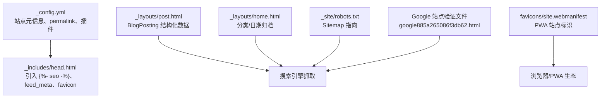
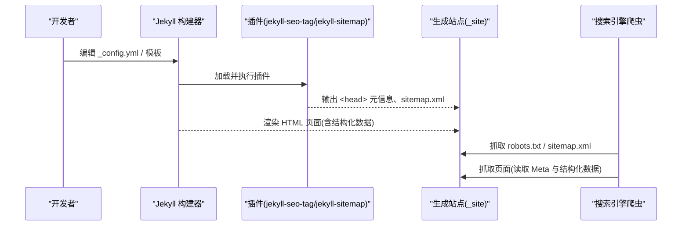
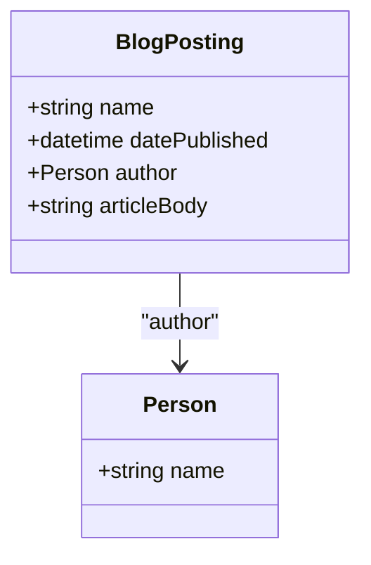
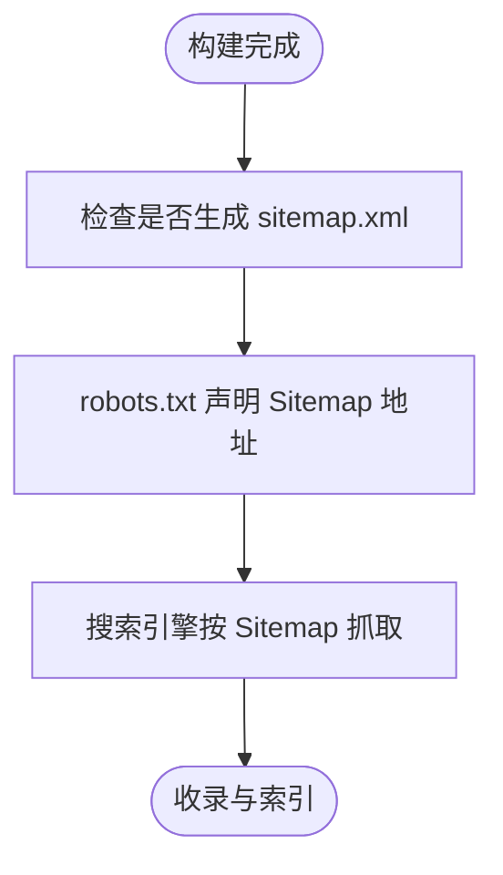
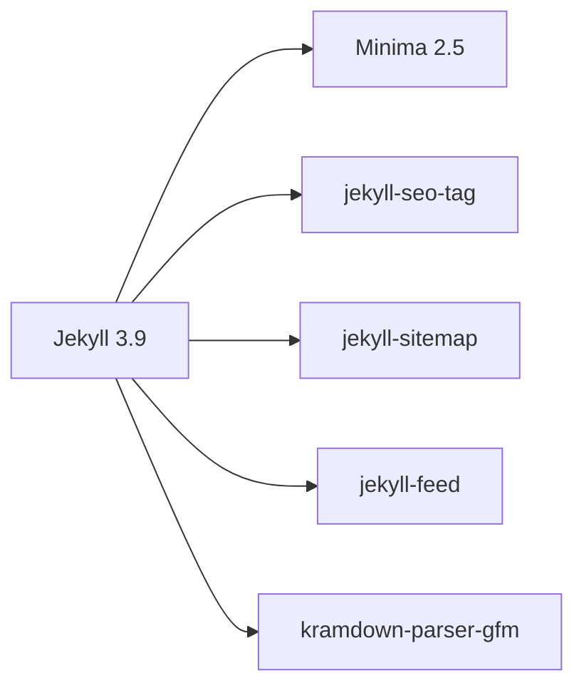

# SEO 优化

<cite>
**本文引用的文件**   
- [_config.yml](file://_config.yml)
- [Gemfile](file://Gemfile)
- [README.md](file://README.md)
- [_includes/head.html](file://_includes/head.html)
- [_layouts/post.html](file://_layouts/post.html)
- [_layouts/home.html](file://_layouts/home.html)
- [_site/robots.txt](file://_site/robots.txt)
- [google885a265086f3db62.html](file://google885a265086f3db62.html)
- [favicons/site.webmanifest](file://favicons/site.webmanifest)
</cite>

## 目录
1. [简介](#简介)
2. [项目结构](#项目结构)
3. [核心组件](#核心组件)
4. [架构总览](#架构总览)
5. [详细组件分析](#详细组件分析)
6. [依赖关系分析](#依赖关系分析)
7. [性能与移动端对 SEO 的影响](#性能与移动端对-seo-的影响)
8. [SEO 分析与效果评估](#seo-分析与效果评估)
9. [故障排查指南](#故障排查指南)
10. [结论](#结论)

## 简介
本指南面向基于 Jekyll + Minima 的博客站点，结合仓库现有实现，系统化梳理 SEO 优化要点：Meta 标签、结构化数据（Schema.org）、社交分享（Open Graph/Twitter Cards）、URL 结构与站点地图、robots.txt、性能与移动端适配，以及常用 SEO 工具与指标。文中所有技术细节均对应仓库中的实际配置与模板，便于直接落地执行。

## 项目结构
本项目采用 Jekyll 标准目录组织，SEO 相关的关键位置包括：
- 站点全局配置：_config.yml
- 页面头部注入：_includes/head.html
- 文章页布局（含结构化数据）：_layouts/post.html
- 首页布局（归档视图）：_layouts/home.html
- 构建产物 robots.txt 与 sitemap.xml：_site/robots.txt、_site/sitemap.xml
- Google 站点验证文件：google885a265086f3db62.html
- PWA Manifest：favicons/site.webmanifest
- 插件声明：Gemfile

图示来源
- [_config.yml:1-45](file://_config.yml#L1-L45)
- [_includes/head.html:1-27](file://_includes/head.html#L1-L27)
- [_layouts/post.html:1-37](file://_layouts/post.html#L1-L37)
- [_layouts/home.html:1-132](file://_layouts/home.html#L1-L132)
- [_site/robots.txt:1-2](file://_site/robots.txt#L1-L2)
- [google885a265086f3db62.html:1-1](file://google885a265086f3db62.html#L1-L1)
- [favicons/site.webmanifest:1-22](file://favicons/site.webmanifest#L1-L22)

章节来源
- [_config.yml:1-45](file://_config.yml#L1-L45)
- [README.md:26-62](file://README.md#L26-L62)

## 核心组件
- 站点元信息与 SEO 插件
  - 站点标题、描述、作者、域名等通过 _config.yml 提供；在 head 中通过  注入由 jekyll-seo-tag 生成的 Meta 标签与结构化数据。
  - 站点地图由 jekyll-sitemap 自动生成，robots.txt 指向 sitemap.xml。
- 结构化数据
  - 文章页使用 Schema.org BlogPosting 标记，包含标题、发布时间、作者、正文等字段。
- 社交分享与 PWA
  - Open Graph/Twitter Cards 由 jekyll-seo-tag 根据站点元信息生成。
  - site.webmanifest 定义站点名称、图标与主题色，提升 PWA 体验。
- 搜索与索引
  - 前端全文搜索基于 search.json 索引，利于用户检索与内容发现。

章节来源
- [_config.yml:1-45](file://_config.yml#L1-L45)
- [_includes/head.html:1-27](file://_includes/head.html#L1-L27)
- [_layouts/post.html:1-37](file://_layouts/post.html#L1-L37)
- [Gemfile:15-19](file://Gemfile#L15-L19)
- [favicons/site.webmanifest:1-22](file://favicons/site.webmanifest#L1-L22)

## 架构总览
下图展示从“站点配置”到“搜索引擎可见性”的端到端流程：

图示来源
- [_config.yml:35-45](file://_config.yml#L35-L45)
- [_includes/head.html:5-11](file://_includes/head.html#L5-L11)
- [_site/robots.txt:1-2](file://_site/robots.txt#L1-L2)

## 详细组件分析

### Meta 标签与 SEO 基础
- 关键标签来源
  - title/description/author/url 等来自 _config.yml，并由 jekyll-seo-tag 在 head 中注入。
  - viewport、charset、X-UA-Compatible 等基础标签位于 _includes/head.html。
  - feed_meta 注入 RSS/Atom 订阅源链接，利于内容分发。
- 建议实践
  - 为每篇文章设置唯一且具描述性的标题与摘要，避免重复。
  - 保持 description 长度适中，突出关键词与价值点。
  - 确保 canonical URL 正确（jekyll-seo-tag 会处理），避免重复收录。

章节来源
- [_config.yml:1-10](file://_config.yml#L1-L10)
- [_includes/head.html:1-11](file://_includes/head.html#L1-L11)

### 结构化数据（Schema.org）
- 文章页使用 BlogPosting 类型，包含 name、datePublished、author、articleBody 等属性，有助于搜索引擎理解文章内容与时效性。
- 建议在 Front Matter 中补充 author、create_time/update_time 等字段以丰富元信息。

图示来源
- [_layouts/post.html:4-36](file://_layouts/post.html#L4-L36)

章节来源
- [_layouts/post.html:1-37](file://_layouts/post.html#L1-L37)

### 社交分享优化（Open Graph / Twitter Cards）
- jekyll-seo-tag 会根据站点元信息自动注入 Open Graph 与 Twitter Card 所需标签。
- 配合 favicon 与 site.webmanifest，可在社交平台预览与 PWA 环境中获得一致的品牌呈现。

章节来源
- [_includes/head.html:5-11](file://_includes/head.html#L5-L11)
- [favicons/site.webmanifest:1-22](file://favicons/site.webmanifest#L1-L22)

### URL 结构与永久链接
- permalink 配置决定文章 URL 模式，当前采用“年/月/日/标题.html”，有利于时间维度检索与可读性。
- 建议：
  - 标题使用简洁、语义化命名，避免特殊字符与过长路径。
  - 固定链接格式一旦确定，尽量避免频繁变更，必要时做好重定向。

章节来源
- [_config.yml:35-37](file://_config.yml#L35-L37)

### 站点地图与 robots.txt
- jekyll-sitemap 自动生成 sitemap.xml，并在 robots.txt 中声明 Sitemap 地址，便于搜索引擎快速发现新内容。
- 注意：本地开发环境 robots.txt 中的 Sitemap 指向 localhost，部署后应更新为线上域名。

图示来源
- [_site/robots.txt:1-2](file://_site/robots.txt#L1-L2)

章节来源
- [_config.yml:41-44](file://_config.yml#L41-L44)
- [_site/robots.txt:1-2](file://_site/robots.txt#L1-L2)

### 站点验证与可访问性
- 已放置 Google 站点验证文件，便于在 Google Search Console 中管理站点。
- 建议同时完成 Bing Webmaster Tools 等其他平台验证，扩大收录覆盖面。

章节来源
- [google885a265086f3db62.html:1-1](file://google885a265086f3db62.html#L1-L1)

### 首页归档与内链结构
- 首页提供分类与日期双视图，增强内部链接密度与导航效率，有利于爬虫抓取与用户停留时长。

章节来源
- [_layouts/home.html:1-132](file://_layouts/home.html#L1-L132)

## 依赖关系分析
- 插件与版本
  - jekyll-seo-tag：负责 SEO Meta 与社交分享标签注入。
  - jekyll-sitemap：生成站点地图。
  - jekyll-feed：生成 RSS/Atom 订阅源。
- 主题与引擎
  - minima 主题提供默认样式与布局基线。
  - kramdown-parser-gfm 支持 GitHub Flavored Markdown。

图示来源
- [Gemfile:15-19](file://Gemfile#L15-L19)
- [Gemfile.lock:56-60](file://Gemfile.lock#L56-L60)

章节来源
- [Gemfile:1-25](file://Gemfile#L1-L25)
- [Gemfile.lock:51-92](file://Gemfile.lock#L51-L92)

## 性能与移动端对 SEO 的影响
- 性能影响
  - 首屏资源加载与字体预连接已在 head 中优化，减少阻塞。
  - 代码块折叠、按需加载脚本等交互逻辑有助于降低初始负载。
- 移动端适配
  - viewport 已启用，响应式布局与暗色模式提升移动体验。
  - PWA manifest 提供离线与安装能力，间接提升留存与回访。
- 建议
  - 图片懒加载与压缩、CSS/JS 合并与缓存策略、CDN 加速等均可进一步提升 Core Web Vitals。

章节来源
- [_includes/head.html:1-26](file://_includes/head.html#L1-L26)
- [favicons/site.webmanifest:1-22](file://favicons/site.webmanifest#L1-L22)
- [README.md:10-24](file://README.md#L10-L24)

## SEO 分析与效果评估
- 推荐工具
  - Google Search Console：提交 sitemap、查看抓取与索引状态、诊断问题。
  - Bing Webmaster Tools：覆盖 Bing 生态。
  - Lighthouse/WebPageTest：评估性能与可访问性。
  - 第三方社交分享调试器：校验 OG/Twitter Card 预览。
- 关键指标
  - 收录量、点击率、平均排名、曝光量、跳出率、平均停留时长、Core Web Vitals。
- 持续优化
  - 定期审计重复内容与死链，完善内链结构。
  - 针对高流量关键词优化标题与摘要，提升点击率。

[本节为通用指导，不直接分析具体文件]

## 故障排查指南
- 本地 robots.txt 的 Sitemap 指向 localhost
  - 现象：本地构建的 robots.txt 指向 http://localhost:4000/sitemap.xml。
  - 解决：部署后确认线上 robots.txt 指向正确的线上 sitemap.xml。
- 站点验证未生效
  - 现象：Google Search Console 无法识别站点。
  - 解决：确认 google-site-verification 文件已放置在站点根目录并可被公开访问。
- 缺少 RSS/Atom 订阅
  - 现象：未看到订阅链接。
  - 解决：确认 jekyll-feed 插件已启用，并在 head 中包含 feed_meta。

章节来源
- [_site/robots.txt:1-2](file://_site/robots.txt#L1-L2)
- [google885a265086f3db62.html:1-1](file://google885a265086f3db62.html#L1-L1)
- [_includes/head.html:11-11](file://_includes/head.html#L11-L11)

## 结论
本项目已具备完善的 SEO 基础：通过 jekyll-seo-tag 注入 Meta 与社交分享标签、jekyll-sitemap 生成站点地图、robots.txt 指引爬虫、文章页使用 Schema.org 结构化数据，并结合 PWA 与响应式设计提升用户体验。建议在此基础上持续完善内容质量、内链结构与性能优化，并通过 Search Console 等工具进行长期监测与迭代。