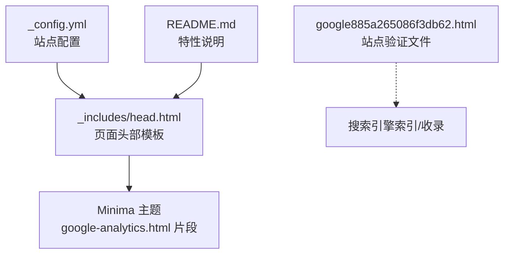
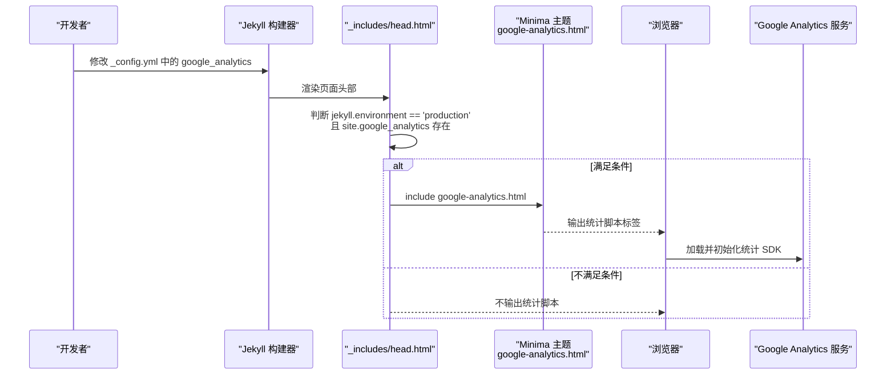
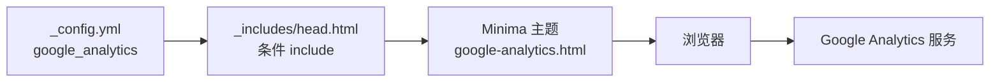

# 统计分析

<cite>
**本文引用的文件**
- [_config.yml](file://_config.yml)
- [_includes/head.html](file://_includes/head.html)
- [README.md](file://README.md)
- [google885a265086f3db62.html](file://google885a265086f3db62.html)
</cite>

## 目录
1. [简介](#简介)
2. [项目结构](#项目结构)
3. [核心组件](#核心组件)
4. [架构总览](#架构总览)
5. [详细组件分析](#详细组件分析)
6. [依赖关系分析](#依赖关系分析)
7. [性能考量](#性能考量)
8. [故障排查指南](#故障排查指南)
9. [结论](#结论)
10. [附录](#附录)

## 简介
本文件面向在本仓库中集成与使用网站统计分析（以 Google Analytics 为主）的读者，提供从配置、注入机制到高级用法与合规建议的完整说明。当前仓库已启用生产环境自动注入统计脚本的能力，并提供了站点验证文件用于搜索引擎收录校验。文档同时给出事件追踪、用户行为分析、流量来源统计、隐私合规、数据收集范围控制、自定义事件、转化漏斗、实时数据监控等实践路径，以及报告解读与性能影响评估方法。

## 项目结构
与统计分析直接相关的文件与职责如下：
- 站点配置：包含 GA 标识与构建/主题相关设置
- 页面头部模板：在生产环境下按需引入统计脚本片段
- 站点验证文件：用于搜索引擎站点所有权验证（非统计必需，但常与 SEO 工作流配合）
- 项目说明：明确“生产环境自动注入统计脚本”的特性

图表来源
- [_config.yml:32-33](file://_config.yml#L32-L33)
- [_includes/head.html:22-24](file://_includes/head.html#L22-L24)
- [google885a265086f3db62.html:1-1](file://google885a265086f3db62.html#L1-L1)
- [README.md:21-21](file://README.md#L21-L21)

章节来源
- [_config.yml:1-45](file://_config.yml#L1-L45)
- [_includes/head.html:1-27](file://_includes/head.html#L1-L27)
- [google885a265086f3db62.html:1-1](file://google885a265086f3db62.html#L1-L1)
- [README.md:1-331](file://README.md#L1-L331)

## 核心组件
- 站点配置项
  - google_analytics：在站点配置中声明 GA 标识，供模板条件渲染使用
- 页面头部模板
  - 仅在 jekyll.environment 为 production 且 site.google_analytics 存在时，才引入 google-analytics.html 片段
- 站点验证文件
  - 放置于根目录，用于搜索引擎站点所有权验证（与统计无关，但常见于 SEO 流程）

章节来源
- [_config.yml:32-33](file://_config.yml#L32-L33)
- [_includes/head.html:22-24](file://_includes/head.html#L22-L24)
- [google885a265086f3db62.html:1-1](file://google885a265086f3db62.html#L1-L1)

## 架构总览
下图展示了从站点配置到最终在浏览器加载统计脚本的关键链路。

图表来源
- [_config.yml:32-33](file://_config.yml#L32-L33)
- [_includes/head.html:22-24](file://_includes/head.html#L22-L24)

章节来源
- [_config.yml:1-45](file://_config.yml#L1-L45)
- [_includes/head.html:1-27](file://_includes/head.html#L1-L27)

## 详细组件分析

### 组件一：站点配置（_config.yml）
- 作用
  - 集中管理站点元信息、主题、插件与第三方服务配置
  - 通过 google_analytics 字段声明 GA 标识，驱动模板的条件注入
- 关键要点
  - 仅当该字段存在且构建环境为 production 时，才会注入统计脚本
  - 若需切换不同环境（如本地开发），可通过环境变量或构建参数控制 jekyll.environment

章节来源
- [_config.yml:32-33](file://_config.yml#L32-L33)

### 组件二：页面头部模板（_includes/head.html）
- 作用
  - 统一注入站点资源与第三方脚本
  - 基于环境条件决定是否引入统计脚本片段
- 关键逻辑
  - 条件：jekyll.environment == 'production' 且 site.google_analytics 存在
  - 动作：include google-analytics.html（由 Minima 主题提供）

章节来源
- [_includes/head.html:22-24](file://_includes/head.html#L22-L24)

### 组件三：Minima 主题的统计片段（google-analytics.html）
- 说明
  - 本仓库未直接提供该片段，属于 Minima 主题内置能力；当条件满足时会被 include 进页面
  - 通常负责根据 site.google_analytics 的值生成对应的统计脚本标签
- 注意
  - 如需自定义统计逻辑（例如添加额外配置、屏蔽特定页面），可在主题层或本项目中覆盖 include 实现

章节来源
- [_includes/head.html:22-24](file://_includes/head.html#L22-L24)

### 组件四：站点验证文件（google885a265086f3db62.html）
- 作用
  - 用于搜索引擎站点所有权验证，便于在搜索控制台进行收录与 SEO 管理
- 位置
  - 置于站点根目录，确保可被搜索引擎访问

章节来源
- [google885a265086f3db62.html:1-1](file://google885a265086f3db62.html#L1-L1)

## 依赖关系分析
- 低耦合
  - 统计功能通过配置项与模板 include 解耦，便于在不同环境启用/禁用
- 外部依赖
  - 运行时依赖 Minima 主题提供的 google-analytics.html 片段
  - 浏览器端依赖 Google Analytics 服务
- 潜在风险
  - 若主题升级导致 include 行为变化，需回归测试统计脚本是否仍按预期注入

图表来源
- [_config.yml:32-33](file://_config.yml#L32-L33)
- [_includes/head.html:22-24](file://_includes/head.html#L22-L24)

章节来源
- [_config.yml:1-45](file://_config.yml#L1-L45)
- [_includes/head.html:1-27](file://_includes/head.html#L1-L27)

## 性能考量
- 注入时机
  - 统计脚本在页面 head 阶段加载，可能阻塞首屏渲染；建议在统计 SDK 层面采用异步加载策略（由主题片段负责）
- 网络开销
  - 仅在 production 环境注入，避免本地开发时的额外请求
- 缓存与预连接
  - 站点已对字体等资源做了预连接优化，统计脚本本身体积较小，一般不会对整体性能造成显著影响

[本节为通用指导，无需代码引用]

## 故障排查指南
- 现象：本地预览无统计脚本
  - 原因：jekyll.environment 不是 production，或未配置 site.google_analytics
  - 处理：确认构建命令与环境变量，或在本地临时开启统计注入（不建议长期保留）
- 现象：线上无统计数据
  - 检查点：
    - 确认 _config.yml 中 google_analytics 已正确填写
    - 确认生产环境构建产物中包含 include 的统计脚本
    - 浏览器开发者工具 Network 面板查看统计脚本是否成功加载
- 现象：搜索引擎无法验证站点
  - 检查点：google885a265086f3db62.html 是否位于站点根目录并可公开访问

章节来源
- [_config.yml:32-33](file://_config.yml#L32-L33)
- [_includes/head.html:22-24](file://_includes/head.html#L22-L24)
- [google885a265086f3db62.html:1-1](file://google885a265086f3db62.html#L1-L1)

## 结论
本仓库通过“配置 + 模板条件 include”的方式实现了生产环境自动注入统计脚本的最小可行方案。该方案清晰、易维护，且与主题能力良好协作。后续可根据业务需要扩展事件追踪、隐私合规与数据治理策略，在不改变现有结构的前提下平滑演进。

[本节为总结性内容，无需代码引用]

## 附录

### 集成与配置步骤（基于仓库现状）
- 在站点配置中添加或更新 google_analytics 字段
- 确保生产环境构建时 jekyll.environment 为 production
- 发布后在浏览器打开任意页面，检查 head 中是否存在统计脚本片段
- 在搜索引擎控制台完成站点验证（可选）

章节来源
- [_config.yml:32-33](file://_config.yml#L32-L33)
- [_includes/head.html:22-24](file://_includes/head.html#L22-L24)
- [google885a265086f3db62.html:1-1](file://google885a265086f3db62.html#L1-L1)

### 高级功能与实践建议（概念性指引）
- 事件追踪
  - 目标：记录按钮点击、表单提交、视频播放等交互
  - 做法：在业务脚本中调用统计 SDK 的事件上报接口，定义事件类别、动作、标签等维度
  - 建议：为关键转化路径建立命名规范，便于报表筛选
- 用户行为分析
  - 目标：了解页面停留时长、滚动深度、返回率等
  - 做法：启用 SDK 的行为采集能力，结合自定义维度区分用户群
- 流量来源统计
  - 目标：识别自然搜索、付费广告、社交分享等渠道效果
  - 做法：使用 UTM 参数标记外链，结合平台归因模型分析
- 隐私合规与数据范围控制
  - 目标：遵循当地法规，尊重用户选择
  - 做法：
    - 提供同意开关，在未同意前不加载统计脚本
    - 对 IP 地址、设备指纹等敏感信息进行脱敏或关闭采集
    - 遵守 Cookie 政策，必要时使用无 Cookie 模式
- 自定义事件与转化漏斗
  - 目标：衡量关键业务流程的转化率
  - 做法：定义漏斗步骤事件，计算各步骤间的流失率，定位瓶颈环节
- 实时数据监控
  - 目标：快速发现异常与热点内容
  - 做法：利用平台的实时面板观察活跃用户、热门页面与事件分布
- 报告解读与指标体系
  - 建议：围绕“获取-激活-留存-变现-推荐”框架建立指标树，定期复盘
- 性能影响评估
  - 方法：对比开启/关闭统计脚本的首屏时间、TTI、主线程占用等指标
  - 优化：延迟加载、合并请求、减少不必要的自定义维度

[本节为概念性内容，无需代码引用]