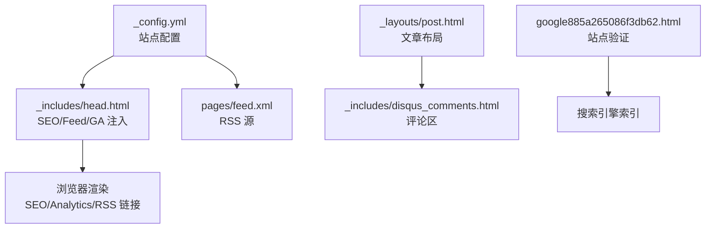
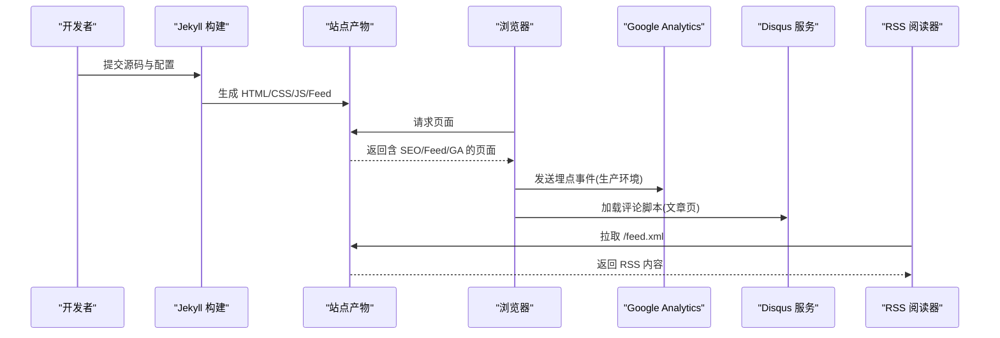
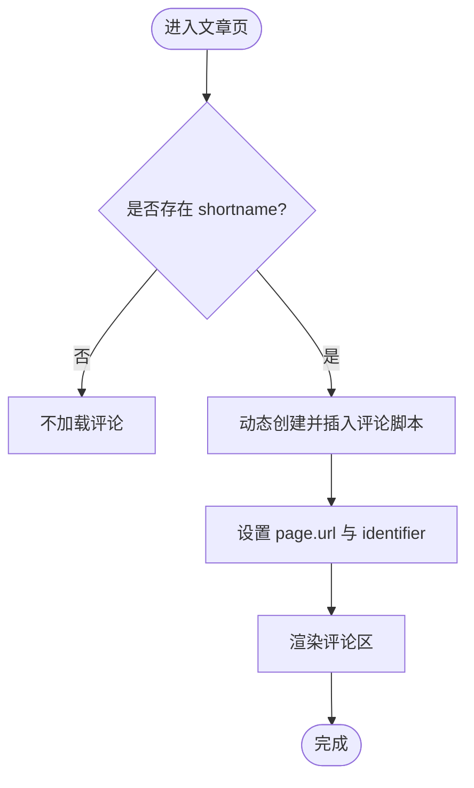
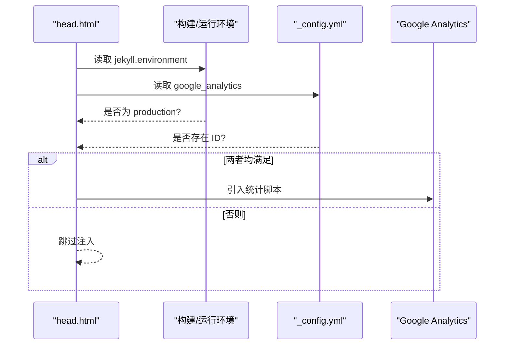
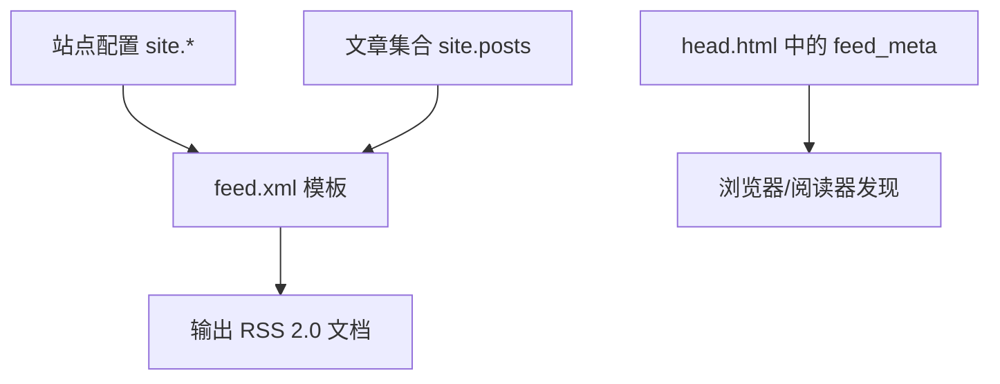
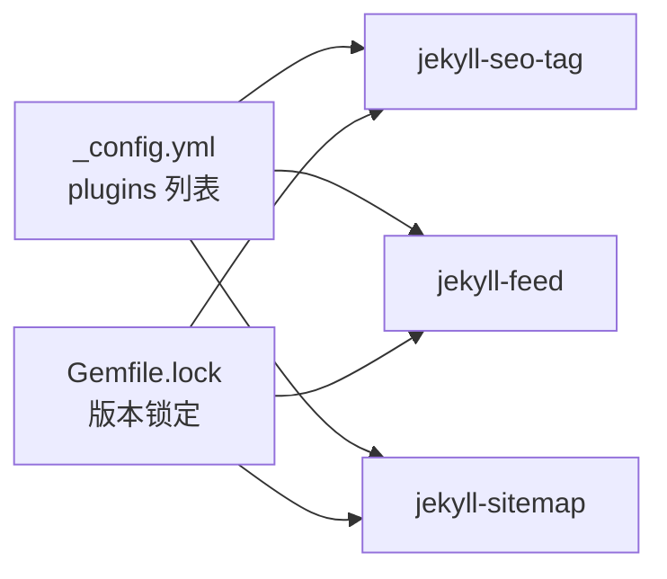

# 高级功能

<cite>
**本文引用的文件**
- [_config.yml](file://_config.yml)
- [_includes/head.html](file://_includes/head.html)
- [_includes/disqus_comments.html](file://_includes/disqus_comments.html)
- [pages/feed.xml](file://pages/feed.xml)
- [google885a265086f3db62.html](file://google885a265086f3db62.html)
- [Gemfile.lock](file://Gemfile.lock)
- [README.md](file://README.md)
</cite>

## 目录
1. [简介](#简介)
2. [项目结构](#项目结构)
3. [核心组件](#核心组件)
4. [架构总览](#架构总览)
5. [详细组件分析](#详细组件分析)
6. [依赖关系分析](#依赖关系分析)
7. [性能与可观测性](#性能与可观测性)
8. [故障排查指南](#故障排查指南)
9. [结论](#结论)
10. [附录](#附录)

## 简介
本章节面向“高级功能”的技术文档目标，聚焦以下能力：Disqus 评论系统集成、Google Analytics 统计注入、RSS 订阅源生成与配置、SEO 优化（Meta 标签与结构化数据）、多语言支持思路、性能监控与错误追踪、日志收集、API/Webhook/自动化扩展、安全与访问控制、数据备份等企业级能力。内容基于仓库现有实现进行梳理，并给出可扩展建议与最佳实践。

## 项目结构
本项目为 Jekyll + Minima 主题博客，采用静态站点生成模式。关键的高级能力通过配置与模板片段组合实现：
- 站点全局配置位于 _config.yml
- 页面头部资源与第三方脚本注入在 _includes/head.html
- 评论区嵌入在 _includes/disqus_comments.html
- RSS 订阅源由 pages/feed.xml 提供
- SEO 相关插件与 Feed 元信息在 head 中启用
- Google Analytics 在生产环境条件注入
- 搜索引擎验证文件 google-site-verification 置于根目录



图表来源
- [_config.yml:1-45](file://_config.yml#L1-L45)
- [_includes/head.html:1-27](file://_includes/head.html#L1-L27)
- [pages/feed.xml:1-31](file://pages/feed.xml#L1-L31)
- [google885a265086f3db62.html:1-1](file://google885a265086f3db62.html#L1-L1)

章节来源
- [README.md:26-62](file://README.md#L26-L62)

## 核心组件
- Disqus 评论系统
  - 通过配置 shortname 并在文章页引入评论脚本，实现每篇文章底部自动加载评论区。
- Google Analytics 统计
  - 在生产环境条件下注入统计脚本，用于采集访问指标。
- RSS 订阅源
  - 自定义 feed.xml 输出最近文章条目，供阅读器订阅。
- SEO 与结构化数据
  - 启用 jekyll-seo-tag 插件，在 head 中输出标准 SEO 元信息；同时包含 favicon、manifest 等增强体验的元数据。
- 站点验证
  - 放置 google-site-verification 文件以完成搜索引擎站点所有权验证。

章节来源
- [_config.yml:28-34](file://_config.yml#L28-L34)
- [_includes/head.html:5,11,22-24:5-5](file://_includes/head.html#L5-L5)
- [_includes/head.html:11](file://_includes/head.html#L11-L11)
- [_includes/head.html:22-24](file://_includes/head.html#L22-L24)
- [pages/feed.xml:1-31](file://pages/feed.xml#L1-L31)
- [google885a265086f3db62.html:1-1](file://google885a265086f3db62.html#L1-L1)

## 架构总览
下图展示了从构建到运行的关键路径：Jekyll 根据配置与模板生成 HTML，head 中注入 SEO、Feed 链接与 GA 脚本；文章页按需加载 Disqus 评论；RSS 源作为独立页面暴露给订阅客户端。



图表来源
- [_includes/head.html:5,11,22-24:5-5](file://_includes/head.html#L5-L5)
- [_includes/disqus_comments.html:1-21](file://_includes/disqus_comments.html#L1-L21)
- [pages/feed.xml:1-31](file://pages/feed.xml#L1-L31)

## 详细组件分析

### Disqus 评论系统集成
- 配置入口
  - 在站点配置中设置 Disqus shortname，控制是否启用评论。
- 模板注入
  - 文章布局中按条件引入评论片段，片段内动态设置当前页面 URL 与标识符，并异步加载 Disqus 脚本。
- 行为说明
  - 当页面 comments 未显式关闭且存在 shortname 时，才会加载评论。
  - 本地预览也可加载，但需网络可达 Disqus 服务。



图表来源
- [_config.yml:28-31](file://_config.yml#L28-L31)
- [_includes/disqus_comments.html:1-21](file://_includes/disqus_comments.html#L1-L21)

章节来源
- [_config.yml:28-31](file://_config.yml#L28-L31)
- [_includes/disqus_comments.html:1-21](file://_includes/disqus_comments.html#L1-L21)
- [README.md:296-308](file://README.md#L296-L308)

### Google Analytics 统计分析注入
- 配置入口
  - 在站点配置中设置 analytics ID。
- 注入机制
  - 在 head 中判断运行环境为 production 且存在 analytics ID 时，才引入统计脚本片段。
- 注意事项
  - 仅在构建或运行时环境标记为 production 时生效，避免开发环境污染数据。



图表来源
- [_includes/head.html:22-24](file://_includes/head.html#L22-L24)
- [_config.yml:32-33](file://_config.yml#L32-L33)

章节来源
- [_includes/head.html:22-24](file://_includes/head.html#L22-L24)
- [_config.yml:32-33](file://_config.yml#L32-L33)

### RSS 订阅源生成与配置
- 生成方式
  - 使用自定义 feed.xml 模板，遍历最新文章集合，输出 RSS 2.0 格式。
- 内容字段
  - 包含标题、描述、发布时间、链接、GUID、分类与标签等。
- 发现方式
  - 在 head 中通过 feed_meta 输出订阅链接，便于浏览器与阅读器发现。



图表来源
- [pages/feed.xml:1-31](file://pages/feed.xml#L1-L31)
- [_includes/head.html:11](file://_includes/head.html#L11-L11)

章节来源
- [pages/feed.xml:1-31](file://pages/feed.xml#L1-L31)
- [_includes/head.html:11](file://_includes/head.html#L11-L11)

### SEO 优化与结构化数据
- 插件启用
  - 启用 jekyll-seo-tag 插件，自动生成标准 SEO 元信息（如 title、description、canonical、og 标签等）。
- 元数据增强
  - 在 head 中输出 favicon、manifest、theme-color 等，提升跨平台展示与 PWA 体验。
- 站点验证
  - 放置 google-site-verification 文件，完成搜索引擎站点所有权校验。

```mermaid
classDiagram
class Head {
"+seo 标签"
"+feed_meta 链接"
"+favicon/manifest"
"+条件注入 GA"
}
class Plugins {
"+jekyll-seo-tag"
"+jekyll-feed"
"+jekyll-sitemap"
}
class Config {
"+title/description/url"
"+plugins 列表"
}
Head --> Plugins : "调用"
Head --> Config : "读取"
```

图表来源
- [_includes/head.html:5,11,13-21:5-5](file://_includes/head.html#L5-L5)
- [_config.yml:41-44](file://_config.yml#L41-L44)
- [google885a265086f3db62.html:1-1](file://google885a265086f3db62.html#L1-L1)

章节来源
- [_includes/head.html:5,11,13-21:5-5](file://_includes/head.html#L5-L5)
- [_config.yml:41-44](file://_config.yml#L41-L44)
- [google885a265086f3db62.html:1-1](file://google885a265086f3db62.html#L1-L1)

### 多语言支持与国际化（I18n）
- 现状
  - 仓库未内置多语言路由或翻译文件组织方案。
- 可行路径
  - 使用 Jekyll 多语言插件（如 jekyll-i18n）或按语言分目录（/zh/, /en/）配合 permalink 策略。
  - 在 head 中输出 hreflang 与 canonical，利于搜索引擎识别语言版本。
  - 导航与菜单增加语言切换，保持用户上下文一致。
- 注意
  - 需要统一 SEO 元信息与 RSS 源的多语言适配。

[本节为概念性说明，不直接分析具体文件]

### 性能监控、错误追踪与日志收集
- 前端性能
  - 已启用 defer 加载搜索脚本，减少阻塞；可按需拆分统计与第三方脚本。
- 错误追踪
  - 可在 head 中引入前端错误上报 SDK（如 Sentry），对未捕获异常与 Promise 拒绝进行上报。
- 日志收集
  - 静态站点无服务端日志，可将关键交互事件上报至后端 API 或日志聚合服务（如 Logtail、Sentry、GA Events）。
- 可观测性建议
  - 结合 Core Web Vitals 上报、慢请求采样、白屏时间监控等指标完善可观测体系。

[本节为通用建议，不直接分析具体文件]

### API 接口、Webhook 与自动化工作流
- 静态站点特性
  - 不提供业务 API；可通过 GitHub Actions 触发构建与部署。
- 可能的扩展
  - 将评论迁移至后端或第三方服务，并通过 Webhook 通知外部系统。
  - 发布新文章后，通过 Actions 推送消息到聊天工具或更新缓存。
- 安全边界
  - 对外暴露的脚本与资源应遵循最小权限原则，避免泄露敏感信息。

[本节为概念性说明，不直接分析具体文件]

### 安全配置、访问控制与数据备份
- 访问控制
  - 静态站点默认公开；如需私有化，可在托管平台开启密码保护或使用反向代理鉴权。
- 传输安全
  - 建议使用 HTTPS，并确保所有第三方资源使用 https 协议。
- 数据备份
  - 定期备份源码与附件（_posts、files、favicons、assets 等），确保可恢复。
- 依赖安全
  - 锁定 Ruby 与 Jekyll 插件版本，关注 CVE 公告并及时升级。

[本节为通用建议，不直接分析具体文件]

## 依赖关系分析
- 关键插件
  - jekyll-seo-tag：生成 SEO 元信息
  - jekyll-feed：提供 feed 元信息（与自定义 feed.xml 并存）
  - jekyll-sitemap：生成站点地图
- 版本锁定
  - Gemfile.lock 固定了各插件版本，保证构建一致性



图表来源
- [_config.yml:41-44](file://_config.yml#L41-L44)
- [Gemfile.lock:34-42](file://Gemfile.lock#L34-L42)

章节来源
- [_config.yml:41-44](file://_config.yml#L41-L44)
- [Gemfile.lock:34-42](file://Gemfile.lock#L34-L42)

## 性能与可观测性
- 构建与渲染
  - 使用 defer 加载非关键脚本，减少首屏阻塞。
- 资源优化
  - 预连接字体域名，减少 DNS 解析耗时；按需加载 CSS/JS。
- 可观测性
  - 在前端埋点上报关键交互与错误；结合 GA 事件与自定义指标完善分析。

[本节为通用建议，不直接分析具体文件]

## 故障排查指南
- Disqus 评论无法加载
  - 检查 shortname 是否正确配置；确认页面 comments 未被禁用；本地预览需网络可达 Disqus。
- GA 未上报数据
  - 确认 jekyll.environment 是否为 production；检查 head 中是否注入统计脚本；核对 UA/Measurement ID。
- RSS 无法订阅
  - 确认 feed.xml 路径可访问；检查 head 中 feed_meta 是否输出；验证 XML 结构与编码。
- SEO 元信息缺失
  - 确认 jekyll-seo-tag 插件已启用；检查 head 中 seo 标签是否输出；核对站点配置项。

章节来源
- [_config.yml:28-34](file://_config.yml#L28-L34)
- [_includes/head.html:5,11,22-24:5-5](file://_includes/head.html#L5-L5)
- [_includes/disqus_comments.html:1-21](file://_includes/disqus_comments.html#L1-L21)
- [pages/feed.xml:1-31](file://pages/feed.xml#L1-L31)

## 结论
本项目在 Disqus 评论、Google Analytics 注入、RSS 订阅与 SEO 方面已有清晰实现路径。在此基础上，可进一步扩展多语言、可观测性与企业级安全能力，以满足更复杂的运营与合规需求。

## 附录
- 参考文档
  - README 中对 Disqus、GA、Favicon、搜索等特性的使用说明可作为快速上手参考。

章节来源
- [README.md:296-331](file://README.md#L296-L331)